<div class="MCWHeader1">
SAP HANA on Azure
</div>

<div class="MCWHeader2">
Hands-on lab step-by-step
</div>

<div class="MCWHeader3">
October 2020
</div>


Information in this document, including URL and other Internet Web site references, is subject to change without notice. Unless otherwise noted, the example companies, organizations, products, domain names, e-mail addresses, logos, people, places, and events depicted herein are fictitious, and no association with any real company, organization, product, domain name, e-mail address, logo, person, place or event is intended or should be inferred. Complying with all applicable copyright laws is the responsibility of the user. Without limiting the rights under copyright, no part of this document may be reproduced, stored in or introduced into a retrieval system, or transmitted in any form or by any means (electronic, mechanical, photocopying, recording, or otherwise), or for any purpose, without the express written permission of Microsoft Corporation.

Microsoft may have patents, patent applications, trademarks, copyrights, or other intellectual property rights covering subject matter in this document. Except as expressly provided in any written license agreement from Microsoft, the furnishing of this document does not give you any license to these patents, trademarks, copyrights, or other intellectual property.

The names of manufacturers, products, or URLs are provided for informational purposes only and Microsoft makes no representations and warranties, either expressed, implied, or statutory, regarding these manufacturers or the use of the products with any Microsoft technologies. The inclusion of a manufacturer or product does not imply endorsement of Microsoft of the manufacturer or product. Links may be provided to third party sites. Such sites are not under the control of Microsoft and Microsoft is not responsible for the contents of any linked site or any link contained in a linked site, or any changes or updates to such sites. Microsoft is not responsible for webcasting or any other form of transmission received from any linked site. Microsoft is providing these links to you only as a convenience, and the inclusion of any link does not imply endorsement of Microsoft of the site or the products contained therein.

© 2020 Microsoft Corporation. All rights reserved.

Microsoft and the trademarks listed at https://www.microsoft.com/en-us/legal/intellectualproperty/Trademarks/Usage/General.aspx are trademarks of the Microsoft group of companies. All other trademarks are property of their respective owners.

**Contents**

<!-- TOC -->

- [SAP HANA on Azure hands-on lab step-by-step](#sap-hana-on-azure-hands-on-lab-step-by-step)
    - [Abstract and learning objectives](#abstract-and-learning-objectives)
    - [Overview](#overview)
    - [Solution architecture](#solution-architecture)
    - [Requirements](#requirements)
    - [Help references](#help-references)
    - [Exercise 1: Implement a single node HANA instance by using Terraform and Ansible](#exercise-1-Implement-a-single-node-HANA-instance-by-using-Terraform-and-Ansible)
        - [Task 1: Provision a Linux virtual machine hosting lab deployment tools](#task-1-Provision-a-Linux-virtual-machine-hosting-lab-deployment-tools)
        - [Task 2: Deploy a single node HANA instance by using Terraform and Ansible](#task-2-Deploy-a-single-node-HANA-instance-by-using-Terraform-and-Ansible)
        - [Task 3: Review the deployment of a single node HANA instance](#task-3-Review-the-deployment-of-a-single-node-HANA-instance)
        - [Task 4: Prepare for the highly-available deployment of SAP HANA](#task-4-Prepare-for-the-highly-available-deployment-of-SAP-HANA)
    - [Exercise 2: Implement highly-available HANA instances by using Terraform and Ansible](#exercise-2-Implement-highly-available-HANA-instances-by-using-Terraform-and-Ansible)
        - [Task 1: Deploy highly-available Azure infrastructure by using Terraform](#task-1-Deploy-highly-available-Azure-infrastructure-by-using-Terraform)
        - [Task 2: Deploy highly-available Azure HANA instances by using Ansible](#task-2-Deploy-highly-available-Azure-HANA-instances-by-using-Ansible)
        - [Task 3: Review the deployment of highly-available HANA instances](#task-3-Review-the-deployment-of-highly-available-HANA-instances)
        - [Task 4: Install SAP HANA Client on the Windows Server jumpbox Azure VM](#task-4-Install-SAP-HANA-Client-on-the-Windows-Server-jumpbox-Azure-VM)
        - [Task 5: Test failover of the clustered resources](#task-5-Test-failover-of-the-clustered-resources)
        - [Task 6: Test fencing of the clustered resources](#task-6-Test-fencing-of-the-clustered-resources)
        - [Task 7: Test migration of the clustered resources](#task-7-Test-migration-of-the-clustered-resources)
        - [Task 8: Test fencing of the clustered resources with the AUTOMATED_REGISTER parameter enabled](#task-8-Test-fencing-of-the-clustered-resources-with-the-AUTOMATED_REGISTER-parameter-enabled)
    - [After the Hands-on lab](#after-the-hands-on-lab)


<!-- /TOC -->

# SAP HANA on Azure hands-on lab step-by-step

## Abstract and learning objectives 

In this hands-on lab, you will step through the implementation of a single-node and highly-available SAP HANA deployments on Microsoft Azure virtual machines running SUSE Linux Enterprise Server. 

After its completion, you will be able to perform single-node and highly-available SAP HANA deployments by using Terraform and Ansible, validate both types of deployments, test failover scenarios, and remove the deployed resources.

## Overview

In this hands-on lab, you are working with Contoso to develop a process of implementing an automated deployment of single-node and highly-available SAP HANA instances on Azure virtual machines (VMs). Your tasks will include the preparation for the deployment process, invoking the deployment, validating the outcome of the deployment, and removal all of the deployed resources.


## Solution architecture

HANA single-node deployment

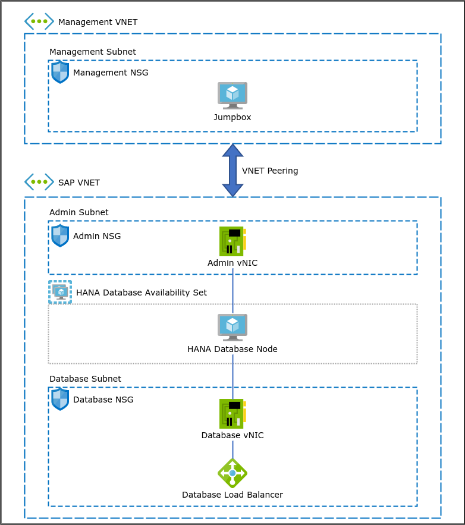

HANA highly-available deployment

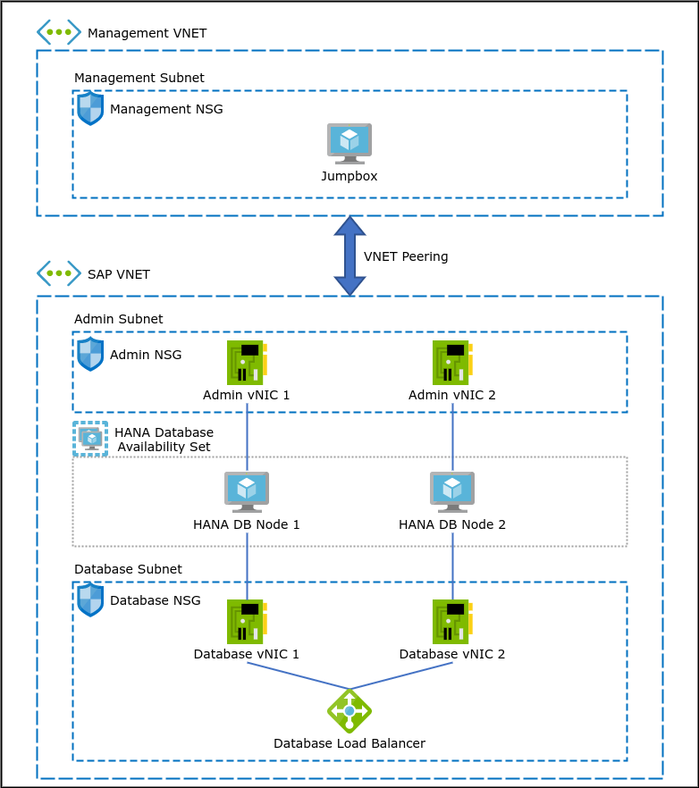

## Requirements

-   A Microsoft Azure subscription

-   A work or school account with the Owner role in the Azure subscription and permissions to create service principals in the Azure Active Directory (Azure AD) tenant associated with the Azure subscription

-   A SAP-user (S-user) account with access to SAP software downloads

-   A lab computer with:

    -   Access to Microsoft Azure

    -   Access to the SAP HANA software (requires an SAP Online Service System account)

    -   An SSH client such as PuTTY available from [PuTTY download page](https://www.chiark.greenend.org.uk/~sgtatham/putty/latest.html)

    -   A modern web browser (Microsoft Edge, Google Chrome, or Mozilla Firefox)

   > **Note**: Besides an SSH client and a web browser, the lab computer does not require locally installed software.

## Help references

|    |            |
|----------|:-------------:|
| **Description** | **Links** |
| Automated SAP Deployments in Azure Cloud | <https://github.com/Azure/sap-hana/> |


## Exercise 1: Implement a single-node HANA instance by using Terraform and Ansible

Duration: 120 minutes

In this exercise, you will implement a single-node deployment of SAP HANA on Azure virtual machines (VMs). Following initial configuration of Terraform-based templates, the deployment will be fully automated, including installation of all necessary SAP HANA components. 

### Task 1: Provision a Linux virtual machine hosting lab deployment tools

1.  From the lab computer, start a Web browser, navigate to the Azure portal at https://portal.azure.com and sign in with credentials you will be using in this lab.

1.  In the Azure portal at <http://portal.azure.com>, start a Bash session in **Cloud Shell**.

1.  If prompted, in the **Welcome to Azure Cloud Shell** window, select **Bash (Linux)**.

1.  If prompted, in the **You have no storage mounted** window, select **Create storage**.

1.  In the **Bash** session in the **Cloud Shell** pane, run the following to select the Azure subscription in which you will provision the Azure resources in this lab (replace the `[subscription_ID]` placeholder with the value of the subscriptionID parameter of the Azure subscription you intend to use in this lab):

    ```sh
    az account set --subscription '[subscription_ID]'
    ```

1.  In the **Bash** session in the **Cloud Shell** pane, run the following to create an Azure resource group that will contain the Azure VM hosting the lab deployment tools (replace the `[Azure_region]` placeholder with the name of the Azure region you intend to use for all Azure resources you will deploy in this lab):

    ```sh
    LOCATION='[Azure region]'
    RGNAME='mcw-hana-on-azure-cli-RG'
    az group create --location $LOCATION --name $RGNAME
    ```

1.  In the **Bash** session in the **Cloud Shell** pane, run the following to download into the Cloud Shell home directory the Azure Resource Manager template and the corresponding parameters file you will use for provisioning of the Azure VM that will host the lab deployment tools:

    ```sh
    rm ubuntu_azurecli_vm_template.json -f
    rm ubuntu_azurecli_vm_template.parameters.json -f

    wget https://github.com/polichtm/MCW-SAP-HANA-on-Azure/tree/master/Hands-on%20lab/labfiles/sap-hana/templates/ubuntu_azurecli_vm_template.json
    wget https://github.com/mpolicht/sap-hana/tree/master/templates/ubuntu_azurecli_vm_template.parameters.json
    ```

1.  In the **Bash** session in the **Cloud Shell** pane, run the following to provision the Azure VM that will host the lab deployment tools:

    ```sh
    az deployment group create \
    --resource-group $RGNAME \
    --template-file ubuntu_azurecli_vm_template.json \
    --parameters @ubuntu_azurecli_vm_template.parameters.json
    ```

    > **Note**: When prompted, specify a user name and its password that you will use to sign in to the operating system of the Azure VM.

    > **Note**: Wait until the provisioning completes. This should take about 3 minutes.

1.  In the **Bash** session in the **Cloud Shell** pane, run the following to display the public IP address of the Azure VM you deployed in the previous step:

    ```sh
    VMNAME=$(az vm list --resource-group $RGNAME --query '[].{Name:name}' -o tsv)
    az vm show --show-details --resource-group $RGNAME --name $VMNAME --query publicIps -o tsv
    ```

1.  From your computer, start the SSH client and connect via SSH to the newly provisioned Azure VM via the public IP address you identified in the previous step. When prompted to sign in, authentiate by using the credentials you provided during provisioning.

1.  Within the SSH session to the Azure VM, run the following to update the package manager list of available packages and their versions (confirm when prompted whether to proceed):

    ```sh
    sudo apt-get update
    ```

1.  Within the SSH session to the Azure VM, run the following to upgrade the versions of the local packages (confirm when prompted whether to proceed):

    ```sh
    sudo apt-get upgrade
    ```

1.  Within the SSH session to the Azure VM, run the following to install Azure CLI:

    ```sh
    curl -sL https://aka.ms/InstallAzureCLIDeb | sudo bash
    ```

1.  Within the SSH session to the Azure VM, run the following to install the latest version of Terraform:

    ```sh
    TER_VER='0.13.4'
    wget https://releases.hashicorp.com/terraform/${TER_VER}/terraform_${TER_VER}_linux_amd64.zip
    sudo apt install unzip
    unzip terraform_${TER_VER}_linux_amd64.zip
    sudo mv terraform /usr/local/bin/
    ```

1.  Within the SSH session to the Azure VM, run the following to install jq (confirm when prompted whether to proceed):

    ```sh
    sudo apt-get install jq
    ```

1.  Within the SSH session to the Azure VM, run the following to install Ansible (confirm when prompted whether to proceed):

    ```sh
    sudo apt install ansible
    ```

1.  Within the SSH session to the Azure VM, run the following to install Git:

    ```sh
    sudo apt-get install git
    ```

### Task 2: Deploy a single-node HANA instance by using Terraform and Ansible

1.  In the SSH session to the Azure VM you provisioned in the previous task, run the following to generate the SSH key pair that will be used to secure access to Linux Azure VMs deployed in this lab (when prompted to specify the location of the file in which to save the key and to specify the passphrase protecting the content of the file, press the **Enter** key three times): 

     ```sh
     ssh-keygen -t rsa -b 2048
     ``` 

1.  In the SSH session to the Azure VM you provisioned in the previous task, run the following to clone the code you will use to perform the deployment and switch to the directory containing the deployment files:

    ```sh
    mkdir ~/projects/ && cd $_
    git clone https://github.com/Azure/sap-hana.git
    cd sap-hana/
    ```

1.  In the SSH session to the Azure VM, run the following to extend the **$PATH** environment variable to include the location of the utility scripts that are part of the cloned repo:

    ```sh
    source util/source_path.sh
    ```

1.  In the SSH session to the Azure VM you provisioned in the previous task, run the following to authenticate to the Azure AD tenant associated with your Azure subscription:

    ```sh
    az login
    ```

1.  Note the code displayed as the output of the previous command, switch to your lab computer, open another tab in the browser window displaying the Azure portal, navigate to [the Microsoft Device Login page](https://microsoft.com/devicelogin) and, when prompted, enter the code and select **Next**.

1.  When prompted, sign in with credentials you are using in this lab and close the browser tab.

1.  Switch back to the SSH session to the Azure VM you provisioned in the previous task and run the following to identify the current Azure subscription:

    ```sh
    check_subscription.sh
    ```

1.  If needed, in the SSH session to the Azure VM, run the following to select the Azure subscription in which you will provision the Azure resources in this lab (replace the `[subscription_ID]` placeholder with the value of the subscriptionID parameter of the Azure subscription you are using in this lab):

    ```sh
    az account set --subscription '[subscription_ID]':
    ```

1.  In the SSH session to the Azure VM, run the following to create an Azure AD service principal that will be used during deployment:

    ```sh
    create_service_principal.sh sp-hanav2sn
    ```

1.  In the SSH session to the Azure VM, run the following to export the environment variables designating the service principal you created in the previous step:

    ```sh
    source set-sp.sh
    ```

1.  In the SSH session to the Azure VM, run the following to download into the current directory the Azure Resource Manager template and the corresponding parameters file you will use for provisioning of the single-node SAP HANA lab environment:

    ```sh
    curl https://github.com/polichtm/MCW-SAP-HANA-on-Azure/tree/master/Hands-on%20lab/labfiles/sap-hana/templates/template-sn1.json  --output ./deploy/template_samples/template-sn1.json
    ```

    > **Note**: The template has the following content:

    ```json
    {
      "infrastructure": {
        "region": "eastus",
        "resource_group": {
          "is_existing": "false",
          "name": "hanav2-sn-RG"
        },
        "ppg": {
          "is_existing": "false",
          "name": "hanav2-sn-ppg"
        },
        "vnets": {
          "management": {
            "is_existing": "false",
            "name": "hanav2-sn-vnet-mgmt",
            "address_space": "10.0.0.0/16",
            "subnet_mgmt": {
              "is_existing": "false",
              "name": "subnet-mgmt",
              "prefix": "10.0.0.0/24",
              "nsg": {
                "is_existing": "false",
                "name": "nsg-mgmt",
                "allowed_ips": [
                  "0.0.0.0/0"
                ]
              }
            }
          },
          "sap": {
            "is_existing": "false",
            "name": "hanav2-sn-vnet-sap",
            "address_space": "10.1.0.0/16",
            "subnet_admin": {
              "is_existing": "false",
              "name": "subnet-admin",
              "prefix": "10.1.1.0/24",
              "nsg": {
               "is_existing": "false",
                "name": "nsg-admin"
              }
            },
            "subnet_db": {
              "is_existing": "false",
              "name": "subnet-db",
              "prefix": "10.1.2.0/24",
              "nsg": {
                "is_existing": "false",
                "name": "nsg-db"
              }
            },
            "subnet_app": {
              "is_existing": "false",
              "name": "subnet-app",
              "prefix": "10.1.3.0/24",
              "nsg": {
                "is_existing": "false",
                "name": "nsg-app"
              }
            }
          }
        }
      },
      "jumpboxes": {
        "windows": [
          {
            "name": "hanav2jmp-vm0",
            "destroy_after_deploy": "false",
            "size": "Standard_D2s_v3",
            "disk_type": "StandardSSD_LRS",
            "os": {
              "publisher": "MicrosoftWindowsServer",
              "offer": "WindowsServer",
              "sku": "2019-Datacenter"
            },
            "authentication": {
              "type": "password",
              "username": "azureadm",
              "password": "Sap@hana2019!"
            },
            "components": []
          }
        ],
        "linux": []
      },
      "databases": [
        {
          "platform": "HANA",
          "db_version": "2.00.043",
          "os": {
            "publisher": "suse",
            "offer": "sles-sap-12-sp5",
            "sku": "gen1"
          },
          "size": "Demo",
          "filesystem": "xfs",
          "high_availability": false,
          "authentication": {
            "type": "key",
            "username": "azureadm"
          },
          "instance": {
            "sid": "HN1",
            "instance_number": "00"
          },
          "credentials": {
            "db_systemdb_password": "Manager1",
            "os_sidadm_password": "Help4you",
            "os_sapadm_password": "Help4you",
            "xsa_admin_password": "Manager1",
            "cockpit_admin_password": "Manager1"
          },
          "dbnodes": [
            {
              "name": "hdb1",
              "role": "worker"
            }
          ],
          "components": {
            "hana_database": [],
            "hana_client_linux": [],
            "xs": [
               "xsac_ui5_sb",
               "xsac_ui5_fesv6",
               "xsac_portal_serv",
               "xsac_services",
               "xsac_mess_srv",
               "xsac_alm_pi_ui",
               "xsac_xsa_cockpit"
            ] 
          },
          "xsa": {
            "routing": "ports"
          },
          "shine": {
            "email": "shinedemo@microsoft.com"
          },
          "loadbalancer": {}
        }
      ],
      "software": {
        "storage_account_sapbits": {
          "is_existing": false,
          "account_tier": "Standard",
          "account_replication_type": "LRS",
          "account_kind": "Storage",
          "blob_container_name": "bits",
          "container_access_type": "private"
        },
        "downloader": {
          "credentials": {
            "sap_user": "",
            "sap_password": ""
          },
          "scenarios": [
            {
              "scenario_type": "DB",
              "product_name": "HANA",
              "product_version": "2.0",
              "os_type": "LINUX_X64",
              "os_version": "SLES12.3",
              "components": [
                "PLATFORM"
              ]
            },
            {
              "scenario_type": "RTI",
              "product_name": "RTI",
              "os_type": "LINUX_X64"
            },
            {
              "scenario_type": "BASTION",
              "os_type": "NT_X64"
            }
          ],
          "debug": {
            "enabled": false,
            "cert": "charles.pem",
            "proxies": {
              "http": "http://127.0.0.1:8888",
              "https": "https://127.0.0.1:8888"
            }
          }
        }
      },
      "sshkey": {
        "path_to_public_key": "~/.ssh/id_rsa.pub",
        "path_to_private_key": "~/.ssh/id_rsa"
      },
      "options": {
        "enable_secure_transfer": true,
        "ansible_execution": true,
        "enable_prometheus": false
      }
    }
    ```

1.  In the SSH session to the Azure VM, run the following to set the credentials necessary to access SAP downloads site (replace the `[SID]` placeholder with your SAP ID and the `[SID_password]` placeholder with the corresponding password):

    ```sh
    set_sap_download_credentials.sh [SID] [SID_password] template-sn1
    ```

1.  In the SSH session to the Azure VM, run the following to generate the name of the storage account that will host the SAP media files and add it to the Azure Resource Manager template you are using in this deployment:

    ```sh
    STORAGE_ACCOUNT_NAME=hana$RANDOM$RANDOM$RANDOM
    sed -i "s/VAR_STORAGE_ACCOUNT_NAME/$STORAGE_ACCOUNT_NAME/" ./deploy/template_samples/template-sn1.json
    ```

1.  In the SSH session to the Azure VM, run the following to initialize Terraform environment:

    ```sh
    terraform_v2.sh init
    ```

1.  In the SSH session to the Azure VM, run the following to create an execution plan for the Terraform deployment:

    ```sh
    terraform_v2.sh plan template-sn1
    ```

1.  In the SSH session to the Azure VM, run the following to initiate the Terraform deployment:

    ```sh
    terraform_v2.sh apply template-sn1
    ```

    > **Note**: Wait for the deployment to complete. This might take about 90 minutes.

    > **Note**: Once the deployment completes, the output will include the public IP address of the Linux jumpbox VM included in the Terraform deployment and its root account name, which you will use in the next task. 


### Task 3: Review the deployment of a single-node HANA instance

1.  In the SSH session to the Azure VM, run the following to identify the private IP addresses of the **hdb1-0** Azure VM:

    ```sh
    RGNAME='hanav2-sn-RG'
    VMNAME='hdb1-0'
    az vm show --show-details --resource-group $RGNAME --name $VMNAME --query privateIps --output tsv
    ```

    > **Note**: The **hdb1-0** Azure VM has two IP addresses **10.1.1.10** and **10.1.2.10**. The first one is meant to be used for management. You will use this IP address in this exercise. 

1.  In the SSH session to the Azure VM, run the following to connect via SSH to the Linux jumpbox VM, which public IP address you identified in the previous task (replace the `[IP_address]` placeholder with the value of the public IP address and confirm when prompted whether to proceed):

    ```sh
    ssh azureadm@[IP_address]
    ```

1.  From within the SSH session to the Linux jumpbox Azure VM, connect to the **hdb1-0** Azure VM running HANA by using its private IP address you identified earlier in this task:

    ```sh
    ssh azureadm@10.1.1.10
    ```

1.  Within the SSH session to the **hdb1-0** Azure VM, run the following to switch to the security context of the **\<sid\>adm** account and, when prompted for its password, type **Help4you** (HANA SID in the lab environment is set to **HN1**):

    ```sh
    su - hn1adm
    ```

1.  Within the SSH session to the **hdb1-0** Azure VM, run the following to identify the version of the local HANA instance:

    ```sh
    HDB version
    ```

    > **Note**: The output should resemble the following:

    ```sh
    HDB version info:
      version:             2.00.050.00.1592305219
      branch:              fa/hana2sp05
      machine config:      linuxx86_64
      git hash:            7daf311088b6a86552a9b0152c9f178d9cfe2ac7
      git merge time:      2020-06-16 13:00:19
      weekstone:           0000.00.0
      cloud edition:       0000.00.00
      compile date:        2020-06-16 13:10:42
      compile host:        ld5146
      compile type:        rel
    ` ``

1.  Within the SSH session to the **hdb1-0** Azure VM, run the following to verify that HANA is operational by listing all HANA processes:

    ```sh
    ps -le |grep hdb
    ```

    > **Note**: The output should resemble the following:

    ```sh
    hn1adm@hdb1-1:/usr/sap/HN1/HDB00> ps -le |grep hdb
    0 S  1001 27178 27171  0  80   0 - 113666 -     ?        00:00:01 hdb.sapHN1_HDB0
    0 S  1001 27196 27178  2  80   0 - 2349845 -    ?        00:04:41 hdbnameserver
    0 S  1001 27298 27178  0  80   0 - 240858 -     ?        00:01:05 hdbcompileserve
    0 S  1001 27301 27178  0  80   0 - 307069 -     ?        00:01:08 hdbpreprocessor
    0 S  1001 27357 27178  3  80   0 - 2475778 -    ?        00:05:34 hdbindexserver
    0 S  1001 27360 27178  1  80   0 - 1131862 -    ?        00:01:50 hdbxsengine
    0 S  1001 27617 27178  0  80   0 - 711971 -     ?        00:01:10 hdbwebdispatche
    1 S  1001 27860     1  0  80   0 - 177521 -     ?        00:00:00 hdbrsutil
    1 S  1001 28295     1  0  80   0 - 177521 -     ?        00:00:00 hdbrsutil
    ```

1.  Within the SSH session to the **hdb1-0** Azure VM, run the following to use the locally installed HANA DB client to sign in to the **systemdb** database with the **SYSTEM** user credentials (when prompted for its password, type **Manager1**):

    ```sh
    hdbsql -d systemdb -u SYSTEM
    ```

1.  From the **hdbsql SYSTEMDB=\>** prompt, run the following to identify tenant databases:

    ```sql
    select * from M_DATABASES 
    ```

    > **Note**: Verify that the instance includes a single tenant database named **HN1**.

1.  From the **hdbsql SYSTEMDB=\>** prompt, type **quit** to exit the HANA DB client.

1.  Within the SSH session to the **hdb1-0** Azure VM, run the following to sign in to the locally installed SAP HANA XS Advanced environment (when prompted, provide the password **Manager1** for the **XSA_ADMIN** user):

    ```sh
    cd /hana/shared/HN1/xs/bin
    ./xs-admin-login
    ```

    > **Note**: The output should resemble the following:

    ```sh
    API_URL: https://hdb1-0.fyz5ci1dm3lurnjzgn2dsvpb0g.bx.internal.cloudapp.net:30030
    USERNAME: XSA_ADMIN
    Authenticating...
    ORG: orgname
    SPACE: SAP
    API endpoint:   https://hdb1-0.fyz5ci1dm3lurnjzgn2dsvpb0g.bx.internal.cloudapp.net:30030 (API version: 1)
    User:           XSA_ADMIN
    Org:            orgname
    Space:          SAP
    ```

1.  From the **hn1adm@hdb1-0:/hana/shared/HN1/xs/bin\>** prompt, run the following to list the XSA apps:

    ```sh
    xs apps
    ```

    > **Note**: The output should resemble the following:

    ```sh
    Getting apps in org "orgname" / space "SAP" as XSA_ADMIN...
    Found apps:

    name                          requested state   instances   memory    disk          alerts   urls
    --------------------------------------------------------------------------------------------------------------------------
    auditlog-broker               STARTED           1/1         64.0 MB   <unlimited>   https://hdb1-0.fyz5ci1dm3lurnjzgn2dsvpb0g.bx.internal.cloudapp.net:51003
    auditlog-db                   STOPPED           0/1         16.0 MB   <unlimited>   <none>
    auditlog-server               STARTED           1/1         256 MB    <unlimited>   https://hdb1-0.fyz5ci1dm3lurnjzgn2dsvpb0g.bx.internal.cloudapp.net:51002
    component-registry-db         STOPPED           0/1         16.0 MB   <unlimited>   <none>
    deploy-service                STARTED           1/1         300 MB    <unlimited>   https://hdb1-0.fyz5ci1dm3lurnjzgn2dsvpb0g.bx.internal.cloudapp.net:51004
    jobscheduler-backend          STARTED           1/1         256 MB    <unlimited>   https://hdb1-0.fyz5ci1dm3lurnjzgn2dsvpb0g.bx.internal.cloudapp.net:51020
    jobscheduler-broker           STARTED           1/1         256 MB    <unlimited>   https://hdb1-0.fyz5ci1dm3lurnjzgn2dsvpb0g.bx.internal.cloudapp.net:51017
    jobscheduler-dashboard        STARTED           1/1         256 MB    <unlimited>   https://hdb1-0.fyz5ci1dm3lurnjzgn2dsvpb0g.bx.internal.cloudapp.net:51021
    jobscheduler-db               STOPPED           0/1         256 MB    <unlimited>   <none>
    jobscheduler-rest             STARTED           1/1         256 MB    <unlimited>   https://hdb1-0.fyz5ci1dm3lurnjzgn2dsvpb0g.bx.internal.cloudapp.net:51015
    jobscheduler-service          STARTED           1/1         512 MB    <unlimited>   https://hdb1-0.fyz5ci1dm3lurnjzgn2dsvpb0g.bx.internal.cloudapp.net:51016
    messaging-service-broker      STARTED           1/1         64.0 MB   <unlimited>   https://hdb1-0.fyz5ci1dm3lurnjzgn2dsvpb0g.bx.internal.cloudapp.net:51009
    messaging-service-hub         STARTED           1/1         512 MB    <unlimited>   tcps://hdb1-0.fyz5ci1dm3lurnjzgn2dsvpb0g.bx.internal.cloudapp.net:51007
    messaging-service-node        STARTED           1/1         512 MB    <unlimited>   tcps://hdb1-0.fyz5ci1dm3lurnjzgn2dsvpb0g.bx.internal.cloudapp.net:51008
    product-installer             STARTED           1/1         256 MB    <unlimited>   https://hdb1-0.fyz5ci1dm3lurnjzgn2dsvpb0g.bx.internal.cloudapp.net:51005
    product-installer-ui          STARTED           1/1         512 MB    <unlimited>   https://hdb1-0.fyz5ci1dm3lurnjzgn2dsvpb0g.bx.internal.cloudapp.net:51023
    sap-portal-persistency        STARTED           1/1         256 MB    <unlimited>   https://hdb1-0.fyz5ci1dm3lurnjzgn2dsvpb0g.bx.internal.cloudapp.net:51010
    sap-portal-static-resources   STARTED           1/1         1.00 GB   <unlimited>   https://hdb1-0.fyz5ci1dm3lurnjzgn2dsvpb0g.bx.internal.cloudapp.net:51011
    sapui5_fesv6                  STARTED           1/1         256 MB    <unlimited>   https://hdb1-0.fyz5ci1dm3lurnjzgn2dsvpb0g.bx.internal.cloudapp.net:51022
    sapui5_sb                     STARTED           1/1         128 MB    <unlimited>   https://hdb1-0.fyz5ci1dm3lurnjzgn2dsvpb0g.bx.internal.cloudapp.net:51024
    xsa-cockpit                   STARTED           1/1         512 MB    <unlimited>   https://hdb1-0.fyz5ci1dm3lurnjzgn2dsvpb0g.bx.internal.cloudapp.net:51025
    ```

### Task 4: Prepare for the highly-available deployment of SAP HANA

> **Note**: In the next exercise, you will implement a highly-available SAP HANA deployment. You will leverage for that purpose the SAP media downloaded in this exercise. 

1.  From the **hn1adm@hdb1-0:/hana/shared/HN1/xs/bin\>** prompt, type **exit** and press **Enter** to exit the XSA environment. 

1.  Within the SSH session to the **hdb1-0** Azure VM, run the following to switch to the security context of the **\<sid\>adm** account and, when prompted for its password, type **Help4you**:

    ```sh
    su - hn1adm
    ```

1.  Within the SSH session to the **hdb1-0** Azure VM, run the following to stop the HANA instance:

    ```sh
    hn1adm@hdb1-0:/hana/shared/HN1/xs/bin> HDB stop
    ```

1.  Within the SSH session to the **hdb1-0** Azure VM, run the following to verify that the HANA instance is no longer running:

    ```sh
    ps -le |grep hdb
    ```

    > **Note**: The output should resemble the following:

    ```sh
    hn1adm@hdb1-0:/usr/sap/HN1/HDB00> ps -le |grep hdb
    1 S  1001 13905     1  0  80   0 - 177500 -     ?        00:00:00 hdbrsutil
    1 S  1001 14314     1  0  80   0 - 177501 -     ?        00:00:00 hdbrsutil
    ```

1.  Within the SSH session to the **hdb1-0** Azure VM, run the following to shut down operating system:

    ```sh
    exit
    sudo shutdown now
    ```

    > **Note**: This will automatically terminate the SSH session to the **hdb1-0** Azure VM.

1.  Within the SSH session to the Linux jumpbox Azure VM, run the following to shut down operating system:

    ```sh
    sudo shutdown now
     ```

    > **Note**: This will automatically terminate the SSH session to the Linux jumpbox Azure VM.

1.  Within the SSH session to the Azure VM you used to perform the Terraform deployment, run the following to delete all VMs that were included in that deployment:

    ```sh
    RGNAME='hanav2-sn-RG'
    az vm delete --ids $(az vm list --resource-group $RGNAME --query "[].id" -o tsv) --yes
    ```

1.  Within the SSH session to the Azure VM you used to perform the Terraform deployment, run the following to delete all VM disks that were included in that deployment:

    ```sh
    az disk delete --ids $(az disk list --resource-group $RGNAME --query "[].id" -o tsv) --yes --no-wait
    ```

1.  In the SSH session to the Azure VM you used for Terraform deployment, run the following to clean up the working directries and files (confirm when prompted whether to proceed):

    ```sh
    terraform_v2.sh clean
    ```

## Exercise 2: Implement highly-available HANA instances by using Terraform and Ansible

Duration: 120 minutes

In this exercise, you will implement a highly-available deployment of SAP HANA on Azure virtual machines (VMs). The deployment will be divided into two fully automated parts. The first one will use Terraform to deploy Azure resources that will host SAP deployment. The second one will use Ansible to deploy and configure all of the SAP components. 

You will leverage a number of artifacts that you implemented in the first exercise of this lab, including:

-   HANA software that you uploaded to an Azure Storage account

-   SSH key pair

-   The service principal created to facilitate authentication and authorization required by Terraform to provision Azure resources.

### Task 1: Deploy highly-available Azure infrastructure by using Terraform

1.  In the SSH session to the Azure VM you used for Terraform deployment, run the following to extend the $PATH environment variable to include the location of the utility scripts that are part of the cloned repo:

    ```sh
    source util/source_path.sh
    ```

1.  In the SSH session to the Azure VM, run the following to export the environment variables designating the service principal you created in the previous exercise:

    ```sh
    source set-sp.sh
    ```

1.  In the SSH session to the Azure VM, run the following to download into the current directory the Azure Resource Manager template and the corresponding parameters file you will use for provisioning of the single-node SAP HANA lab environment:

    ```sh
    curl https://github.com/polichtm/MCW-SAP-HANA-on-Azure/tree/master/Hands-on%20lab/labfiles/sap-hana/templates/template-ha1.json  --output ./deploy/template_samples/template-ha1.json
    ```

    > **Note**: The template has the following content:

    ```json
    {
      "infrastructure": {
        "region": "eastus",
        "resource_group": {
          "is_existing": "false",
          "name": "hanav2-ha-RG"
        },
        "ppg": {
          "is_existing": "false",
          "name": "hanav2-ha-ppg"
        },
        "vnets": {
          "management": {
            "is_existing": "false",
            "name": "hanav2-ha-vnet-mgmt",
            "address_space": "10.100.0.0/16",
            "subnet_mgmt": {
              "is_existing": "false",
              "name": "subnet-mgmt",
              "prefix": "10.100.0.0/24",
              "nsg": {
                "is_existing": "false",
                "name": "nsg-mgmt",
                "allowed_ips": [
                  "0.0.0.0/0"
                ]
              }
            }
          },
          "sap": {
            "is_existing": "false",
            "name": "hanav2-ha-vnet-sap",
            "address_space": "10.101.0.0/16",
            "subnet_admin": {
              "is_existing": "false",
              "name": "subnet-admin",
              "prefix": "10.101.1.0/24",
              "nsg": {
                "is_existing": "false",
                "name": "nsg-admin"
              }
            },
            "subnet_db": {
              "is_existing": "false",
              "name": "subnet-db",
              "prefix": "10.101.2.0/24",
              "nsg": {
                "is_existing": "false",
                "name": "nsg-db"
              }
            },
            "subnet_app": {
              "is_existing": "false",
              "name": "subnet-app",
              "prefix": "10.101.3.0/24",
              "nsg": {
                "is_existing": "false",
                "name": "nsg-app"
              }
            },
            "subnet_iscsi": {
              "is_existing": "false",
              "name": "subnet-iscsi",
              "prefix": "10.101.4.0/24",
              "nsg": {
                "is_existing": "false",
                "name": "nsg-iscsi"
              }
            }
          }
        },
        "iscsi": {
          "iscsi_count": 3,
          "size":"Standard_D2s_v3",
          "os": {
            "publisher": "SUSE",
            "offer": "sles-sap-12-sp5",
            "sku": "gen1",
            "version": "latest"
          },
          "authentication": {
            "type": "key",
            "username": "azureadm"
          }
        }
      },
      "jumpboxes": {
        "windows": [
          {
            "name": "hanav2jmp-vm0",
            "destroy_after_deploy": "false",
            "size": "Standard_D2s_v3",
            "disk_type": "StandardSSD_LRS",
            "os": {
              "publisher": "MicrosoftWindowsServer",
              "offer": "WindowsServer",
              "sku": "2019-Datacenter"
            },
            "authentication": {
              "type": "password",
              "username": "azureadm",
              "password": "Sap@hana2019!"
            },
            "components": []
          }
        ],
        "linux": []
      },
      "databases": [
        {
          "platform": "HANA",
          "db_version": "2.00.043",
          "os": {
            "publisher": "suse",
            "offer": "sles-sap-12-sp5",
            "sku": "gen1"
          },
          "size": "Demo",
          "filesystem": "xfs",
          "high_availability": true,
          "authentication": {
            "type": "key",
            "username": "azureadm"
          },
          "instance": {
            "sid": "HN1",
            "instance_number": "00"
          },
          "credentials": {
            "db_systemdb_password": "Manager1",
            "os_sidadm_password": "Help4you",
            "os_sapadm_password": "Help4you",
            "xsa_admin_password": "Manager1",
            "cockpit_admin_password": "Manager1",
            "ha_cluster_password": "ASecurePa55w0rd"
          },
          "dbnodes": [
            {
              "name": "hdb1",
              "role": "worker"
            }
          ],
          "components": {
            "hana_database": [],
            "hana_client_linux": [],
            "xs": [
               "xsac_ui5_sb",
               "xsac_ui5_fesv6",
               "xsac_portal_serv",
               "xsac_services",
               "xsac_mess_srv",
               "xsac_alm_pi_ui",
               "xsac_xsa_cockpit"
            ]
          },
          "xsa": {
            "routing": "ports"
          },
          "shine": {
            "email": "shinedemo@microsoft.com"
          },
          "loadbalancer": {}
        }
      ],
      "application": {
        "sid": "HN1",
        "enable_deployment": true,
        "scs_instance_number": "01",
        "ers_instance_number": "02",
        "scs_high_availability": true,
        "application_server_count": 1,
        "webdispatcher_count": 1,
        "vm_sizing": "Default",
        "authentication": {
          "type": "key",
          "username": "azureadm"
        },
        "os": {
          "os_type": "Linux",
          "publisher": "suse",
          "offer": "sles-sap-12-sp5",
          "sku": "gen1"
        }
      },
      "software": {
        "storage_account_sapbits": {
          "is_existing": true,
          "account_tier": "Standard",
          "account_replication_type": "LRS",
          "account_kind": "Storage",
          "blob_container_name": "bits",
          "container_access_type": "private",
          "arm_id": "VAR_STORAGE_ACCOUNT_ID"
        },
        "downloader": {
          "credentials": {
            "sap_user": "",
            "sap_password": ""
          },
          "scenarios": [
            {
              "scenario_type": "DB",
              "product_name": "HANA",
              "product_version": "2.0",
              "os_type": "LINUX_X64",
              "os_version": "SLES12.3",
              "components": [
                "PLATFORM"
              ]
            },
            {
              "scenario_type": "RTI",
              "product_name": "RTI",
              "os_type": "LINUX_X64"
            },
            {
              "scenario_type": "BASTION",
              "os_type": "NT_X64"
            }
          ],
          "debug": {
            "enabled": false,
            "cert": "charles.pem",
            "proxies": {
              "http": "http://127.0.0.1:8888",
              "https": "https://127.0.0.1:8888"
            }
          }
        }
      },
      "sshkey": {
        "path_to_public_key": "~/.ssh/id_rsa.pub",
        "path_to_private_key": "~/.ssh/id_rsa"
      },
      "options": {
        "enable_secure_transfer": true,
        "ansible_execution": false,
        "enable_prometheus": false
      }
    }
    ```

1.  In the SSH session to the Azure VM, run the following to set the credentials necessary to access SAP downloads site (replace the `[SID]` placeholder with your SAP ID and the `[SID_password]` placeholder with the corresponding password):

    ```sh
    set_sap_download_credentials.sh [SID] [SID_password] template-ha1.json
    ```

1.  In the SSH session to the Azure VM, run the following to set the resource id of the existing storage account that hosts the SAP media files and add it to the Azure Resource Manager template you are using in this deployment:

    ```sh
    SN_RGNAME='hanav2-sn-RG'
    STORAGE_ACCOUNT_ID=$(az storage account list --resource-group $SN_RGNAME --query "[?starts_with(name,'sapbits')].id" -o tsv)
    STORAGE_ACCOUNT_ID_REGEX="$(echo $STORAGE_ACCOUNT_ID | sed -e 's/\\/\\\\/g; s/\//\\\//g; s/&/\\\&/g')"
    sed -i "s/VAR_STORAGE_ACCOUNT_ID/$STORAGE_ACCOUNT_ID_REGEX/" ./deploy/template_samples/template-ha1.json
    ```

1.  In the SSH session to the Azure VM, run the following to initialize the Terraform environment:

    ```sh
    terraform_v2.sh init
    ```

1.  In the SSH session to the Azure VM, run the following to create an execution plan for the Terraform deployment:

    ```sh
    terraform_v2.sh plan template-ha1
    ```

1.  In the SSH session to the Azure VM, run the following to initiate the Terraform deployment:

    ```sh
    terraform_v2.sh apply template-ha1
    ```

    > **Note**: Wait for the deployment to complete. This should take about 10 minutes.

    > **Note**: Once the deployment completes, the output will include the public IP address of the Linux jumpbox Azure VM included in the Terraform deployment and its administrator's account name, which you will use in the next task. 


### Task 2: Deploy highly-available Azure HANA instances by using Ansible

1.  Within the SSH session to the Azure VM you used for Terraform deployment, run the following to connect via SSH to the Linux jumpbox VM, which public IP address you identified in the previous task (replace the `[IP_address]` placeholder with the value of the public IP address and confirm when prompted whether to proceed):

    ```sh
    ssh azureadm@[IP_address]
    ```

1.  Within the SSH session to the Linux jumpbox VM, run the following to set the environment variables necessary for the Ansible-based scripts to provision the lab environment:

    ```sh
    export OBJC_DISABLE_INITIALIZE_FORK_SAFETY=YES
    export ANSIBLE_HOST_KEY_CHECKING=False
    source ~/export-clustering-sp-details.sh
    ```

1.  Within the SSH session to the Linux jumpbox VM, run the following to initiate the Ansible-based provisioning of the lab environment: 

    ```sh
    ansible-playbook -i hosts.yml ~/sap-hana/deploy/ansible/sap_playbook.yml
    ```

    > **Note**: Wait for the deployment to complete. This should take about 60 minutes.

    > **Note**: Once the deployment completes, the output will include the public IP address of the Windows jumpbox VM included in the Terraform deployment, its local user name with the Administrator privileges, and its password, which you will use in the next task. 


### Task 3: Review the deployment of highly-available HANA instances

> **Note**: In this deployment, the **hdb1-0** Azure VM also has two private IP addresses **10.101.1.10** and **10.101.2.10**. The first one is meant to be used for management. You will use this IP address in this exercise. 

1.  From within the SSH session to the Linux jumpbox Azure VM, connect to the **hdb1-0** Azure VM running HANA by using its private IP address you identified earlier in this task:

    ```sh
    ssh azureadm@10.101.1.10
    ```

1.  Within the SSH session to the **hdb1-0** Azure VM, run the following to switch to the security context of the **\<sid\>adm** account and, when prompted for its password, type **Help4you**:

    ```sh
    su - hn1adm
    ```

1.  Within the SSH session to the **hdb1-0** Azure VM, run the following to sign in to the locally installed SAP HANA XS Advanced environment (when prompted, provide the password **Manager1** for the **XSA_ADMIN** user):

    ```sh
    cd /hana/shared/HN1/xs/bin
    ./xs-admin-login
    ```

1.  From the **hn1adm@hdb1-0:/hana/shared/HN1/xs/bin\>** prompt, run the following to identify the URL of the XSA Cockpit:

    ```sh
    xs apps | grep xsa-cockpit
    ```

    > **Note**: The output should resemble the following:

    ```sh
    xsa-cockpit                   STARTED           1/1         512 MB    <unlimited>   https://hdb1-0.fyz5ci1dm3lurnjzgn2dsvpb0g.bx.internal.cloudapp.net:51025
    ```

    > **Note**: Take the note of the URL designating the access point of xsa-cockpit. You will need it later in this exercise.

1.  Within the SSH session to the **hdb1-0** Azure VM, run the following to identify the **default_domain** and **api_url** XSA parameters:

    ```sh
    cat /hana/shared/HN1/global/hdb/custom/config/xscontroller.ini
    ```

    > **Note**: The output should include the following:

    ```sh
    [communication]
    default_domain = hdb1-0.fyz5ci1dm3lurnjzgn2dsvpb0g.bx.internal.cloudapp.net
    api_url = https://hdb1-0.fyz5ci1dm3lurnjzgn2dsvpb0g.bx.internal.cloudapp.net:30030
    ```

1.  Switch to the lab computer and initiate a Remote Desktop session to the Windows Server jumpbox Azure VM **hanav2jmp-vm0** which public IP address you identified in the previous task. When prompted, sign in with the credentials, also provided at the end of the previous task.

1.  Within the Remote Desktop session to the Windows Server jumpbox Azure VM **hanav2jmp-vm0**, navigate to the **Local Server** view in the **Server Manager** window and disable **IE Enhanced Security Configuration**.

1.  Within the Remote Desktop session to the Windows Server jumpbox Azure VM **hanav2jmp-vm0**, open the **hosts** file located in **C:\\Windows\\System32\\drivers\\etc** in Notepad.

1.  Add the following entries to the host file, save your changes, and close the file:

    ```
    10.101.2.4	hdbha
    10.101.2.10	hdb1-0
    10.101.2.11	hdb1-1
    ```

    > **Note**: `10.101.2.4` is the IP address assigned to the front end of the Azure Internal Load Balancer that distributes network traffic to the HANA cluster hosted on two Azure VMs **hdb1-0** and **hdb1-1**.

1.  Within the Remote Desktop session to the Windows Server jumpbox Azure VM **hanav2jmp-vm0**, start **Internet Explorer**, and browse to [the Azure portal](https://portal.azure.com). When prompted, sign in with the credentials you are using in this lab.

1.  In the Azure portal, search for and select **Proximity placement groups** and, on the **Proximity placement groups** blade, select the **hanav2-ha-ppg** entry.

1.  On the **hanav2-ha-ppg** blade, note that the proximity placement group contains the **HN1_hdb-avset** availability set along with both Azure VMs **hdb1-0** and **hdb1-1**, operating as the HANA cluster nodes.

    > **Note**: The proximity placement group ensures that the latency of replication between the cluster nodes is minimized.

1.  In the Azure portal, search for and select **Network security groups** and, on the **Network security groups** blade, select the entry representing the **nsg-db** network security group in the **hanav2-ha-RG** resource group.

    > **Note**: Make sure that you select the **nsg-db** network security group in the **hanav2-ha-RG** resource group (rather than the one in the **hanav2-sn-RG** resource group).

    > **Note**: The **nsg-db** network security group restrict connectivity to the Azure VMs hosting the HANA databases. In order to proceed with further testing within the lab environment, you need to allow incoming traffic from the jumpbox VM running Windows Server 2019 and from load balancer probes (which are currently denied) to the virtual network hosting the load balancer Azure VMs running HANA.

1.  On the **nsg-db** blade, select **Inbound security rules** and then select **+ Add**. 

1.  On the **Add inbound security rule** blade, specify the following settings (leave others with their default values) and select **Add**:

    | Setting | Value |
    | --- | --- |
    | Source | **Any** |
    | Source port ranges | **\*** |
    | Destination | **IP Addresses** |
    | Destination IP addresses/CIDR ranges | **10.101.0.0/16** |
    | Destination port ranges | * |
    | Protocol | **Any** |
    | Action | **Allow** |
    | Priority | **100** |
    | Name | **allow-lab-traffic** |

1.  In the Azure portal, search for and select **Load balancers** and, on the **Load balancers** blade, select the **HN1_hdb-alb** entry. 

    > **Note**: The **HN1_hdb-alb** load balancer provides load balancing for connections targeting Azure VMs hosting the HANA databases. In order to proceed with testing in the lab environment, you need to modify the backend pool of the load balancer.

1.  On the **HN1_hdb-alb \| Load balancing rules** blade, select **Backend pools**. 

1.  On the **HN1_hdb-alb \| Backend pools** blade, select the **HN1_hdbAlb-bePool** entry.

1.  On the **HN1_hdbAlb-bePool** blade, in the **Virtual machines** section, select the **hdb1-0** and the **hdb1-1** checkboxes and then select **Remove**.

1.  On the **HN1_hdbAlb-bePool** blade, in the **Virtual machines** section, select **Add**.

1.  On the **Add virtual machines to backend pool** blade, select the entry referencing **hdb1-0-admin-nic-ip (10.1.1.10)** and **hdb1-1-admin-nic-ip (10.1.1.11)** and then select **Add**. 

    > **Note**: Make sure to select the IP Configuration entries that reference IP addresses on the **10.1.1.0/24** subnet. This is necessary to allow for the traffic originating from the Windows Server jumpbox Azure VM to reach the backend pool VMs.

1.  Back on the **HN1_hdbAlb-bePool** blade, select **Save**.

1.  Within the Remote Desktop session to the Windows Server jumpbox Azure VM **hanav2jmp-vm0**, start **Internet Explorer**, and browse to **https://hdb1-0:7630**. 

1.  Disregard the **This site is not secure** error message, select **More information**, and then select **Go on to the webpage (not recommended)**. 

    > **Note**: Ignore any messages indicating problems with security certificate of the target website. This is expected in the lab environment. 

1.  On the **SUSE Hawk Sign in** page, sign in as **hacluster** with the password **ASecurePa55w0rd**.

1.  Once you signed in, review the **Resources** tab on the **Status** page.

    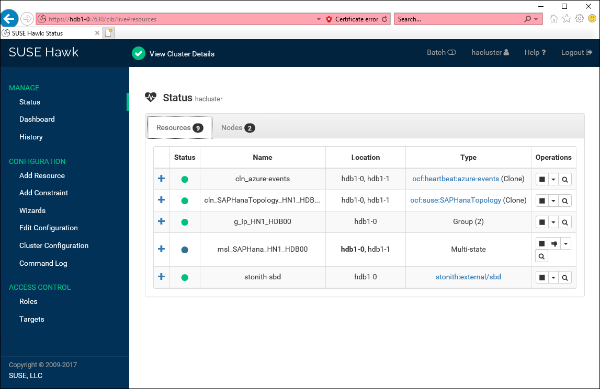

1.  Next, switch to the **Nodes** tab on the **Status** page.

    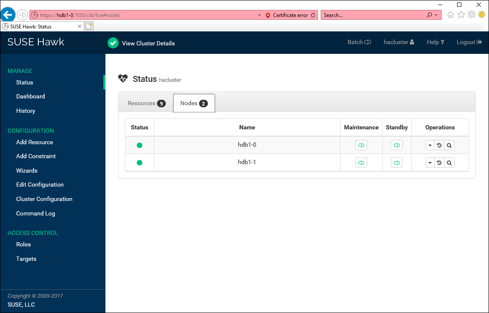

1.  Switch back to the **Resources** tab and use the magnifying glass icon to examine the state of the HANA resources starting with the **SAPHANATopology**.

    

1.  Close the **SAPHANATopology** pane and use the magnifying glass icon to examine the state of the **SAPHana** resource.

    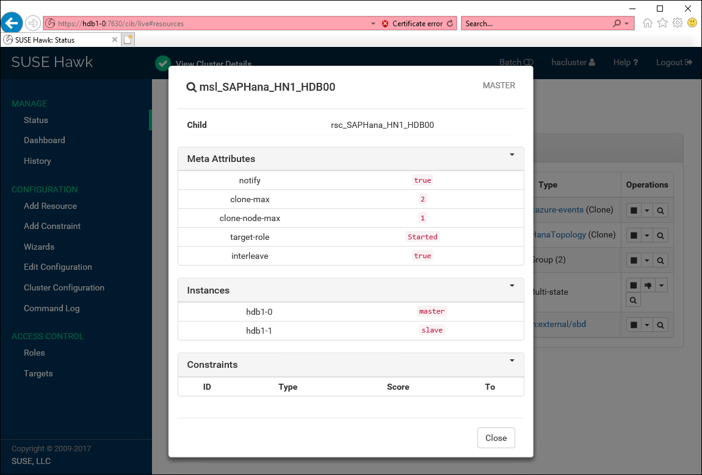

1.  Within the Remote Desktop session to the Windows Server jumpbox Azure VM **hanav2jmp-vm0**, start another instance of **Internet Explorer**, and browse to **https://hdb1-1:7630**. 

    > **Note**: This connection targets the Azure VM hosting the passive HANA instance.

1.  Disregard the **This site is not secure** error message, select **More information**, and then select **Go on to the webpage (not recommended)**. 

1.  On the **SUSE Hawk Sign in** page, sign in as **hacluster** with the password **ASecurePa55w0rd**.

1.  Once you signed in, verify that you can view the status of the cluster in the same manner as when connected to **https://hdb1-0:7630**.

1.  Within the Remote Desktop session to the Windows Server jumpbox Azure VM **hanav2jmp-vm0**, start **Internet Explorer**, and browse to the XSA Cockpit URL you identified earlier in this task.

    > **Note**: The URL should resemble **https://hdb1-0.fyz5ci1dm3lurnjzgn2dsvpb0g.bx.internal.cloudapp.net:51025** (the domain name will differ).

1.  Disregard the **This site is not secure** error message, select **More information**, and then select **Go on to the webpage (not recommended)**. 

    > **Note**: Ignore any messages indicating problems with security certificate of the target website. This is expected in the lab environment. 

1.  On the **SAP HANA XS Advanced** page, sign in as **XSA_ADMIN** with the password **Manager1**.

1.  Once you signed in, on the **XSA Host: Home - Organizations** page, select **User management**:

    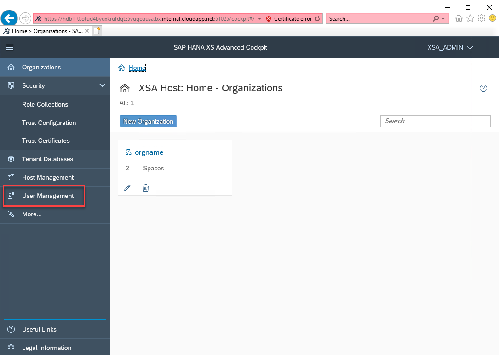

1.  On the **XSA Host: Home - User Management** page, select **New User**:

    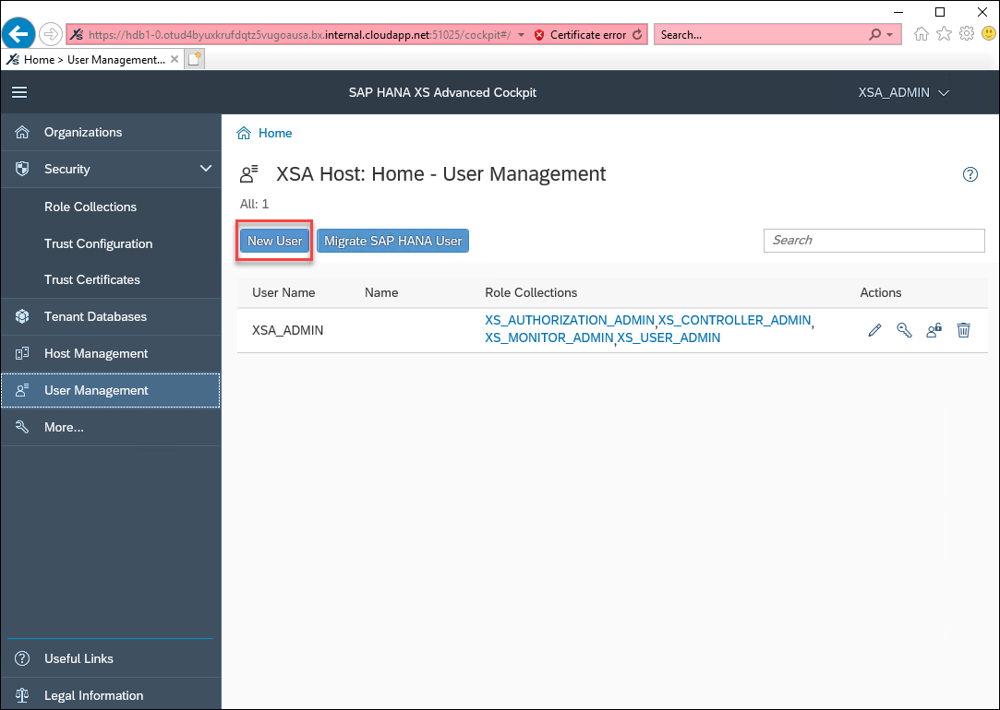

1.  In the **New User** pane, specify the following settings and select **Create**:

    | Setting | Value |
    | --- | --- |
    | User Name | **labuser1** |
    | First Name | **lab** |
    | Last Name | **user1** |
    | E-Mail | **Labuser1@contoso.com** | 
    | Password | **Lab@pass123** | 

    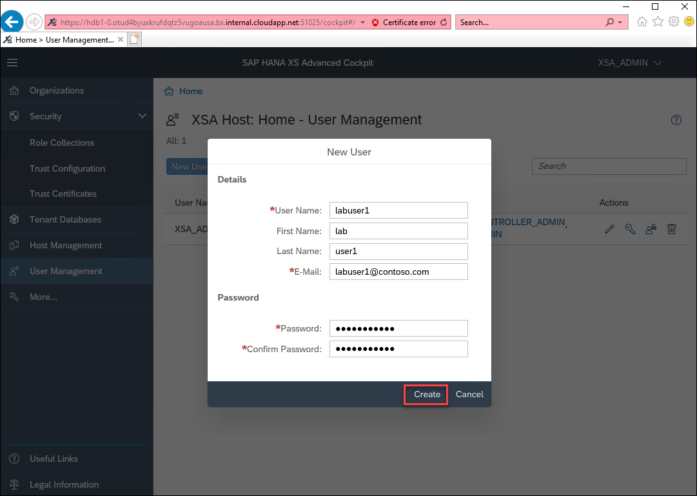

    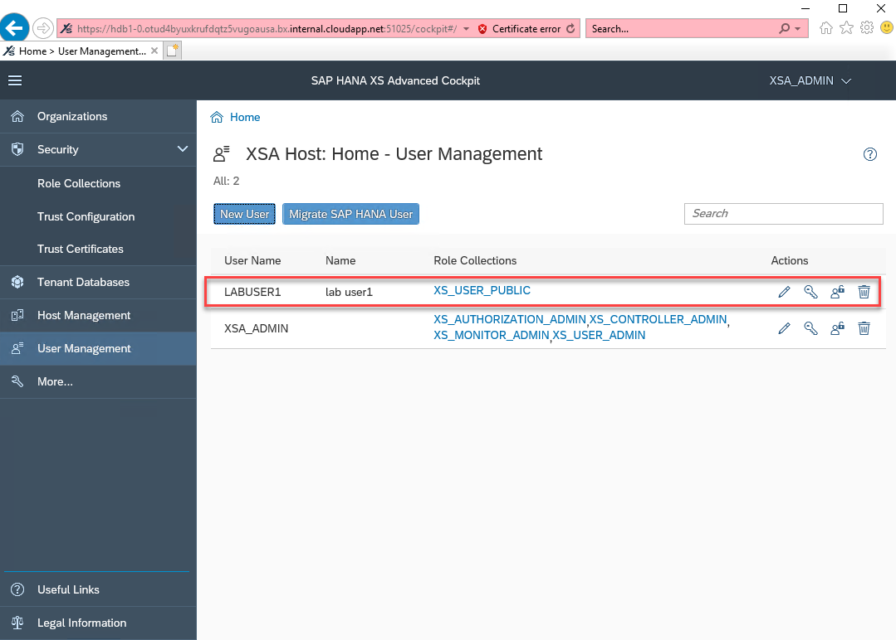


### Task 4: Install SAP HANA Client on the Windows Server jumpbox Azure VM

1.  Within the Remote Desktop session to Windows Server jumpbox Azure VM **hanav2jmp-vm0**, start **Internet Explorer**, and browse to [SAP HANA Client 2.0 download page](https://tools.hana.ondemand.com/#hanatools)

1.  From the [SAP HANA Client 2.0 download page](https://tools.hana.ondemand.com/#hanatools), download the latest version of the HANA client for Windows x64 to the **Downloads** folder, extract its content, and double-click the **hdbsetup.exe** file to start the installation.

1.  On the **Define Client Properties** page of the **SAP HANA Lifecycle Management** wizard, accept the default settings and select **Next**:

    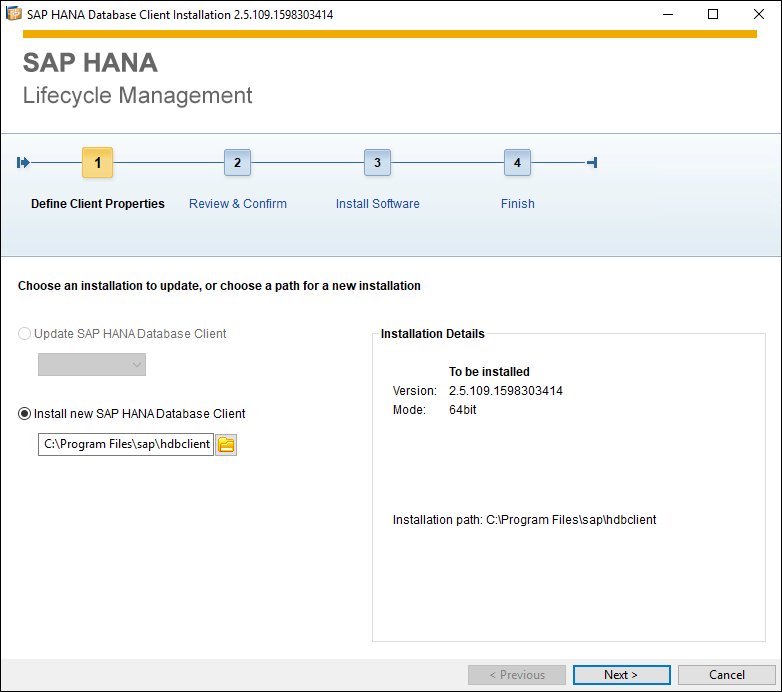

1.  On the **Review & Confirm** page of the **SAP HANA Lifecycle Management** wizard, accept the default settings and select **Install**:

    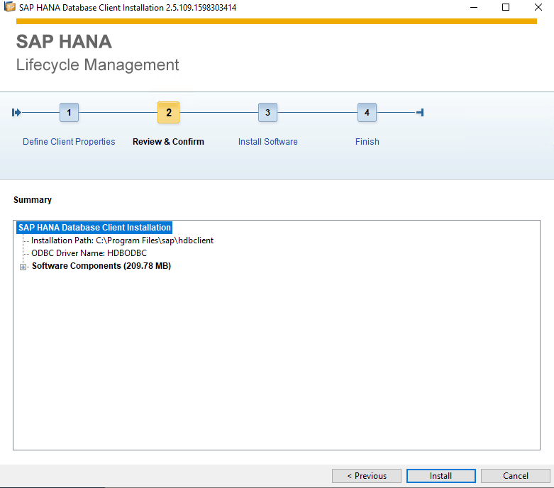

1.  Wait for the installation to complete and select **Finish**.

1.  Within the Remote Desktop session to the Windows Server jumpbox Azure VM **hanav2jmp-vm0**, start **Command Prompt**. 

1.  Within the Remote Desktop session to the Windows Server jumpbox Azure VM **hanav2jmp-vm0**, in the **Command Prompt** window, run the following to connect the newly installed SAP HANA Client 2.0 to the active HANA instance via the load balancer:

    ```cmd
    cd C:\Program Files\sap\hdbclient
    hdbsql -n hdbha:30013 -d systemdb -u SYSTEM -p Manager1    
    ```

    > **Note**: Make sure not to include the `-e` switch since this will result in an untrusted certificate-related error **-10709: Connection failed (RTE:[300015] SSL certificate validation failed: The certificate chain was issued by an authority that is not trusted.**

    > **Note**: You should see the output similar to the following:

    ```
    Welcome to the SAP HANA Database interactive terminal.

    Type:  \h for help with commands
           \q to quit

    hdbsql SYSTEMDB=>
    ```

1.  At the `hdbsql SYSTEMDB=>` prompt, type `\s` and press the **Enter** key to display the local SYSTEMDB information 

    > **Note**: You should see the output similar to the following:

    ```
    hdbsql SYSTEMDB=> \s
    host          : hdbha:30013
    sid           : HN1
    dbname        : SYSTEMDB
    user          : SYSTEM
    kernel version: 2.00.050.00.1592305219
    SQLDBC version:        libSQLDBCHDB 2.05.109.1598303414
    autocommit    : ON
    locale        : English_United States.1252
    input encoding: UTF8
    sql port      : hdb1-0:30013
    ```

    > **Note**: Review the output, including the **sql port** entry, which allows you to identify the target HANA instance. You will use this method to verify connectivity to HANA in the subsequent tasks of this exercise.


### Task 5: Test failover of the clustered resources

1.  Within the Remote Desktop session to **hanav2jmp-vm0** Azure VM, in the Internet Explorer window displaying the **SUSE Hawk** page, from the **msl\_SAPHana\_HN1\_HDB01** pane, verify that **hdb1-0** is currently serving the master role. Then close the **msl\_SAPHana\_HN1\_HDB01** pane.

    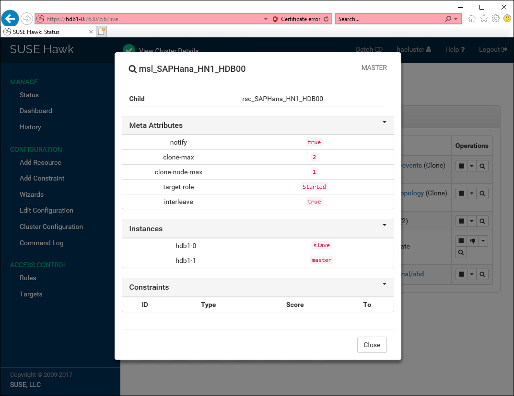

1.  Switch to the SSH session to **hb1-0** and run the following to stop the Pacemaker Cluster Resource Manager monitor on the first cluster node:

    ```sh
    sudo service pacemaker stop
    ```

1.  Switch back to the Remote Desktop session to the **hanav2jmp-vm0** Azure VM and, in the Internet Explorer window displaying the **SUSE Hawk** page connected to **https://hdb1-1:7630**, observe how the status of the resource changes first to a question mark and then to a blue dot.

    

    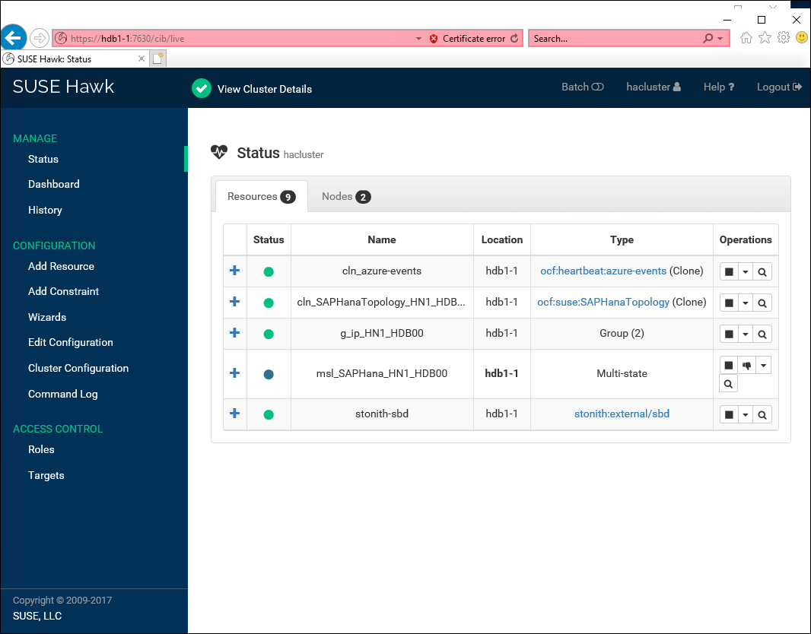

    > **Note**: You might need to wait a few minutes before the operational state stabilizes.

1.  Switch to the **Command Prompt** window and, at the `hdbsql SYSTEMDB=>` prompt, type `\s` and press the **Enter** key to display the local SYSTEMDB information 

    > **Note**: You should see the output similar to the following:

    ```
    hdbsql SYSTEMDB=> \s
    host          : hdbha:30013
    sid           : HN1
    dbname        : SYSTEMDB
    user          : SYSTEM
    kernel version: 2.00.050.00.1592305219
    SQLDBC version:        libSQLDBCHDB 2.05.109.1598303414
    autocommit    : ON
    locale        : English_United States.1252
    input encoding: UTF8
    sql port      : hdb1-1:30013
    ```

    > **Note**: Review the output, including the **sql port** entry, which allows you to identify the target HANA instance. Verify that it includes the reference to **hdb1-1**.

1.  Switch to the SSH session to the **hdb1-1** Azure VM, run the following to switch to the security context of the **\<sid\>adm** account and, when prompted for its password, type **Help4you**:

    ```sh
    su - hn1adm
    ```

1.  Within the SSH session to the **hdb1-1** Azure VM, run the following to open the **xscontroller.ini** file for editing:

    ```sh
    vi /hana/shared/HN1/global/hdb/custom/config/xscontroller.ini
    ```

    > **Note**: You can use any Linux editor based on your preferences.

1.  Within the editor interface, update the value of the **api_url** parameter to reference the **hdb1-1** cluster node and close the file, saving your changes. 

    > **Note**: The entry you edit should reseble the following (the domain name will be different):

    ```sh
    api_url = https://hdb1-1.fyz5ci1dm3lurnjzgn2dsvpb0g.bx.internal.cloudapp.net:30030
    ```

1.  Within the SSH session to the **hdb1-1** Azure VM, run the following to reset the certificate for the controller API. 

    ```sh
    cd /hana/shared/HN1/xs/bin    
    XSA reset-certificate
    ```

    > **Note**: For details regarding this procedure, refer to [SAP Note #2243019](https://launchpad.support.sap.com/#/notes/2243019)

1.  Within the SSH session to the **hdb1-1** Azure VM, run the following to sign in to the locally installed SAP HANA XS Advanced environment (when prompted, provide the password **Manager1** for the **XSA_ADMIN** user):

    ```sh
    ./xs-admin-login
    ```

1.  From the **hn1adm@hdb1-0:/hana/shared/HN1/xs/bin\>** prompt, run the following to identify the URL of XSA Cockpit:

    ```sh
    xs apps | grep xsa-cockpit
    ```

    > **Note**: The output should resemble the following (the domain name will be different):

    ```sh
    xsa-cockpit                   STARTED           1/1         512 MB    <unlimited>   https://hdb1-1.fyz5ci1dm3lurnjzgn2dsvpb0g.bx.internal.cloudapp.net:51025
    ```

    > **Note**: Take the note of the URL designating the access point of xsa-cockpit. You will need it next.

1.  Switch back to the Remote Desktop session to the **hanav2jmp-vm0** Azure VM and, start Internet Explorer, and navigate to the XSA Cockpit URL you identified in the previous step. 

1.  Disregard the **This site is not secure** error message, select **More information**, and then select **Go on to the webpage (not recommended)**. 

1.  On the **SAP HANA XS Advanced** page, sign in as **XSA_ADMIN** with the password **Manager1**.

1.  Once you signed in, on the **XSA Host: Home - Organizations** page, select **User management** and verify that the list of users on **XSA Host: Home - User Management** page includes the user account you created in the previous task.

    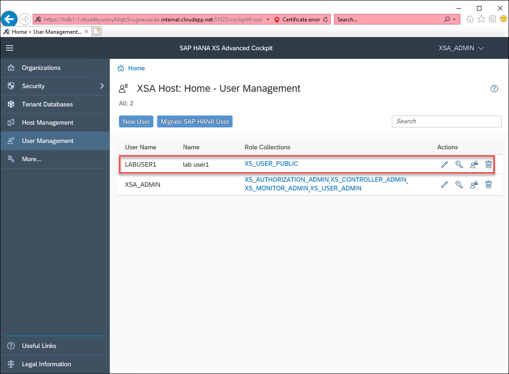

1.  Switch to the SSH session to the **hb1-0** Azure VM and run the following to start the Pacemaker Cluster Resource Manager monitor on the first cluster node:

    ```sh
    sudo service pacemaker start
    ```

1.  Switch back to the Remote Desktop session to **hanav2jmp-vm0** Azure VM, review the **SUSE Hawk Status** page at **https://hdb1-1:7630**, and observe how the status of some of the clustered resources is changing to include references to both hdb1-0 and hdb1-1:

    > **Note**: The **msl_SAPHana_HN1_HDB00** resource does not automatically add **hdb1-0** as the passive node, as indicated by the error message. This is expected, since the **AUTOMATED_REGISTER** parameter of the resource is set to **false**. The **AUTOMATED_REGISTER** parameter defines, whether a former primary instance should be registered automatically by the resource agent during cluster or resource start.

    

1.  Within the SSH session to the **hdb1-0** Azure VM, run the following to switch to the security context of the **\<sid\>adm** account and, when prompted for its password, type **Help4you**:

    ```sh
    su - hn1adm
    ```

1.  Within the SSH session to the **hdb1-0** Azure VM, run the following to ensure that the HANA instance is stopped:

    ```sh
    sapcontrol -nr 00 -function StopWait 600 10
    ```

1.  Within the SSH session to the **hdb1-0** Azure VM, run the following to re-configure the local HANA instance as secondary:

    ```sh
    hdbnsutil -sr_register --remoteHost=hdb1-1 --remoteInstance=00 --replicationMode=sync --name=SITE1 
    ```

1.  Within the SSH session to the **hdb1-0** Azure VM, run the following to switch back to root context and clean up the failed state:

    ```sh
    exit
    sudo crm resource cleanup msl_SAPHana_HN1_HDB00 hdb1-0
    ```

1.  Switch back to the Remote Desktop session to **hanav2jmp-vm0** Azure VM, review the **SUSE Hawk Status** page at **https://hdb1-1:7630**, and observe how the **SAPHana** clustered resource status is changing to operational on both hdb1-0 and hdb1-1 with the latter as the primary (you might need to wait a few minutes for the interface to refresh):

    


### Task 6: Test fencing of the clustered resources

1.  Within the Remote Desktop session to **hanav2jmp-vm0** Azure VM, in the Internet Explorer window displaying the Azure portal, search for and select the **Virtual machines** entry, on the **Virtual machines** blade, select the entry representing the **hdb1-1** Azure VM hosting the currently active HANA instance, in the toolbar, select **Stop** and, when prompted for confirmation, select **Yes**. 

1.  Within the Remote Desktop session to **hanav2jmp-vm0** Azure VM, switch to the Internet Explorer window displaying the **SUSE Hawk Status** page at **https://hdb1-0:7630**, wait until the status of the **msl_SAPHana_HN1_HDB01** resource in the Internet Explorer window displaying connection to **https://hdb1-0:7630** changes from a question mark to a blue dot, and verify that its location changed to **hdb1-1**.

    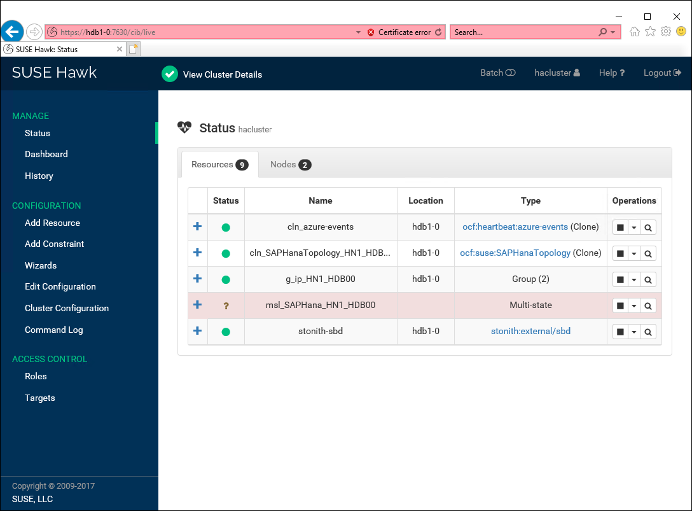

    

1.  Within the Remote Desktop session to **hanav2jmp-vm0** Azure VM, switch to the **Command Prompt** window and, at the `hdbsql SYSTEMDB=>` prompt, type `\s` and press the **Enter** key to display the local SYSTEMDB information 

    > **Note**: You should see the output similar to the following:

    ```
    hdbsql SYSTEMDB=> \s
    host          : hdbha:30013
    sid           : HN1
    dbname        : SYSTEMDB
    user          : SYSTEM
    kernel version: 2.00.050.00.1592305219
    SQLDBC version:        libSQLDBCHDB 2.05.109.1598303414
    autocommit    : ON
    locale        : English_United States.1252
    input encoding: UTF8
    sql port      : hdb1-0:30013
    ```

    > **Note**: Review the output, including the **sql port** entry, which allows you to identify the target HANA instance. Verify that it includes the reference to **hdb1-0**.

1.  Switch to the lab computer, in the Azure portal, on the **Virtual machines** blade, select the entry representing the **hdb1-1** Azure VM, in the toolbar, select **Start** and, when prompted for confirmation, select **Yes**. 

    > **Note**: The **msl_SAPHana_HN1_HDB00** resource does not automatically add **hdb1-1** as the passive node. This is expected, since the **AUTOMATED_REGISTER** parameter of the resource is set to **false**. 

1.  Wait until the **hdb1-1** Azure VM is running, switch to the duplicate SSH session and run the following to connect to that Azure VM via its private IP address:

    ```sh
    ssh azureadm@10.101.1.11
    ```

1.  Within the SSH session to the **hdb1-1** Azure VM, run the following to switch to the security context of the **\<sid\>adm** account and, when prompted for its password, type **Help4you**:

    ```sh
    su - hn1adm
    ```

1.  Within the SSH session to the **hdb1-0** Azure VM, run the following to ensure that the HANA instance is stopped:

    ```sh
    sapcontrol -nr 00 -function StopWait 600 10
    ```

1.  Within the SSH session to the **hdb1-0** Azure VM, run the following to re-configure the local HANA instance as secondary

    ```sh
    hdbnsutil -sr_register --remoteHost=hdb1-0 --remoteInstance=00 --replicationMode=sync --name=SITE2
    ```

1.  Within the SSH session to the **hdb1-0** Azure VM, run the following to switch back to root context and clean up the failed state:

    ```sh
    exit
    sudo crm resource cleanup msl_SAPHana_HN1_HDB00 hdb1-1
    ```

1.  Switch back to the Remote Desktop session to **hanav2jmp-vm0** Azure VM and, on the **SUSE Hawk Status** page at **https://hdb1-0:7630** note that the **SAPHana** clustered resource is operational on both hdb1-0 and hdb1-1 with hdb1-1 as the primary (you might need to wait a few minutes for the interface to refresh and transition from a question mark to a blue dot displayed next to the msl_SAPHana_HN1_HDB00 resource):

    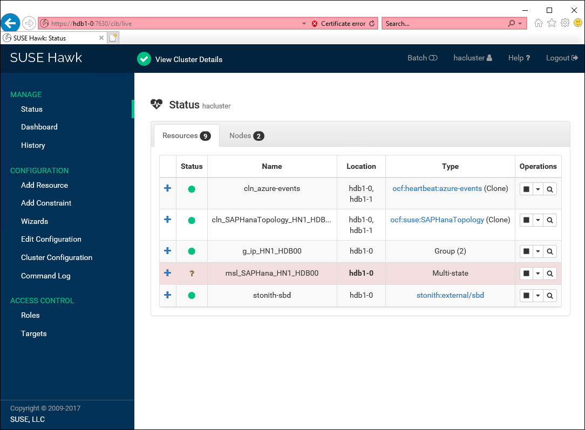

    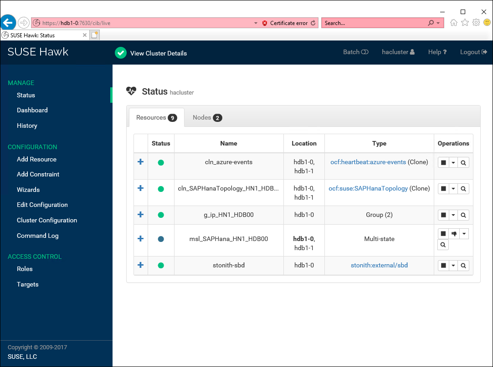


### Task 7: Test migration of the clustered resources

1.  Within the Remote Desktop session to **hanav2jmp-vm0** Azure VM, switch to the Internet Explorer window displaying the **SUSE Hawk Status** page at **https://hdb1-1:7630**.

    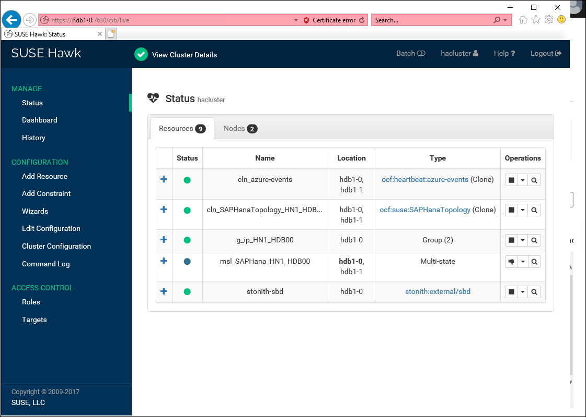

1.  From the **SUSE Hawk Status** page at **https://hdb1-1:7630**, select the **Migrate** option of the **SAPHana** clustered resource.

    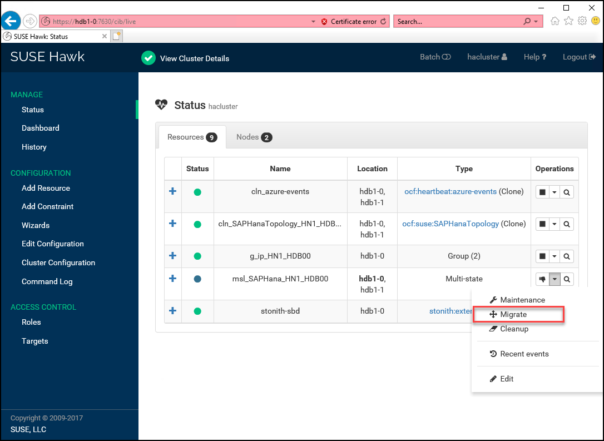

1.  From the **SUSE Hawk Status** page at **https://hdb1-1:7630**, select the **hdb1-1** node as the migration target.

    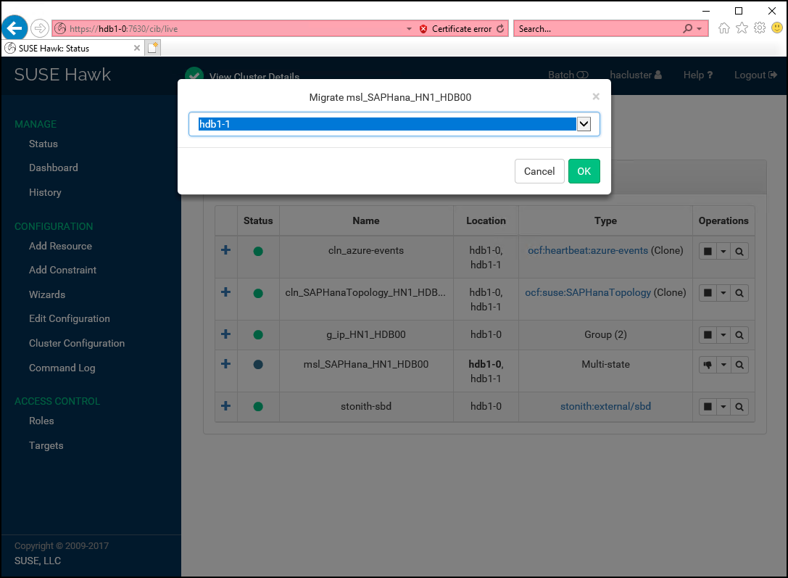

1.  On the **SUSE Hawk Status** page, note that the status of **SAPHana** clustered resource is listed with a question mark, which subsequently turns into a blue dot, and chain link icons representing constraints. 

    

    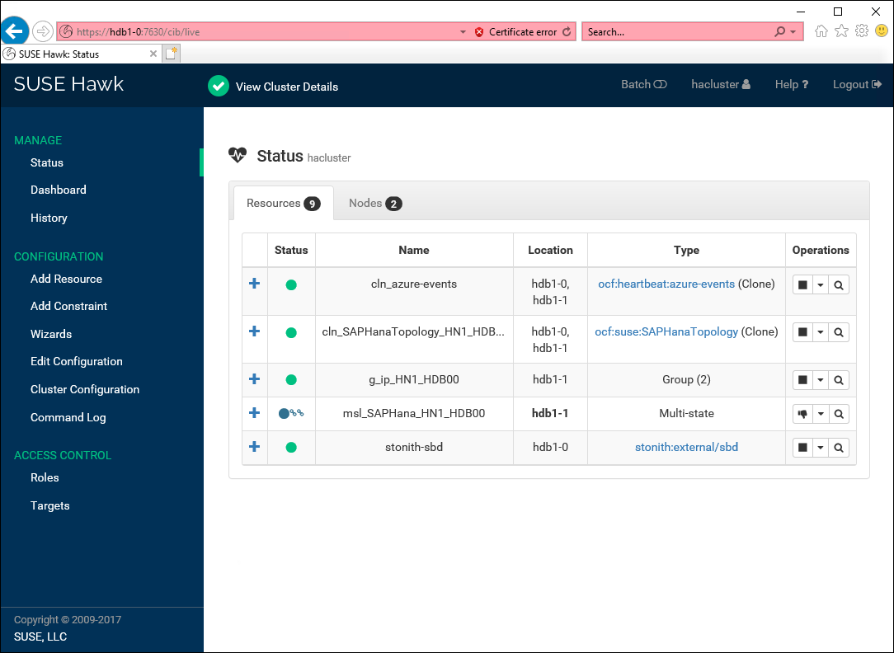

1.  Switch to the **Command Prompt** window and, at the `hdbsql SYSTEMDB=>` prompt, type `\s` and press the **Enter** key to display the local SYSTEMDB information 

    > **Note**: You should see the output similar to the following:

    ```
    hdbsql SYSTEMDB=> \s
    host          : hdbha:30013
    sid           : HN1
    dbname        : SYSTEMDB
    user          : SYSTEM
    kernel version: 2.00.050.00.1592305219
    SQLDBC version:        libSQLDBCHDB 2.05.109.1598303414
    autocommit    : ON
    locale        : English_United States.1252
    input encoding: UTF8
    sql port      : hdb1-1:30013
    ```

    > **Note**: Review the output, including the **sql port** entry, which allows you to identify the target HANA instance. Verify that it includes the reference to **hdb1-1**.

    > **Note**: At this point, the **msl_SAPHana_HN1_HDB00** resource uses only a single-node (**hdb1-1**). To allow failback to **hdb1-0**, you need to first remove the constraints that were generated automatically when you initiated the migration task. 

1.  To remove constraints, use the vertical menu on the left-hand side of the **SUSE Hawk Status** to switch to the **Edit Configuration** page and display its **Constraints** tab. 

    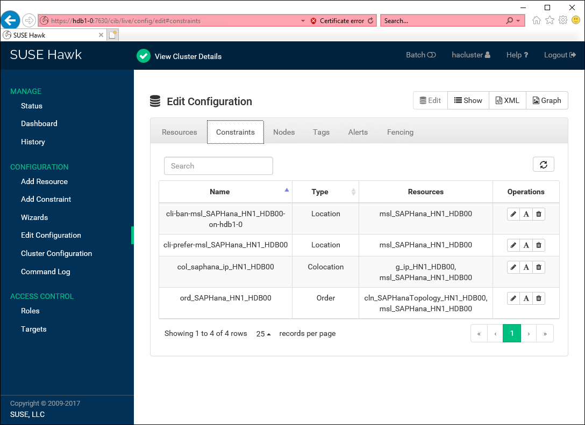

    > **Note**: Ban and prefer location constraints are generated automatically during migration operation in order to prevent unintended failback to the original cluster node. However, such constraints should be removed once the original node is available to host cluster resources. 

    > **Note**: Make sure not to accidentally remove other constraints.  
    
1.  From the **Constraints** page, delete the **cli-ban-msl\_SAPHana\_HN1\_HDB00-on-hdb1-0** Location constraint.

    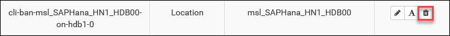

1.  From the **Constraints** page, delete the **cli-prefer-msl\_SAPHana\_HN1\_HDB00** Location constraint.

    

1.  Switch back to the **SUSE Hawk Status** page at **https://hdb1-0:7630**, and note that the icons representing constraints are no longer present, however, the console displays an error message indicating a failure of the start operation for resource rsc_SAPHana_HN1_HDB00 on node hdb1-0. 

    > **Note**: The **msl_SAPHana_HN1_HDB00** resource does not automatically add **hdb1-0** as the passive node, as indicated by the error message. This is expected, since the **AUTOMATED_REGISTER** parameter of the resource is set to **false**. 

    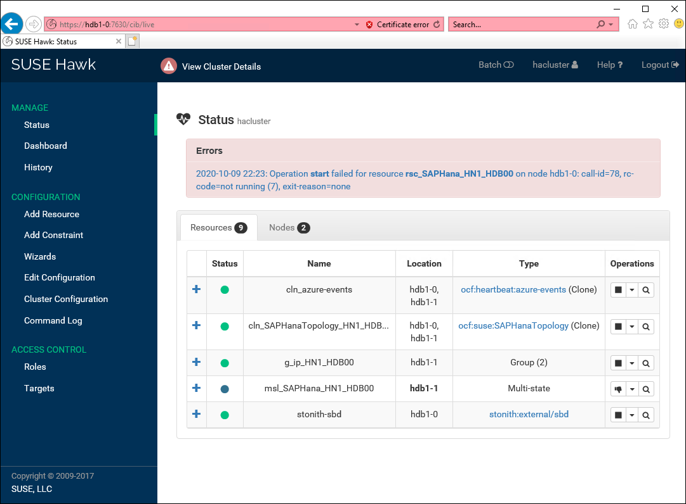

1.  Switch to the SSH session to the **hdb1-0** Azure VM, run the following to switch to the security context of the **\<sid\>adm** account and, when prompted for its password, type **Help4you**:

    ```sh
    su - hn1adm
    ```

1.  Within the SSH session to the **hdb1-0** Azure VM, run the following to ensure that the HANA instance is stopped:

    ```sh
    sapcontrol -nr 00 -function StopWait 600 10
    ```

1.  Within the SSH session to the **hdb1-0** Azure VM, run the following to re-configure the local HANA instance as secondary

    ```sh
    hdbnsutil -sr_register --remoteHost=hdb1-1 --remoteInstance=00 --replicationMode=sync --name=SITE1
    ```

1.  Within the SSH session to the **hdb1-0** Azure VM, run the following to switch back to root context and clean up the failed state:

    ```sh
    exit
    sudo crm resource cleanup msl_SAPHana_HN1_HDB00 hdb1-0
    ```
   
1.  Switch to the **SUSE Hawk Status** page, and verify that the status indicator of the **SAPHana** clustered resource changed initially to a question mark and then to a blue dot, with hdb1-0 as the master (you might need to wait a few minutes for the interface to refresh).

    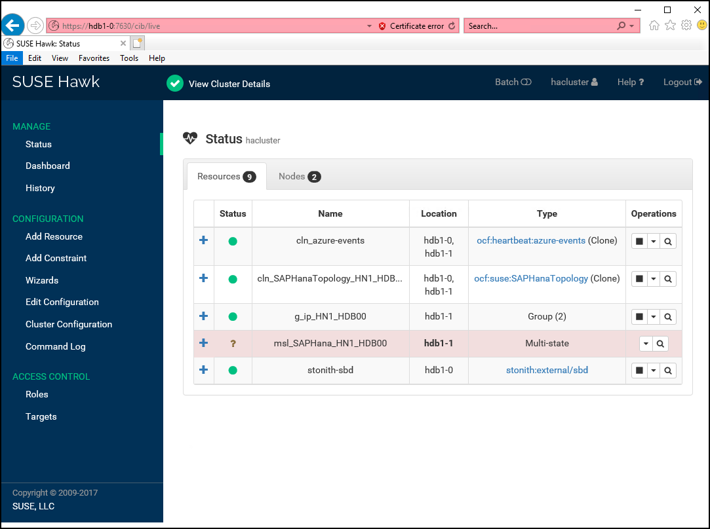

1.  Switch to the **SUSE Hawk Status** page, and verify the **SAPHana** clustered resource is operational on both nodes with hdb1-0 as the master (you might need to wait a few minutes for the interface to refresh).

    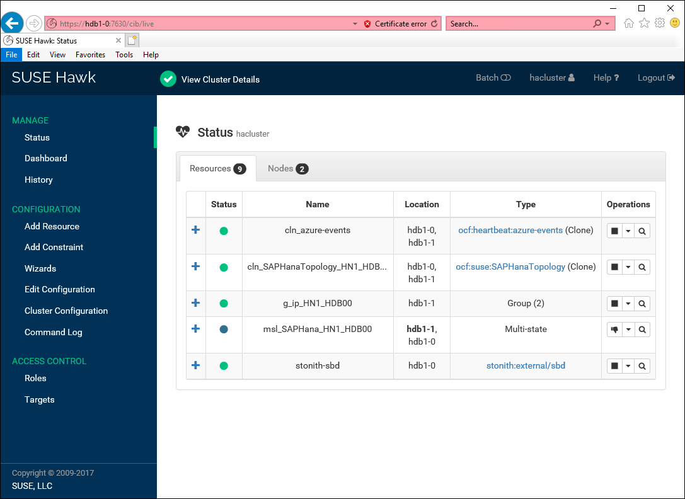


### Task 8: Test fencing of the clustered resources with the AUTOMATED_REGISTER parameter enabled

> **Note**: The parameter AUTOMATED_REGISTER defines, whether a former primary instance shouldbe registered automatically by the resource agent during cluster/resource start

1.  Within the Remote Desktop session to **hanav2jmp-vm0** Azure VM, in the Internet Explorer window displaying the **SUSE Hawk Status** page at **https://hdb1-0:7630**, select **Edit Configuration**. 

    

1.  On the **SUSE Hawk** **Edit Configuration** page **https://hdb1-0:7630**, scroll down to the **rsc_SAPHana_HN1_HDB00** clustered resource and select the edit icon (**pencil**) at the right end of its entry.

    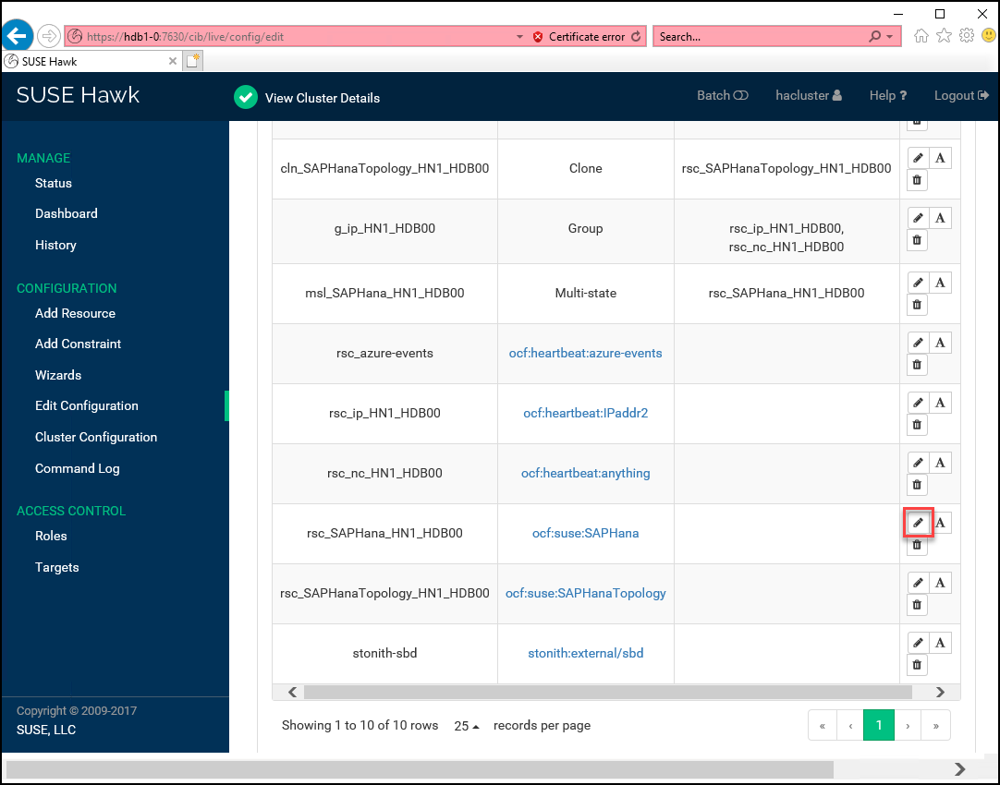

1.  On the **SUSE Hawk** **Edit Primitive** page **https://hdb1-0:7630**, select **Yes** in the **AUTOMATED_REGISTER** drop-down list.

    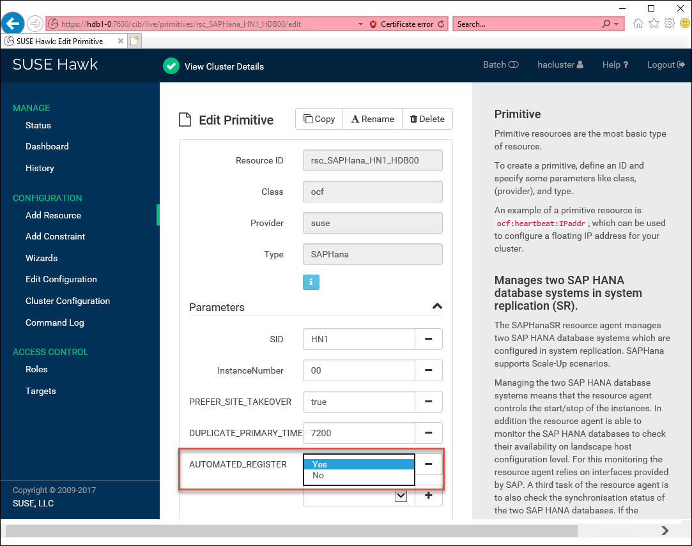

1.  On the **SUSE Hawk** **Edit Primitive** page **https://hdb1-0:7630**, scroll down to the bottom of the page and select **Apply**.

    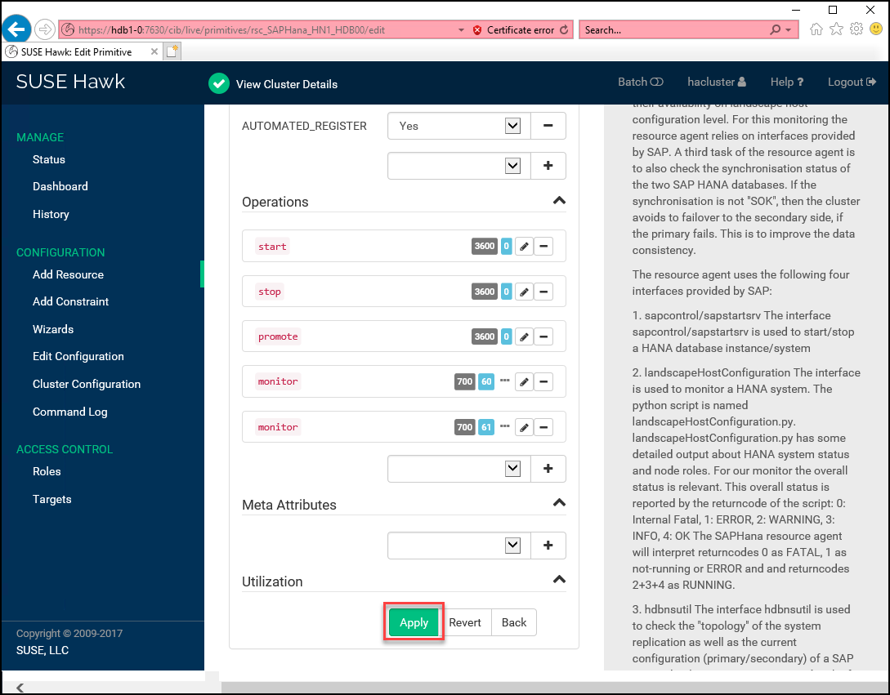

1.  Within the Remote Desktop session to **hanav2jmp-vm0** Azure VM, in the Internet Explorer window displaying the **SUSE Hawk Status** page at **https://hdb1-0:7630**, select **Status** to display the list of resources and their status. 

    

1.  Within the Remote Desktop session to **hanav2jmp-vm0** Azure VM, in the Internet Explorer window displaying the Azure portal, search for and select the **Virtual machines** entry, on the **Virtual machines** blade, select the entry representing the **hdb1-1** Azure VM hosting the currently active HANA instance, in the toolbar, select **Stop** and, when prompted for confirmation, select **Yes**. 

1.  Within the Remote Desktop session to **hanav2jmp-vm0** Azure VM, switch to the Internet Explorer window displaying the **SUSE Hawk Status** page at **https://hdb1-0:7630**, wait until the status of the **msl_SAPHana_HN1_HDB01** resource in the Internet Explorer window displaying connection to **https://hdb1-0:7630** changes from a question mark to a blue dot, and verify that its location changed to **hdb1-0**.

    

1.  Switch to the lab computer, in the Azure portal, on the **Virtual machines** blade, select the entry representing the **hdb1-1** Azure VM, in the toolbar, select **Start** and, when prompted for confirmation, select **Yes**. 

1.  Switch back to the Remote Desktop session to **hanav2jmp-vm0** Azure VM and, on the **SUSE Hawk Status** page at **https://hdb1-0:7630** note that the **SAPHana** clustered resource is operational on both hdb1-0 and hdb1-1 with hdb1-1 as the primary (you might need to wait a few minutes for the interface to refresh and transition from a question mark to a blue dot displayed next to the msl_SAPHana_HN1_HDB00 resource):

    > **Note**: Pacemaker automatically adds **hdb1-1** as the passive node of the **msl_SAPHana_HN1_HDB00** resource. This is expected, since the **AUTOMATED_REGISTER** parameter of the resource is now set to **true**. 

    > **Note**: You might need to wait a few minutes for the change to be reflected in the SUSE Hawk interface.

    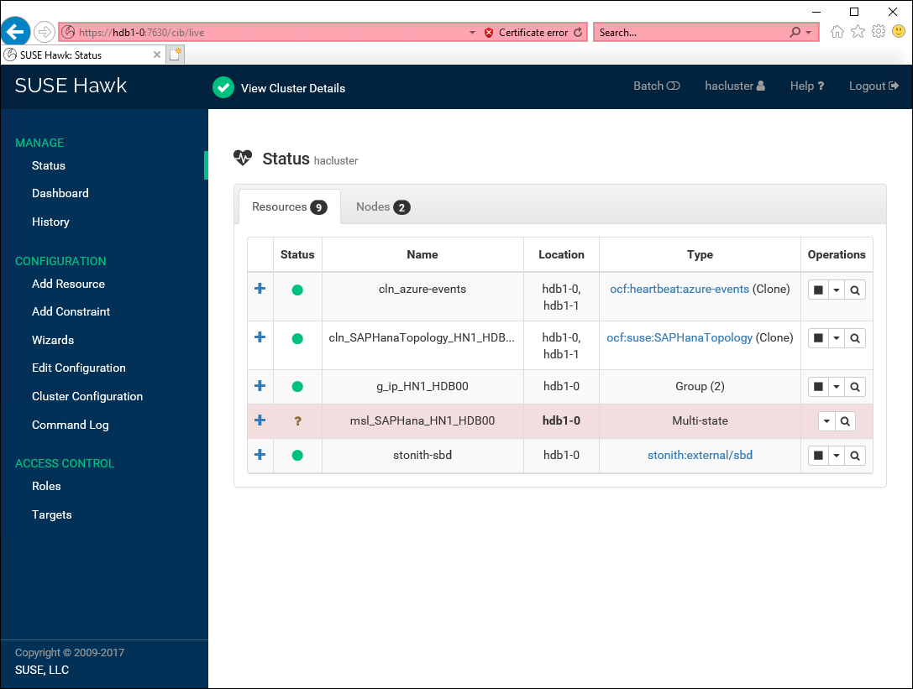

    


## After the Hands-on lab 

Duration: 5 minutes

After completing the hands-on lab, remove the resource group and any remaining resources.

### Task 1: Remove the resource group containing all Azure resources deployed in this lab

1.  From the lab computer, in [the Azure portal](http://portal.azure.com) , select the **Cloud Shell** icon.

1.  If prompted, in the **Welcome to Azure Cloud Shell** window, select **Bash (Linux)**.

1.  In the **Bash** session in the **Cloud Shell** pane, run the following to select the Azure subscription in which you will provision the Azure resources in this lab (replace the `[subscription_ID]` placeholder with the value of the subscriptionID parameter of the Azure subscription you used in this lab):

    ```sh
    az account set --subscription '[subscription_ID]'
    ```

1.  In the **Bash** session in the **Cloud Shell** pane, run the following to delete all resource groups and their resources that you provisioned in this lab:

    ```sh
    if [ az group exists --name hanav2-sn-RG ]
    then
         az group delete --name hanav2-sn-RG --no-wait --yes
    fi
    az group delete --name hanav2-sn-RG --no-wait --yes
    az group delete --name mcw-hana-on-azure-cli-RG --no-wait --yes
    ```

You should follow all steps provided *after* attending the Hands-on lab.
