

<div class="MCWHeader1">
SAP HANA on Azure
</div>

<div class="MCWHeader2">
Hands-on lab step-by-step
</div>

<div class="MCWHeader3">
May 2020
</div>


Information in this document, including URL and other Internet Web site references, is subject to change without notice. Unless otherwise noted, the example companies, organizations, products, domain names, e-mail addresses, logos, people, places, and events depicted herein are fictitious, and no association with any real company, organization, product, domain name, e-mail address, logo, person, place or event is intended or should be inferred. Complying with all applicable copyright laws is the responsibility of the user. Without limiting the rights under copyright, no part of this document may be reproduced, stored in or introduced into a retrieval system, or transmitted in any form or by any means (electronic, mechanical, photocopying, recording, or otherwise), or for any purpose, without the express written permission of Microsoft Corporation.

Microsoft may have patents, patent applications, trademarks, copyrights, or other intellectual property rights covering subject matter in this document. Except as expressly provided in any written license agreement from Microsoft, the furnishing of this document does not give you any license to these patents, trademarks, copyrights, or other intellectual property.

The names of manufacturers, products, or URLs are provided for informational purposes only and Microsoft makes no representations and warranties, either expressed, implied, or statutory, regarding these manufacturers or the use of the products with any Microsoft technologies. The inclusion of a manufacturer or product does not imply endorsement of Microsoft of the manufacturer or product. Links may be provided to third party sites. Such sites are not under the control of Microsoft and Microsoft is not responsible for the contents of any linked site or any link contained in a linked site, or any changes or updates to such sites. Microsoft is not responsible for webcasting or any other form of transmission received from any linked site. Microsoft is providing these links to you only as a convenience, and the inclusion of any link does not imply endorsement of Microsoft of the site or the products contained therein.

© 2019 Microsoft Corporation. All rights reserved.

Microsoft and the trademarks listed at https://www.microsoft.com/en-us/legal/intellectualproperty/Trademarks/Usage/General.aspx are trademarks of the Microsoft group of companies. All other trademarks are property of their respective owners.

**Contents**

<!-- TOC -->

- [SAP HANA on Azure hands-on lab step-by-step](#sap-hana-on-azure-hands-on-lab-step-by-step)
    - [Abstract and learning objectives](#abstract-and-learning-objectives)
    - [Overview](#overview)
    - [Solution architecture](#solution-architecture)
    - [Requirements](#requirements)
    - [Help references](#help-references)
    - [Exercise 1: Deploy a single node HANA instance by using Terraform and Ansible](#exercise-1-deploy-a-single-node-hana-instance-by-using-terraform-and-ansible)
        - [Task 1: Upload media files to Azure Storage](#task-1-upload-media-files-to-azure-storage)
        - [Task 2: Prepare for a single node HANA deployment](#task-2-prepare-for-a-single-node-hana-deployment)
        - [Task 3: Perform the single node HANA deployment](#task-3-perform-the-single-node-hana-deployment)
    - [Exercise 2: Validate and remove the single node HANA deployment](#exercise-2-validate-and-remove-the-single-node-hana-deployment)
        - [Task 1: Connect to the single node HANA instance by using SAP HANA Studio](#task-1-connect-to-the-single-node-hana-instance-by-using-sap-hana-studio)
        - [Task 2: Remove the single node HANA deployment](#task-2-remove-the-single-node-hana-deployment)
    - [Exercise 3: Deploy highly-available HANA instances by using Terraform and Ansible](#exercise-3-deploy-highly-available-hana-instances-by-using-terraform-and-ansible)
        - [Task 1: Prepare for a highly-available HANA deployment](#task-1-prepare-for-a-highly-available-hana-deployment)
        - [Task 2: Perform the highly-available HANA deployment](#task-2-perform-the-highly-available-hana-deployment)
    - [Exercise 4: Validate and remove the deployment of the highly-available HANA instances](#exercise-4-validate-and-remove-the-deployment-of-the-highly-available-hana-instances)
        - [Task 1: Connect to the highly-available HANA instances by using SAP HANA Studio](#task-1-connect-to-the-highly-available-hana-instances-by-using-sap-hana-studio)
        - [Task 2: Connect to the highly-available HANA instances by using Hawk](#task-2-connect-to-the-highly-available-hana-instances-by-using-hawk)
        - [Task 3: Test a failover](#task-3-test-a-failover)
        - [Task 4: Test a migration](#task-4-test-a-migration)
        - [Task 5: Test fencing](#task-5-test-fencing)
        - [Task 6: Remove the highly-available HANA deployment](#task-6-remove-the-highly-available-hana-deployment)
    - [After the Hands-on lab](#after-the-hands-on-lab)


<!-- /TOC -->

# SAP HANA on Azure hands-on lab step-by-step

## Abstract and learning objectives 

In this hands-on lab, you will step through the implementation of a single node and highly available SAP HANA deployments on Microsoft Azure virtual machines running SUSE Linux Enterprise Server. 

After its completion, you will be able to perform single node and highly available SAP HANA deployments by using Terraform and Ansible, validate both types of deployments, test failover scenarios, and remove the deployed resources.

## Overview

In this hands-on lab, you are working with Contoso to develop a process of implementing an automated deployment of single node and highly available SAP HANA instances on Azure virtual machines (VMs). Your tasks will include the preparation for the deployment process, invoking the deployment, validating the outcome of the deployment, and removal all of the deployed resources.


## Solution architecture

HANA single node deployment

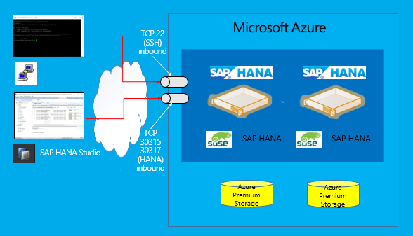

HANA highly available deployment


## Requirements

-   A Microsoft Azure subscription

-   A lab computer running Windows 10 or Windows Server 2019 with:

    -   Access to Microsoft Azure

    -   Access to the SAP HANA software (requires an SAP Online Service System account)

   > **Note**: The lab does not require locally installed software. Azure CLI and Terraform tasks are performed by using Cloud Shell in the Azure portal.

## Help references

|    |            |
|----------|:-------------:|
| **Description** | **Links** |
| Automated SAP Deployments in Azure Cloud | <https://github.com/Azure/sap-hana/> |


## Exercise 1: Deploy a single node HANA instance by using Terraform and Ansible

Duration: 90 minutes

In this exercise, you will implement a single-node deployment of SAP HANA on Azure virtual machines (VMs). Following initial configuration of Terraform-based templates, the deployment will be fully automated, including installation of all necessary SAP HANA components. 

### Task 1: Upload media files to Azure Storage

1.  From the lab computer, start a Web browser, navigate to **SAP Software Downloads** at https://launchpad.support.sap.com/#/softwarecenter/ and log on using your SAP Online Service System account.

1.  From the **SAP Software Download**, download the following software packages to the lab computer:

    -   SAPCAR 7.21 SAPCAR for Linux x86_64 (SAPCAR_1311-80000935.EXE)

    -   SAPCAR 7.21 Windows on x64 64bit (SAPCAR_1311-80000938.EXE)

    -   SAP HANA DATABASE 1.00 Linux on x86_64 64bit Maintenance Revision 122.30 (SPS12) for HANA DB 1.00 (IMDB_SERVER100_122_30-10009569.SAR)

    -   Support Package SAP HOST AGENT 7.21 SP36 Linux on x86_64 64bit (SAPHOSTAGENT36_36-20009394.SAR)

    -   SAP HANA STUDIO 2 Windows on x64 64bit Revision 122.030 for SAP HANA STUDIO 2 (IMC_STUDIO2_122_30-80000323.SAR)

    > **Note**: The packages listed above might be superseded by newer versions. If so, ensure to adjust accordingly all references to the names of these packages in this task. To find appropriate packages, you can take advantage of the search functionality of the **SAP Software Downloads** portal. Use the first part of each package (up to the first hyphen) as the search criterion and, in the search results, identify the type that matches the intended platform (either Linux x86_64 or Windows 64-bit).
    
1.  From the lab computer, start a Web browser, navigate to the Azure portal at https://portal.azure.com and sign in with credentials you will be using in this lab.

1.  In the Azure portal at <http://portal.azure.com>, start a Bash session in **Cloud Shell**.

1.  In the Cloud Shell pane, from the Bash prompt, run the following to create a resource group that will host a storage account containing media files, where the `<location>` placeholder designates the target Azure region that you intend to use for this lab (e.g. `westus2`):

    ```sh
    MEDIA_RESOURCE_GROUP_NAME='hanaMedia-RG'
    MEDIA_RESOURCE_GROUP=$(az group create --location location --name $MEDIA_RESOURCE_GROUP_NAME)
    ``` 

   > **Note**: Consider using the **westus2** Azure region for this lab. Do not use **eastus**.

1.  In the Cloud Shell pane, from the Bash prompt, run the following to generate a pseudo-random name you will assign to the storage account:

    ```sh
    MEDIA_STORAGE_ACCOUNT_NAME=hana$RANDOM$RANDOM
    ``` 

1.  In the Cloud Shell pane, from the Bash prompt, run the following to create the storage account:

    ```sh
    LOCATION=$(echo $MEDIA_RESOURCE_GROUP | jq .location -r)
    az storage account create --location $LOCATION --resource-group $MEDIA_RESOURCE_GROUP_NAME --name $MEDIA_STORAGE_ACCOUNT_NAME --kind Storage --sku Standard_LRS
    ``` 

1.  In the Cloud Shell pane, from the Bash prompt, run the following to retrieve the first key of the newly created storage account:

    ```sh
    MEDIA_STORAGE_ACCOUNT_KEY=$(az storage account keys list --account-name $MEDIA_STORAGE_ACCOUNT_NAME --resource-group $MEDIA_RESOURCE_GROUP_NAME --query '[0].[value]' --output tsv)
    ``` 

1.  In the Cloud Shell pane, from the Bash prompt, run the following to create a container named **sapbits** with the **Blob** access level in the newly created storage account:

    ```sh
    az storage container create --name sapbits --account-key $MEDIA_STORAGE_ACCOUNT_KEY --account-name $MEDIA_STORAGE_ACCOUNT_NAME --public-access blob
    ``` 

1.  In the Azure portal, navigate to the newly created storage account. On the storage account blade, select **Blobs** in the **Blob service** section, select **sapbits** entry representing the container you created in the previous step, and then, on the **sapbits** blade, select **Upload**.

1.  From the **Upload blob**, upload the HANA media files you downloaded from **SAP Software Downloads** at the beginning of this task.


### Task 2: Prepare for a single node HANA deployment

1.  If needed, in the Azure portal, restart the Cloud Shell. 

1.  In the Cloud Shell pane, from the Bash prompt, run the following to download and extract the verified version of the Terraform binary (v.0.12.2) 

    ```sh
    curl -O https://releases.hashicorp.com/terraform/0.12.2/terraform_0.12.2_linux_386.zip \
    && unzip terraform_0.12.2_linux_386.zip \
    && mkdir bin \
    && mv terraform bin/
    ```

1.  In the Cloud Shell pane, from the Bash prompt, run the following to generate the SSH key pair that will be used to secure access to Linux Azure VMs deployed in this lab:

    ```sh
    ssh-keygen -t rsa -b 2048
    ``` 

1.  When prompted to specify the location of the file in which to save the key and to specify the passphrase protecting the content of the file, press the Enter key (three times). You should see the output similar to the following:

    ```sh
    Generating public/private rsa key pair.
    Enter file in which to save the key (/home/m/.ssh/id_rsa):
    Created directory '/home/m/.ssh'.
    Enter passphrase (empty for no passphrase):
    Enter same passphrase again:
    Your identification has been saved in /home/m/.ssh/id_rsa.
    Your public key has been saved in /home/m/.ssh/id_rsa.pub.
    The key fingerprint is:
    SHA256:2gAFQbAc2QFR4miR49Hdk6zyPH7YLWvbjiINEH5WScA m@cc-87c3f8bb-f6549dcd6-8mf42
    The key's randomart image is:
    +---[RSA 2048]----+
    | .XXX== .        |
    | OoE.= =         |
    |+.B o . .        |
    |.+ + o           |
    |  + + . S        |
    |   . + +         |
    |    + = o        |
    |   . = =o.       |
    |    . ++=o       |
    +----[SHA256]-----+
    ```

1.  In the Cloud Shell pane, from the Bash prompt, run the following to create an Azure AD service principal that will be used during deployment:

    ```sh
    HANA_SP_NAME='hanav1snsp01'
    HANA_SP_ID=$(az ad sp list --display-name $HANA_SP_NAME --query "[0].appId" --output tsv)
    if ! [ -z "$HANA_SP_ID" ]
    then
        az ad sp delete --id $HANA_SP_ID
    fi
    HANA_SP=$(az ad sp create-for-rbac --name $HANA_SP_NAME)
    ``` 

1.  In the Cloud Shell pane, from the Bash prompt, run the following to set the variables that that will be used during deployment, representing, respectively, the identifier of the Azure subscription and its Azure AD tenant, as well as the application identifier and the corresponding password of the service principal you created in the previous step:

    ```sh
    export AZURE_SUBSCRIPTION_ID=$(az account show | jq -r '.id')
    export AZURE_TENANT=$(az account show | jq -r '.tenantId')
    export AZURE_CLIENT_ID=$(echo $HANA_SP | jq -r '.appId')
    export AZURE_SECRET=$(echo $HANA_SP | jq -r '.password')

    export ARM_SUBSCRIPTION_ID=$(az account show | jq -r '.id')
    export ARM_TENANT_ID=$(az account show | jq -r '.tenantId')
    export ARM_CLIENT_ID=$(echo $HANA_SP | jq -r '.appId')
    export ARM_CLIENT_SECRET=$(echo $HANA_SP | jq -r '.password')
    ``` 

1.  In the Cloud Shell pane, from the Bash prompt, run the following to clone the repository hosting the Terraform and Ansible files that you will use for deployment:

    ```sh
    rm ~/sap-hana/ -r -f
    git clone https://github.com/polichtm/sap-hana.git
    ``` 

1.  In the Cloud Shell pane, from the Bash prompt, run the following to change the current directory to the one hosting the Terraform and Ansible files that you will use for deployment:

    ```sh
    cd ~/sap-hana/deploy/vm/modules/single_node_hana/
    ``` 

1.  In the Cloud Shell pane, from the Bash prompt, run the following to retrieve the location in which you created the storage account in the previous task:

    ```sh
    MEDIA_RESOURCE_GROUP_NAME='hanaMedia-RG'
    LOCATION=$(az group show --name $MEDIA_RESOURCE_GROUP_NAME --query location --output tsv)
    ``` 

1.  In the Cloud Shell pane, from the Bash prompt, run the following to create the resource group that will host all resources deployed in this task:

    ```sh
    HANA_V1_SN_RESOURCE_GROUP_NAME='hanav1sn-RG'
    az group create --location $LOCATION --name $HANA_V1_SN_RESOURCE_GROUP_NAME
    ``` 

    > **Note**: If needed, this step can be automated as well. Terraform (as well as Azure Resource Manager) templates can be configured to create resource groups.

1.  In the Cloud Shell pane, from the Bash prompt, run the following to generate a pseudo-random name that will be used as a prefix for DNS names assigned to public IP address resources deployed in this task:

    ```sh
    DOMAIN_NAME=hanav1sn$RANDOM
    ``` 

1.  In the Cloud Shell pane, from the Bash prompt, run the following to specify the size of the Azure VM to be used to host the single node HANA instance deployed in this task:

    ```sh
    VM_SIZE='Standard_E8s_v3'
    ``` 

1.  In the Cloud Shell pane, from the Bash prompt, run the following to specify the name of the root user account for the Linux VM deployed in this task:

    ```sh
    VM_USERNAME='labuser'
    ``` 

1.  In the Cloud Shell pane, from the Bash prompt, run the following to add the values you specified to the terraform.tfvars file that contains variables used by Terraform deployment performed in this task:

    ```sh
    sed -i "s/VAR_RESOURCE_GROUP/$HANA_V1_SN_RESOURCE_GROUP_NAME/" ./terraform.tfvars
    sed -i "s/VAR_LOCATION/$LOCATION/" ./terraform.tfvars
    sed -i "s/VAR_DOMAIN_NAME/$DOMAIN_NAME/" ./terraform.tfvars
    sed -i "s/VAR_VM_SIZE/$VM_SIZE/" ./terraform.tfvars
    sed -i "s/VAR_VM_USERNAME/$VM_USERNAME/" ./terraform.tfvars
    ```

1.  In the Cloud Shell pane, from the Bash prompt, run the following to identify the name of the storage account containing the media files, which you configured and populated in the previous task of this exercise:

    ```sh
    STORAGE_ACCOUNT_NAME=$(az storage account list --resource-group $MEDIA_RESOURCE_GROUP_NAME --query "[?starts_with(name,'hana')].[name]" --output tsv)
    ```

1.  In the Cloud Shell pane, from the Bash prompt, run the following to specify the names of the software packages you uploaded to the storage account in the previous task of this exercise:

    ```sh
    SAPCAR_LINUX_NAME='SAPCAR_1311-80000935.EXE'
    SAPCAR_WINDOWS_NAME='SAPCAR_1311-80000938.EXE'
    HDBSERVER_NAME='IMDB_SERVER100_122_30-10009569.SAR'
    SAP_HOST_AGENT_NAME='SAPHOSTAGENT36_36-20009394.SAR'
    HANA_STUDIO_WINDOWS_NAME='IMC_STUDIO2_122_30-80000323.SAR'
    ```

    > **Note**: The packages listed above might be superseded by newer versions. If so, ensure to adjust accordingly the names of these packages. 

1.  In the Cloud Shell pane, from the Bash prompt, run the following to add the values you specified to the terraform.tfvars file that contains variables used by Terraform deployment performed in this task:

    ```sh
    SAPCAR_LINUX_URL='https://'$STORAGE_ACCOUNT_NAME'.blob.core.windows.net/sapbits/'$SAPCAR_LINUX_NAME
    SAPCAR_LINUX_URL_REGEX="$(echo $SAPCAR_LINUX_URL | sed -e 's/\\/\\\\/g; s/\//\\\//g; s/&/\\\&/g')"
    SAPCAR_WINDOWS_URL='https://'$STORAGE_ACCOUNT_NAME'.blob.core.windows.net/sapbits/'$SAPCAR_WINDOWS_NAME
    SAPCAR_WINDOWS_URL_REGEX="$(echo $SAPCAR_WINDOWS_URL | sed -e 's/\\/\\\\/g; s/\//\\\//g; s/&/\\\&/g')"
    HDBSERVER_URL='https://'$STORAGE_ACCOUNT_NAME'.blob.core.windows.net/sapbits/'$HDBSERVER_NAME
    HDBSERVER_URL_REGEX="$(echo $HDBSERVER_URL | sed -e 's/\\/\\\\/g; s/\//\\\//g; s/&/\\\&/g')"
    SAP_HOST_AGENT_URL='https://'$STORAGE_ACCOUNT_NAME'.blob.core.windows.net/sapbits/'$SAP_HOST_AGENT_NAME
    SAP_HOST_AGENT_URL_REGEX="$(echo $SAP_HOST_AGENT_URL | sed -e 's/\\/\\\\/g; s/\//\\\//g; s/&/\\\&/g')"
    HANA_STUDIO_WINDOWS_URL='https://'$STORAGE_ACCOUNT_NAME'.blob.core.windows.net/sapbits/'$HANA_STUDIO_WINDOWS_NAME
    HANA_STUDIO_WINDOWS_URL_REGEX="$(echo $HANA_STUDIO_WINDOWS_URL | sed -e 's/\\/\\\\/g; s/\//\\\//g; s/&/\\\&/g')"

    sed -i "s/VAR_SAPCAR_LINUX_URL/$SAPCAR_LINUX_URL_REGEX/" ./terraform.tfvars
    sed -i "s/VAR_SAPCAR_WINDOWS_URL/$SAPCAR_WINDOWS_URL_REGEX/" ./terraform.tfvars
    sed -i "s/VAR_HDBSERVER_URL/$HDBSERVER_URL_REGEX/" ./terraform.tfvars
    sed -i "s/VAR_HANA_STUDIO_WINDOWS_URL/$HANA_STUDIO_WINDOWS_URL_REGEX/" ./terraform.tfvars
    ```

1.  In the Cloud Shell pane, from the Bash prompt, run the following to set the values of passwords for user accounts that will be used to manage the single-node HANA instance:

    ```sh
    SAPADMUSER_PASSWORD='Lab@pa55hv1.0'
    ADMUSER_PASSWORD='Lab@pa55hv1.0'
    DBSYSTEMUSER_PASSWORD='Lab@pa55hv1.0'
    DBXSAADMIN_PASSWORD='Lab@pa55hv1.0'
    DBSYSTEMTENANTUSER_PASSWORD='Lab@pa55hv1.0'
    DBSHINEUSER_PASSWORD='Lab@pa55hv1.0'
    WINDOWS_ADMIN_PASSWORD='Lab@pa55hv1.0'
    ```

1.  In the Cloud Shell pane, from the Bash prompt, run the following to add the password values to the terraform.tfvars file that contains variables used by Terraform deployment performed in this task:

    ```sh
    sed -i "s/VAR_SAPADMUSER_PASSWORD/$SAPADMUSER_PASSWORD/" ./terraform.tfvars
    sed -i "s/VAR_ADMUSER_PASSWORD/$ADMUSER_PASSWORD/" ./terraform.tfvars
    sed -i "s/VAR_DBSYSTEMUSER_PASSWORD/$DBSYSTEMUSER_PASSWORD/" ./terraform.tfvars
    sed -i "s/VAR_DBXSAADMIN_PASSWORD/$DBXSAADMIN_PASSWORD/" ./terraform.tfvars
    sed -i "s/VAR_DBSYSTEMTENANTUSER_PASSWORD/$DBSYSTEMTENANTUSER_PASSWORD/" ./terraform.tfvars
    sed -i "s/VAR_DBSHINEUSER_PASSWORD/$DBSYSTEMTENANTUSER_PASSWORD/" ./terraform.tfvars
    sed -i "s/VAR_WINDOWS_ADMIN_PASSWORD/$WINDOWS_ADMIN_PASSWORD/" ./terraform.tfvars
    ```

### Task 3: Perform the single node HANA deployment

1.  In the Cloud Shell pane, from the Bash prompt, run the following to initialize Terraform modules and provider plugins necessary to perform Terraform-based single-node HANA deployment:

    ```sh
    ~/bin/terraform init
    ```

1.  In the Cloud Shell pane, from the Bash prompt, run the following to identify changes to be performed by the Terraform-based single-node HANA deployment:

    ```sh
    ~/bin/terraform plan
    ```

1.  In the Cloud Shell pane, from the Bash prompt, run the following to initiate Terraform-based single-node HANA deployment:

    ```sh
    ~/bin/terraform apply -auto-approve
    ```

   > **Note**: The deployment takes about 30 minutes to complete. 

   > **Note**: If your deployment fails with the error **Cannot resolve host name**, error message, the retry the deployment. This issue is a result of waagent not setting up hostname in a stable way, which is expected to be fixed in the next image release of Suse Linux Enterprise Server. For details, refer to <https://github.com/Azure/WALinuxAgent/pull/1832>.


## Exercise 2: Validate and remove the single node HANA deployment

Duration: 20 minutes

In this exercise, you will validate the single-node HANA deployment you performed in the previous exercise by using the Windows bastion host. Once you successfully validate the deployment, you will remove all of its resources.


### Task 1: Connect to the single node HANA instance by using SAP HANA Studio

1.  From the lab computer, in the Azure portal, navigate to the blade of the **hn1-win-bastion** Azure VM operating as the Windows bastion host and initiate a Remote Desktop session. When prompted, sign in with the following credentials:

    -   Username: **bastion_user**

    -   Password: **Lab\@pa55hv1.0**

    > **Note**: The user name of the Windows bastion host is set in **/deploy/vm/modules/single_node_hana/variables.tf**

1.  Within the Remote Desktop session to hn1-win-bastion, start **Notepad**, and open the **hosts** file located in **C:\\Windows\\System32\\drivers\\etc**.

1.  Add the following entries to the host file, save your changes, and close the file:

    ```sh
    10.0.0.6	hn1-hdb0        
    ```

    > **Note**: `10.0.0.6` is the private IP address assigned to the network interface of the Azure VM hosting the HANA instance.

1.  Within the Remote Desktop session, start SAP HANA Studio.

1.  When prompted to select a workspace, accept the default value, and select **Launch**.

    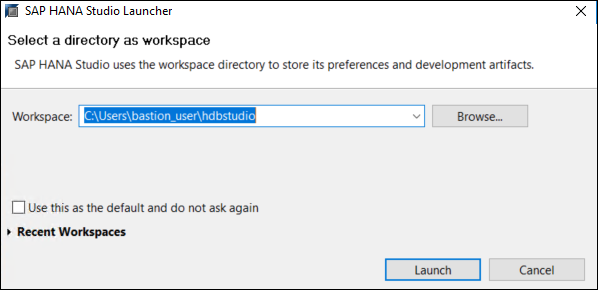

1.  When prompted to provide a password hint, select **No**.

    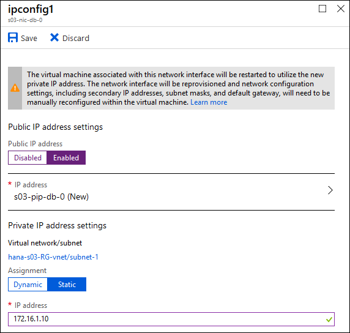

1.  On the **Overview** page, select **Open Administration Console**.

    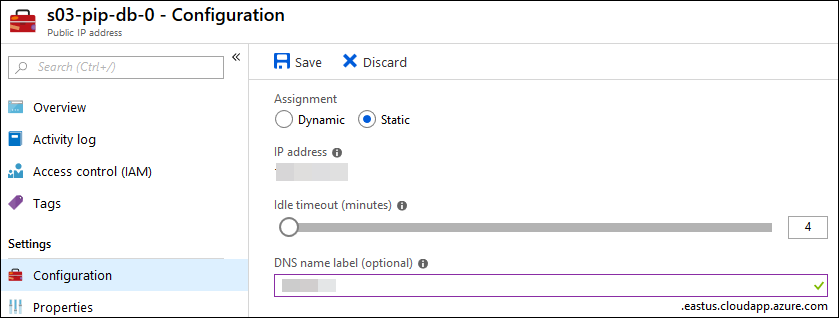

1.  In the **SAP HANA Administration Console**, expand the **Systems** menu, and select **Add System**.

    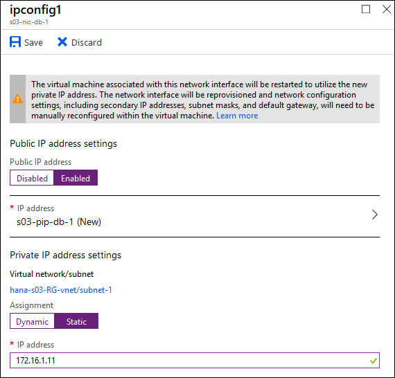

1.  In the Specify System dialog box, specify the following information, and select **Next**.

    -   Host Name: **hn1-hdb0**

    -   Instance number: **01**

        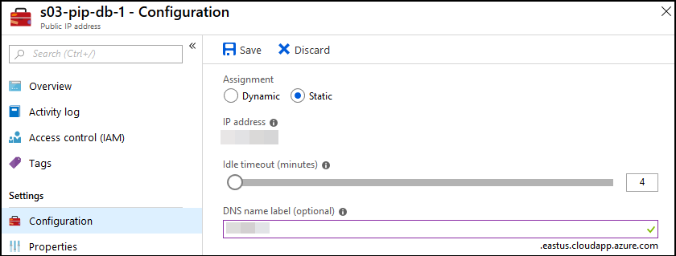

1.  In the **Connection Properties** dialog box, select the **Authentication by database user** option, specify the following information, and select **Finish**.

    -   User Name: **SYSTEM**

    -   Password: **Lab\@pa55hv1.0**

        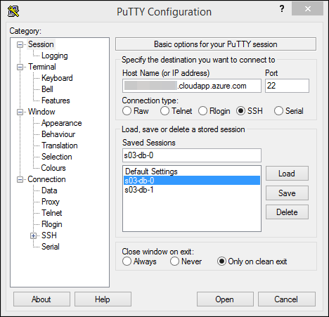

1.  Once you successfully connected to **hn1-hdb0** as **SYSTEM**, select the **HN1 (SYSTEM)** node and select the **Administration** icon in the Systems toolbar and then select **Open Default Administration**.

    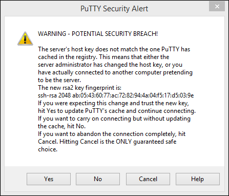

1.  Review the **Administration** status on the Overview tab and ensure that all services are started.

    

1. Switch to the **Alerts** tab, and verify they are no alerts indicating operational issues.

    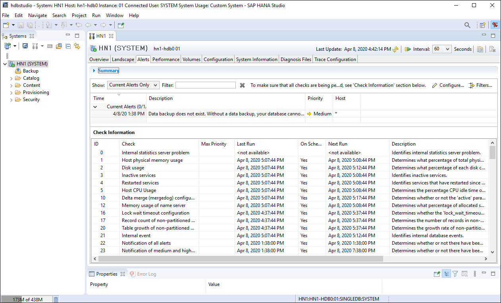


### Task 2: Remove the single node HANA deployment

1.  Switch to the lab computer and, in the Cloud Shell pane, from the Bash prompt, run the following to change the current directory to the one hosting the Terraform and Ansible files that you used for the single node HANA deployment:

    ```sh
    cd ~/sap-hana/deploy/vm/modules/single_node_hana/
    ``` 

    > **Note**: If needed, in the Azure portal, restart the Cloud Shell. 

1.  In the Cloud Shell pane, from the Bash prompt, run the following to remove all resources provisioned by Terraform-based single-node HANA deployment:

    ```sh
    terraform destroy -auto-approve
    ```

1.  When prompted, type **yes** and press the Enter key to continue with the removal of the deployed resources.

   > **Note**: Do not wait for the completion of the removal but instead proceed to the next exercise.


## Exercise 3: Deploy highly-available HANA instances by using Terraform and Ansible

Duration: 90 minutes

In this exercise, you will implement a highly-available deployment of SAP HANA on Azure virtual machines (VMs). Following initial configuration of Terraform configuration files, the deployment will be fully automated, including installation of all necessary SAP HANA components. 

You will leverage a number of artifacts that you already implemented earlier in this lab, including:

-   Terraform binaries which you uploaded into your Cloud Shell home directory in the first task of the first exercise

-   HANA software that you uploaded to an Azure Storage account in the first task of the first exercise

-   SSH key pair you generated in the second task of the first exercise


### Task 1: Prepare for a highly-available HANA deployment

1.  If needed, in the Azure portal, start the Cloud Shell. 

1.  In the Cloud Shell pane, from the Bash prompt, run the following to clone the repository hosting the Terraform and Ansible files that you will use for deployment:

    ```sh
    cd ~
    rm ~/sap-hana/ -r -f
    git clone https://github.com/polichtm/sap-hana.git
    ``` 
    
1.  In the Cloud Shell pane, from the Bash prompt, run the following to change the current directory to the one hosting the Terraform and Ansible files that you will use for deployment:

    ```sh
    cd ~/sap-hana/deploy/vm/modules/ha_pair/
    ``` 

1.  In the Cloud Shell pane, from the Bash prompt, run the following to create an Azure AD service principal that will be used during deployment:

    ```sh
    HANA_SP_NAME='hanav1hasp01'
    HANA_SP_ID=$(az ad sp list --display-name $HANA_SP_NAME --query "[0].appId" --output tsv)
    if ! [ -z "$HANA_SP_ID" ]
    then
        az ad sp delete --id $HANA_SP_ID
    fi
    HANA_SP=$(az ad sp create-for-rbac --name $HANA_SP_NAME)
    ``` 

1.  In the Cloud Shell pane, from the Bash prompt, run the following to set the variables that that will be used during deployment, representing, respectively, the identifier of the Azure subscription and its Azure AD tenant, as well as the application identifier and the corresponding password of the service principal you created in the previous step:

    ```sh
    export AZURE_SUBSCRIPTION_ID=$(az account show | jq -r '.id')
    export AZURE_TENANT=$(az account show | jq -r '.tenantId')
    export AZURE_CLIENT_ID=$(echo $HANA_SP | jq -r '.appId')
    export AZURE_SECRET=$(echo $HANA_SP | jq -r '.password')

    export ARM_SUBSCRIPTION_ID=$(az account show | jq -r '.id')
    export ARM_TENANT_ID=$(az account show | jq -r '.tenantId')
    export ARM_CLIENT_ID=$(echo $HANA_SP | jq -r '.appId')
    export ARM_CLIENT_SECRET=$(echo $HANA_SP | jq -r '.password')
    ``` 

1.  In the Cloud Shell pane, from the Bash prompt, run the following to retrieve the location in which you created the storage account in the first task of the first exercise of this lab:

    ```sh
    MEDIA_RESOURCE_GROUP_NAME='hanaMedia-RG'
    LOCATION=$(az group show --name $MEDIA_RESOURCE_GROUP_NAME --query location --output tsv)
    ``` 

1.  In the Cloud Shell pane, from the Bash prompt, run the following to create the resource group that will host all resources deployed in this task:

    ```sh
    HANA_V1_HA_RESOURCE_GROUP_NAME='hanav1ha-RG'
    az group create --location $LOCATION --name $HANA_V1_HA_RESOURCE_GROUP_NAME
    ``` 

1.  In the Cloud Shell pane, from the Bash prompt, run the following to generate a pseudo-random name that will be used as a prefix for DNS names assigned to public IP address resources deployed in this task:

    ```sh
    DOMAIN_NAME=hanav1ha$RANDOM
    ``` 

1.  In the Cloud Shell pane, from the Bash prompt, run the following to specify the size of the Azure VMs to be used to host the highly available HANA instances deployed in this task:

    ```sh
    VM_SIZE='Standard_E8s_v3'
    ``` 

1.  In the Cloud Shell pane, from the Bash prompt, run the following to specify the name of the root user account for the Linux VMs deployed in this task:

    ```sh
    VM_USERNAME='labuser'
    ``` 

1.  In the Cloud Shell pane, from the Bash prompt, run the following to add the values you specified to the terraform.tfvars file that contains variables used by Terraform deployment performed in this task:

    ```sh
    sed -i "s/VAR_RESOURCE_GROUP/$HANA_V1_HA_RESOURCE_GROUP_NAME/" ./terraform.tfvars
    sed -i "s/VAR_LOCATION/$LOCATION/" ./terraform.tfvars
    sed -i "s/VAR_DOMAIN_NAME/$DOMAIN_NAME/" ./terraform.tfvars
    sed -i "s/VAR_VM_SIZE/$VM_SIZE/" ./terraform.tfvars
    sed -i "s/VAR_VM_USERNAME/$VM_USERNAME/" ./terraform.tfvars
    ```

1.  In the Cloud Shell pane, from the Bash prompt, run the following to identify the name of the storage account containing the media files, which you configured and populated in the previous task of this exercise:

    ```sh
    STORAGE_ACCOUNT_NAME=$(az storage account list --resource-group $MEDIA_RESOURCE_GROUP_NAME --query "[?starts_with(name,'hana')].[name]" --output tsv)
    ```

1.  In the Cloud Shell pane, from the Bash prompt, run the following to specify the names of the software packages you uploaded to the storage account in the previous task of this exercise:

    ```sh
    SAPCAR_LINUX_NAME='SAPCAR_1311-80000935.EXE'
    SAPCAR_WINDOWS_NAME='SAPCAR_1311-80000938.EXE'
    HDBSERVER_NAME='IMDB_SERVER100_122_30-10009569.SAR'
    SAP_HOST_AGENT_NAME='SAPHOSTAGENT36_36-20009394.SAR'
    HANA_STUDIO_WINDOWS_NAME='IMC_STUDIO2_122_30-80000323.SAR'
    ```

    > **Note**: The packages listed above might be superseded by newer versions. If so, ensure to adjust accordingly the names of these packages. 

1.  In the Cloud Shell pane, from the Bash prompt, run the following to add the values you specified to the terraform.tfvars file that contains variables used by Terraform deployment performed in this task:

    ```sh
    SAPCAR_LINUX_URL='https://'$STORAGE_ACCOUNT_NAME'.blob.core.windows.net/sapbits/'$SAPCAR_LINUX_NAME
    SAPCAR_LINUX_URL_REGEX="$(echo $SAPCAR_LINUX_URL | sed -e 's/\\/\\\\/g; s/\//\\\//g; s/&/\\\&/g')"
    SAPCAR_WINDOWS_URL='https://'$STORAGE_ACCOUNT_NAME'.blob.core.windows.net/sapbits/'$SAPCAR_WINDOWS_NAME
    SAPCAR_WINDOWS_URL_REGEX="$(echo $SAPCAR_WINDOWS_URL | sed -e 's/\\/\\\\/g; s/\//\\\//g; s/&/\\\&/g')"
    HDBSERVER_URL='https://'$STORAGE_ACCOUNT_NAME'.blob.core.windows.net/sapbits/'$HDBSERVER_NAME
    HDBSERVER_URL_REGEX="$(echo $HDBSERVER_URL | sed -e 's/\\/\\\\/g; s/\//\\\//g; s/&/\\\&/g')"
    SAP_HOST_AGENT_URL='https://'$STORAGE_ACCOUNT_NAME'.blob.core.windows.net/sapbits/'$SAP_HOST_AGENT_NAME
    SAP_HOST_AGENT_URL_REGEX="$(echo $SAP_HOST_AGENT_URL | sed -e 's/\\/\\\\/g; s/\//\\\//g; s/&/\\\&/g')"
    HANA_STUDIO_WINDOWS_URL='https://'$STORAGE_ACCOUNT_NAME'.blob.core.windows.net/sapbits/'$HANA_STUDIO_WINDOWS_NAME
    HANA_STUDIO_WINDOWS_URL_REGEX="$(echo $HANA_STUDIO_WINDOWS_URL | sed -e 's/\\/\\\\/g; s/\//\\\//g; s/&/\\\&/g')"

    sed -i "s/VAR_SAPCAR_LINUX_URL/$SAPCAR_LINUX_URL_REGEX/" ./terraform.tfvars
    sed -i "s/VAR_SAPCAR_WINDOWS_URL/$SAPCAR_WINDOWS_URL_REGEX/" ./terraform.tfvars
    sed -i "s/VAR_HDBSERVER_URL/$HDBSERVER_URL_REGEX/" ./terraform.tfvars
    sed -i "s/VAR_HANA_STUDIO_WINDOWS_URL/$HANA_STUDIO_WINDOWS_URL_REGEX/" ./terraform.tfvars    
    ```

1.  In the Cloud Shell pane, from the Bash prompt, run the following to set the values of passwords for user accounts that will be used to manage the single-node HANA instance:

    ```sh
    SAPADMUSER_PASSWORD='Lab@pa55hv1.0'
    ADMUSER_PASSWORD='Lab@pa55hv1.0'
    DBSYSTEMUSER_PASSWORD='Lab@pa55hv1.0'
    DBXSAADMIN_PASSWORD='Lab@pa55hv1.0'
    DBSYSTEMTENANTUSER_PASSWORD='Lab@pa55hv1.0'
    DBSHINEUSER_PASSWORD='Lab@pa55hv1.0'
    WINDOWS_ADMIN_PASSWORD='Lab@pa55hv1.0'
    HA_CLUSTER_NODES_PASSWORD='Lab@pa55hv1.0'
    ```

1.  In the Cloud Shell pane, from the Bash prompt, run the following to add the password values to the terraform.tfvars file that contains variables used by Terraform deployment performed in this task:

    ```sh
    sed -i "s/VAR_SAPADMUSER_PASSWORD/$SAPADMUSER_PASSWORD/" ./terraform.tfvars
    sed -i "s/VAR_ADMUSER_PASSWORD/$ADMUSER_PASSWORD/" ./terraform.tfvars
    sed -i "s/VAR_DBSYSTEMUSER_PASSWORD/$DBSYSTEMUSER_PASSWORD/" ./terraform.tfvars
    sed -i "s/VAR_DBXSAADMIN_PASSWORD/$DBXSAADMIN_PASSWORD/" ./terraform.tfvars
    sed -i "s/VAR_DBSYSTEMTENANTUSER_PASSWORD/$DBSYSTEMTENANTUSER_PASSWORD/" ./terraform.tfvars
    sed -i "s/VAR_DBSHINEUSER_PASSWORD/$DBSYSTEMTENANTUSER_PASSWORD/" ./terraform.tfvars
    sed -i "s/VAR_WINDOWS_ADMIN_PASSWORD/$WINDOWS_ADMIN_PASSWORD/" ./terraform.tfvars
    sed -i "s/VAR_HA_CLUSTER_NODES_PASSWORD/$HA_CLUSTER_NODES_PASSWORD/" ./terraform.tfvars
    ```


### Task 2: Perform the highly-available HANA deployment

1.  In the Cloud Shell pane, from the Bash prompt, run the following to initialize Terraform modules and provider plugins necessary to perform Terraform-based single-node HANA deployment:

    ```sh
    ~/bin/terraform init
    ```

1.  In the Cloud Shell pane, from the Bash prompt, run the following to identify changes to be performed by the Terraform-based highly-available HANA deployment:

    ```sh
    ~/bin/terraform plan
    ```

    > **Note**: If you receive an error message regarding listing service principal, wait for 5 minutes and try running the above commmand again.

1.  In the Cloud Shell pane, from the Bash prompt, run the following to initiate Terraform-based highly-available HANA deployment:

    ```sh
    ~/bin/terraform apply -auto-approve
    ```

   > **Note**: The deployment takes about 60 minutes to complete. 

   > **Note**: If the deployment fails, in the Azure portal, delete the **hanav1ha-RG** resource group and re-run the first task.


## Exercise 4: Validate and remove the deployment of the highly-available HANA instances

Duration: 60 minutes

In this exercise, you will validate the deployment of the highly-available HANA instance you performed in the previous exercise by using the Windows bastion host. Once you successfully validate the deployment, you will remove all of its resources.


### Task 1: Connect to the highly-available HANA instances by using SAP HANA Studio

1.  From the lab computer, in the browser displaying the Azure portal, navigate to the blade of the **hn1-win-bastion** Azure VM operating as the Windows bastion host and initiate a Remote Desktop session. When prompted, sign in with the following credentials:

    -   Username: **bastion_user**

    -   Password: **Lab\@pa55hv1.0**

    > **Note**: The user name of the Windows bastion host is set in **/deploy/vm/modules/ha_pair/variables.tf**


1.  Within the Remote Desktop session to hn1-win-bastion, navigate to the **Local Server** view in the **Server Manager** window and disable **IE Enhanced Security Configuration**.

1.  Within the Remote Desktop session to hn1-win-bastion, start **Notepad**, and open the **hosts** file located in **C:\\Windows\\System32\\drivers\\etc**.

1.  Add the following entries to the host file, save your changes, and close the file:

    ```sh
    10.0.0.13	hdbha
    ```

    > **Note**: `10.0.0.13` is the IP address assigned to the front end of the Azure Internal Load Balancer that distributes network traffic to the Azure VMs hosting highly-available HANA instances.

1.  Within the Remote Desktop session to hn1-win-bastion, start SAP HANA Studio.

1.  When prompted to select a workspace, accept the default value, and select **Launch**.

    

1.  When prompted to provide a password hint, select **No**.

    

1.  On the **Overview** page, select **Open Administration Console**.

    

1.  In the **SAP HANA Administration Console**, expand the **Systems** menu, and select **Add System**.

    

1.  In the Specify System dialog box, specify the following information, and select **Next**.

    -   Host Name: **hdbha**

    -   Instance number: **01**

        

1.  In the **Connection Properties** dialog box, select the **Authentication by database user** option, specify the following information, and select **Finish**.

    -   User Name: **SYSTEM**

    -   Password: **Lab\@pa55hv1.0**

        

1.  Once you successfully connected to **HN1** as **SYSTEM**, select the **HN1 (SYSTEM)** node and select the **System Monitor** icon in the Systems toolbar.

    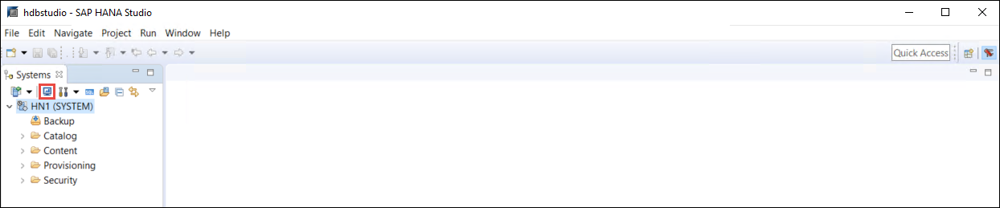

1.  Review the **System Monitor** view.

    

    > **Note**: It typically takes a few minutes before the operational state is fully identified.
   
1.  Right select the **HN1 (SYSTEM)** node and in the right select menu. Next, select **Configuration and Monitoring** followed by **Open Administration**.

    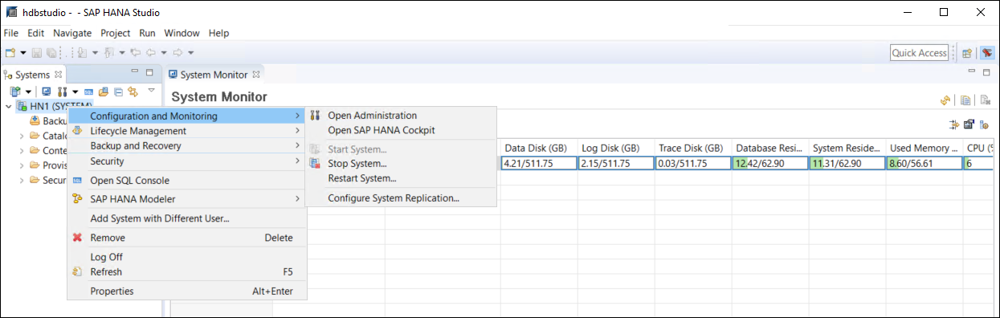

1.  In the **Configuration and Monitoring** view, examine the **Overview** tab. Verify that all services are started, active, and in sync. You might need to wait a few minutes before the operational state is identified.

    

1.  Switch to the **Alerts** tab, and verify they are not indicating any operational issues.

    


### Task 2: Connect to the highly-available HANA instances by using Hawk

1.  From the lab computer, in the Azure portal, navigate to the **Virtual machines** blade. 

1.  On the **Virtual machines** blade, click the **hn1-hdb0** entry and, on the **hn1-hdb0** blade, note the value of the **DNS name** entry. 

1.  In the Azure portal, start a Bash session within the Cloud Shell and type the following entry (where the `<dns_name>` placeholder designates the fully qualified DNS name assigned to the public IP address assigned to the Azure VM, which you copied in the previous step):

    ```sh
    ssh labuser@<dns_name>
    ```

1.  When prompted whether you want to continue connecting, type **yes** and press Enter.

1.  Within the SSH session, reset the password of the **hacluster** account to **Lab\@pa55hv1.0** by running the following and following the prompts:

    ```sh
    sudo passwd hacluster
    ```

1.  Switch back to the **Virtual machines** blade, click the **hn1-hdb1** entry and, on the **hn1-hdb1** blade, note the value of the **DNS name** entry. 

1.  In the Azure portal, start another Bash session within the Cloud Shell and type the following entry (where the `<dns_name>` placeholder designates the fully qualified DNS name assigned to the public IP address assigned to the Azure VM, which you copied in the previous step):

    ```sh
    ssh labuser@<dns_name>
    ```

1.  When prompted whether you want to continue connecting, type **yes** and press Enter.

1.  Within the SSH session, reset the password of the **hacluster** account to **Lab\@pa55hv1.0** by running the following and following the prompts:

    ```sh
    sudo passwd hacluster
    ```

1.  Switch to the Remote Desktop session to hn1-win-bastion Azure VM, start **Internet Explorer**, and browse to **https://hn1-hdb0:7630**. On the **SUSE Hawk Sign in** page, sign in as **hacluster** with the password **Lab\@pa55hv1.0**.

    > **Note**: Ignore any prompts regarding problems with security certificate of the target website. That is expected in this scenario.

1.  Once you sign in, review the **Resources** tab on the **Status** page.

    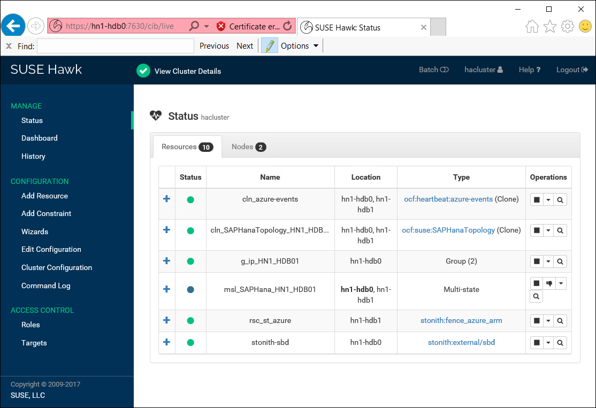

1.  Next, switch to the **Nodes** tab on the **Status** page.

    

1.  Switch back to the **Resources** and use the magnifying glass icon to examine the state of the HANA resources starting with the **SAPHANATopology**.

    

1.  Close the **SAPHANATopology** pane and use the magnifying glass icon to examine the state of the **SAPHana** resource.

    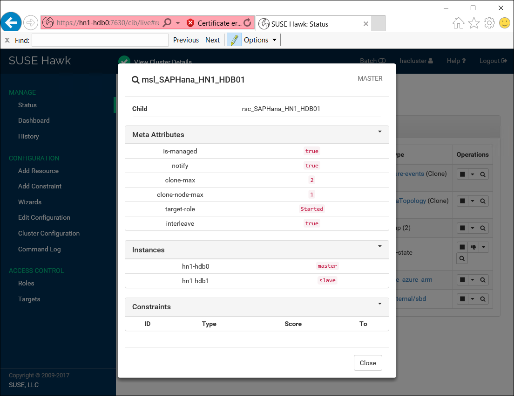


### Task 3: Test a failover

1.  Within the Remote Desktop session to **hn1-win-bastion** Azure VM, in the Internet Explorer window displaying the **SUSE Hawk** page, from the **msl\_SAPHana\_HN1\_HDB01** pane, identify the system currently serving the master role. Then close the **msl\_SAPHana\_HN1\_HDB01** pane.

    

1.  Switch to the lab computer and, in the Azure portal, and identify the Bash session which hosts the SSH session to the Azure VM you identified in the previous step. 

    > **Note**: You might need to restart the Bash session and reestablish the SSH session. If so, follow the instructions in the previous task.

1.  Within the SSH session, initiate a failover by running the following:

    ```sh
    sudo service pacemaker stop
    ```

1.  Switch back to the Remote Desktop session to **hn1-win-bastion** Azure VM and, in the Internet Explorer window displaying the **SUSE Hawk** page, observe how the status of the resource changes first to a question mark and then to a blue dot.

    

1.  Start **Internet Explorer**, and browse to **https://hn1-hdb1:7630**. On the **SUSE Hawk Sign in** page, sign in as **hacluster** with the password **Lab\@pa55hv1.0**.

1.  In the Internet Explorer window displaying the **SUSE Hawk** resources status page, identify the system currently serving the master role hosting the **msl\_SAPHana\_HN1\_HDB01** resource:

    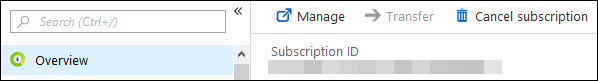

1.  Switch to **SAP HANA Administration Console**, and refresh the **Overview** tab in the **Configuration and Monitoring** view. Note that SAP HANA is running at this point on the **hn1-hdb1** node, and it is operational:

    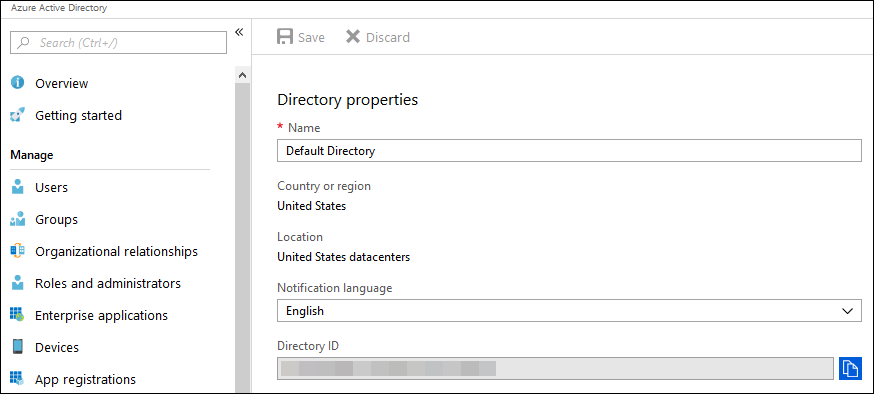

    > **Note**: You might need to wait a few minutes before the operational state is identified.

1.  Switch to the lab computer, in the Azure portal and, in the SSH session in Cloud Shell, start the pacemaker service by running the following:

    ```sh
    sudo service pacemaker start
    ```

1.  Terminate the SSH session by running the following:

    ```sh
    exit
    ```

1.  Switch back to the Remote Desktop session to **hn1-win-bastion** Azure VM, switch to the **SUSE Hawk Status** page at **https://hn1-hdb1:7630**, and observe how the **SAPHana** clustered resource status is changing to operational on both hn1-hdb0 and hn1-hdb1 with hn1-hdb1 as the primary (you might need to wait a few minutes for the interface to refresh):

    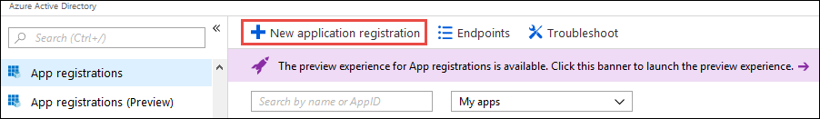


### Task 4: Test a migration

1.  Within the Remote Desktop session to **hn1-win-bastion** Azure VM, ensure that you are viewing the **SUSE Hawk Status** page at **https://hn1-hdb1:7630**.

    

1.  From the **SUSE Hawk Status** page at **https://hn1-hdb1:7630**, select the **Migrate** option of the **SAPHana** clustered resource.

    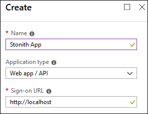

1.  From the **SUSE Hawk Status** page at **https://hn1-hdb1:7630**, select the **hn1-hdb0** node as the migration target.

    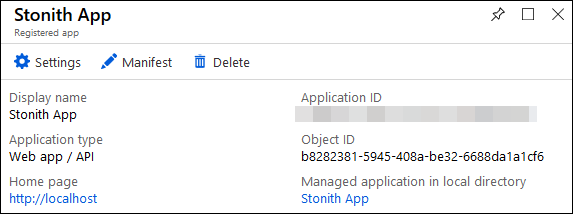

1.  On the **SUSE Hawk Status** page, note that the status of **SAPHana** clustered resource is listed with a question mark and a couple of chain link icons representing constraints. 

    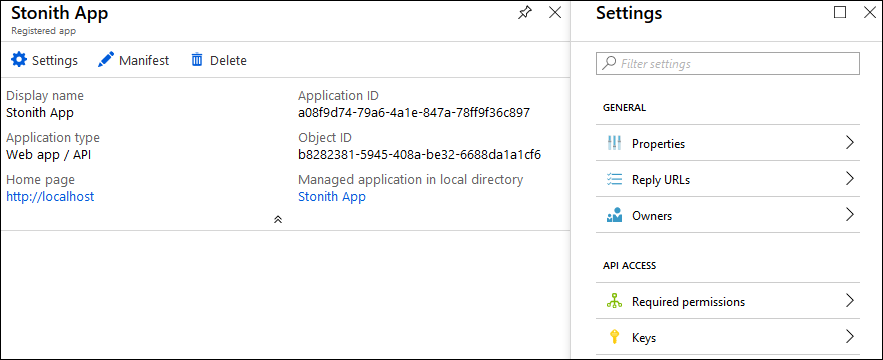

1.  To remediate this, use the vertical menu on the left-hand side of the **SUSE Hawk Status** to switch to the **Edit Configuration** page and display its **Constraints** tab. 

    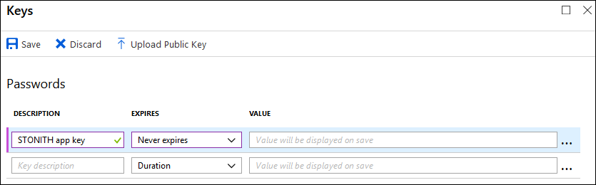

    > **Note**: Ban and prefer location constraints are generated automatically during migration operation in order to prevent unintended failback to the original cluster node. However, such constraints should be removed once the original node is available to host cluster resources. 

    > **Note**: Make sure not to accidentally remove other constraints.  
    
1.  From the **Constraints** page, delete the **cli-prefer-msl\_SAPHana\_HN1\_HDB01** Location constraint.

    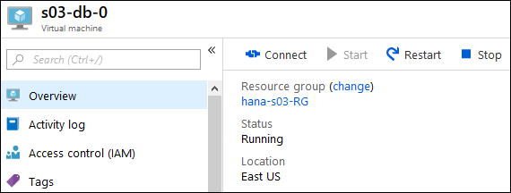
    
1.  From the **Constraints** page, delete the **cli-ban-msl\_SAPHana\_HN1\_HDB01-on-hn1-hdb1** Location constraint.

    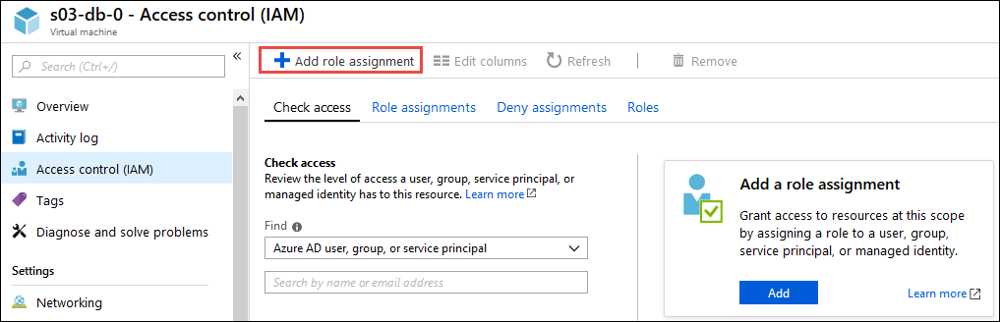
    
1.  Switch to the **SUSE Hawk Status** page, and verify the **SAPHana** clustered resource is operational on both nodes with hn1-hdb0 as the master (you might need to wait a few minutes for the interface to refresh).

    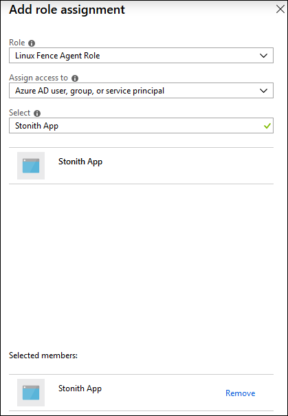

1.  Switch to **SAP HANA Administration Console**, and refresh the Overview tab in the **Configuration and Monitoring** view. Note that SAP HANA is running at this point on the **hn1-hdb0** node and is operational.

    


### Task 5: Test fencing

1.  Switch to the lab computer, in the Azure portal, navigate to the **Virtual machines** blade, and stop the Azure virtual machine to which you migrated HANA resources in the previous task. 

1.  Switch back to the Remote Desktop session to **hn1-win-bastion** Azure VM, wait until the status of the **msl_SAPHana_HN1_HDB01** resource in the Internet Explorer window displaying connection to **https://hn1-hdb1:7630** changes from a question mark to a blue dot, and verify that its location changed to **hn1-hdb1**.

    

1.  Switch to **SAP HANA Administration Console**, and refresh the Overview tab in the **Configuration and Monitoring** view. Note that SAP HANA is running at this point on the **hn1-hdb1** node.

    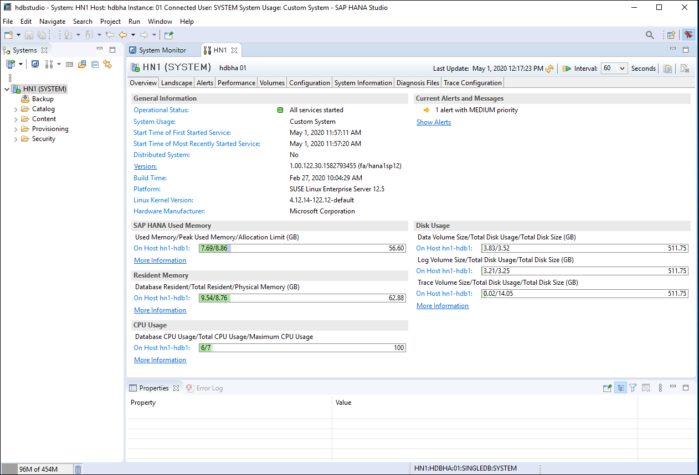

    > **Note**: You might need to wait a few minutes before the operational state is identified.

1.  Switch to the lab computer, in the Azure portal, navigate to the **Virtual machines** blade, start the virtual machine you stopped earlier in this task and wait until it is running again.

1.  Switch back to the Remote Desktop session to **hn1-win-bastion** Azure VM and, on the **SUSE Hawk Status** page at **https://hn1-hdb1:7630** note that the **SAPHana** clustered resource is operational on both hn1-hdb0 and hn1-hdb1 with hn1-hdb1 as the primary (you might need to wait a few minutes for the interface to refresh):

    

1.  Within the Remote Desktop session to **hn1-win-bastion** Azure VM, switch to the **SAP HANA Administration Console**, navigate to the **System Replication** sub-tab of the **Landscape** tab of the **Configuration and Monitoring** view and note that replication status is active.

    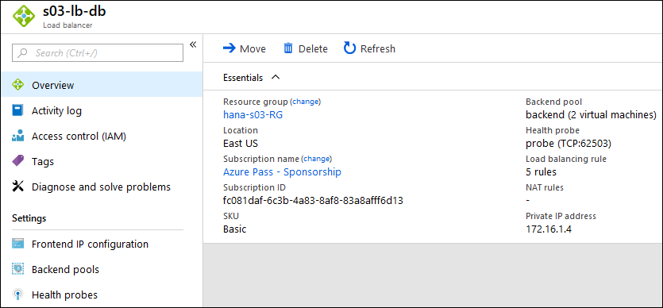

1.  In **SAP HANA Administration Console**, switch to the Overview tab in the **Configuration and Monitoring** view. Note that SAP HANA continues running 	on the **hn1-hdb1** node and is fully operational.

    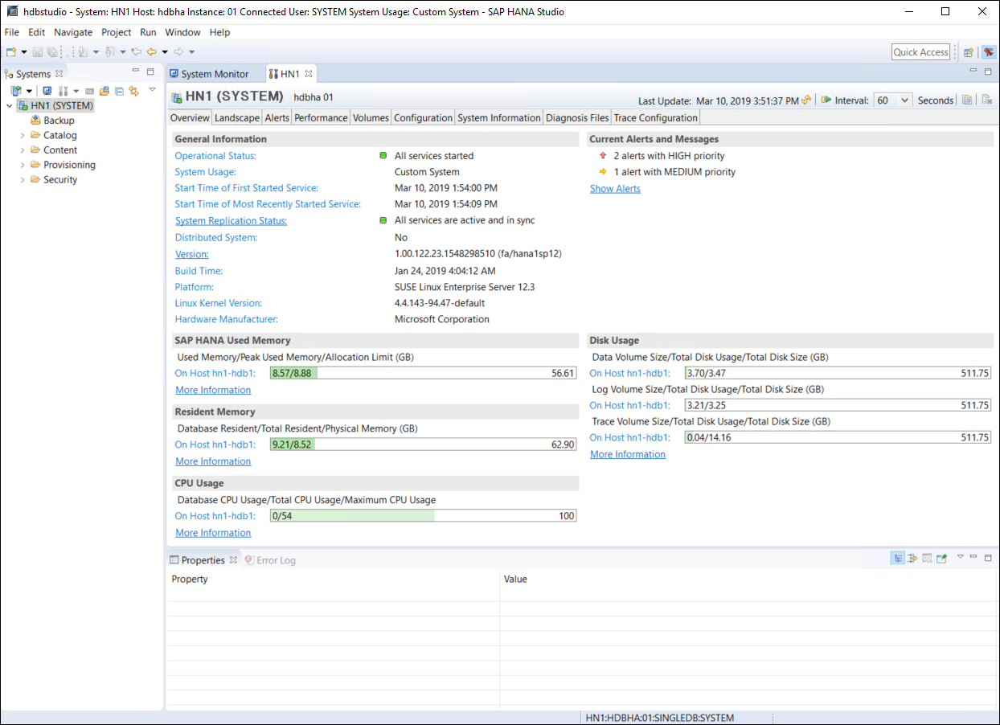


### Task 6: Remove the highly-available HANA deployment

1.  Switch to the lab computer and, in the first Cloud Shell pane, from the Bash prompt, run the following to change the current directory to the one hosting the Terraform and Ansible files that you used for the highly-available HANA deployment:

    ```sh
    cd ~/sap-hana/deploy/vm/modules/ha_pair/
    ``` 

    > **Note**: If needed, in the Azure portal, restart the Cloud Shell. 

1.  In the Cloud Shell pane, from the Bash prompt, run the following to remove all resources provisioned by Terraform-based highly-available HANA deployment:

    ```sh
    terraform destroy -auto-approve
    ```

1.  When prompted, type **yes** and press the Enter key to continue with the deployment. 

   > **Note**: Wait for the completion of the removal before you proceed to the next task.

Make sure to complete all After the Hands-on lab steps below.


## After the Hands-on lab 

Duration: 5 minutes

After completing the hands-on lab, you will remove the resource group and any remaining resources.

### Task 1: Remove the resource group containing all Azure resources deployed in this lab

1.  From the lab computer, in the Azure portal at <http://portal.azure.com> , select the **Cloud Shell** icon.

2.  If prompted, in the **Welcome to Azure Cloud Shell** window, select **Bash (Linux)**.

3.  At the Bash prompt, run the following:

    ```sh
    if [ az group exists --name hanav1sn-RG ]
    then
         az group delete --name hanav1sn-RG --no-wait --yes
    fi
    if [ az group exists --name hanav1ha-RG ]
    then
         az group delete --name hanav1ha-RG --no-wait --yes
    fi
    if [ az group exists --name hanaMedia-RG ]
    then
         az group delete --name hanaMedia-RG --no-wait --yes
    fi
    cd ~
    rm ~/sap-hana/ -r -f
    ```
