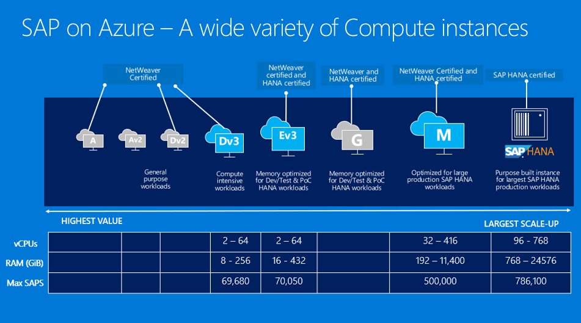
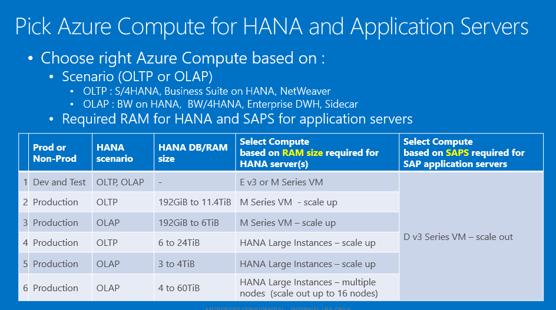
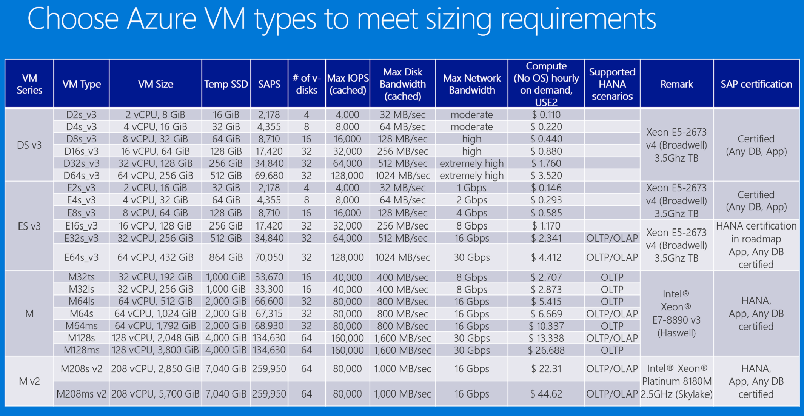
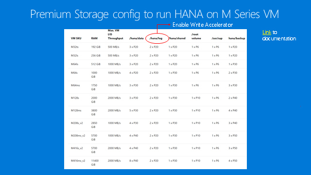
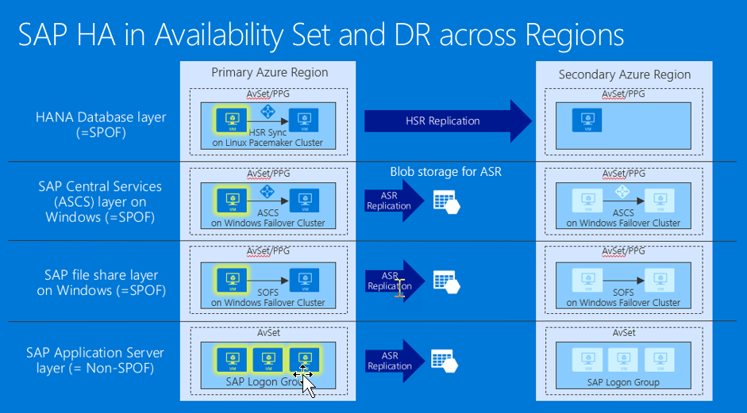
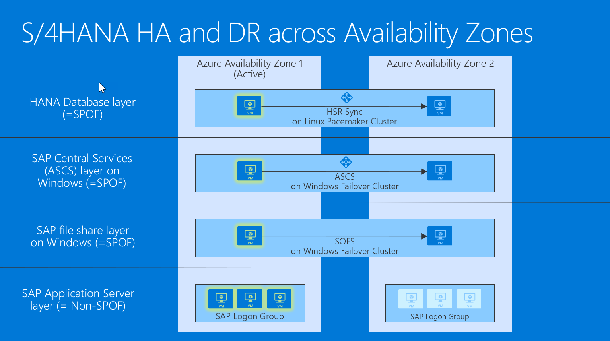
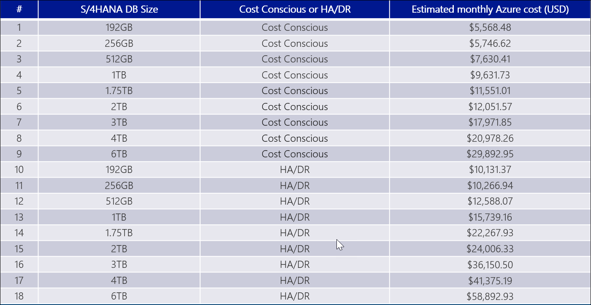



SAP HANA on Azure

 Whiteboard design session trainer guide

October 2020

Information in this document, including URL and other Internet Web site references, is subject to change without notice. Unless otherwise noted, the example companies, organizations, products, domain names, e-mail addresses, logos, people, places, and events depicted herein are fictitious, and no association with any real company, organization, product, domain name, e-mail address, logo, person, place or event is intended or should be inferred. Complying with all applicable copyright laws is the responsibility of the user. Without limiting the rights under copyright, no part of this document may be reproduced, stored in or introduced into a retrieval system, or transmitted in any form or by any means (electronic, mechanical, photocopying, recording, or otherwise), or for any purpose, without the express written permission of Microsoft Corporation.

Microsoft may have patents, patent applications, trademarks, copyrights, or other intellectual property rights covering subject matter in this document. Except as expressly provided in any written license agreement from Microsoft, the furnishing of this document does not give you any license to these patents, trademarks, copyrights, or other intellectual property.

The names of manufacturers, products, or URLs are provided for informational purposes only and Microsoft makes no representations and warranties, either expressed, implied, or statutory, regarding these manufacturers or the use of the products with any Microsoft technologies. The inclusion of a manufacturer or product does not imply endorsement of Microsoft of the manufacturer or product. Links may be provided to third party sites. Such sites are not under the control of Microsoft and Microsoft is not responsible for the contents of any linked site or any link contained in a linked site, or any changes or updates to such sites. Microsoft is not responsible for webcasting or any other form of transmission received from any linked site. Microsoft is providing these links to you only as a convenience, and the inclusion of any link does not imply endorsement of Microsoft of the site or the products contained therein.

© 2020 Microsoft Corporation. All rights reserved.

Microsoft and the trademarks listed at https://www.microsoft.com/en-us/legal/intellectualproperty/Trademarks/Usage/General.aspx are trademarks of the Microsoft group of companies. All other trademarks are property of their respective owners.

**Contents**

<!-- TOC -->

- [Trainer information](#trainer-information)
    - [Role of the trainer](#role-of-the-trainer)
    - [Whiteboard design session flow](#whiteboard-design-session-flow)
    - [Before the whiteboard design session: How to prepare](#before-the-whiteboard-design-session-how-to-prepare)
    - [During the whiteboard design session: Tips for an effective whiteboard design session](#during-the-whiteboard-design-session-tips-for-an-effective-whiteboard-design-session)
- [SAP HANA on Azure whiteboard design session student guide](#sap-hana-on-azure-whiteboard-design-session-student-guide)
    - [Abstract and learning objectives](#abstract-and-learning-objectives)
    - [Prerequisites](#prerequisites)
    - [Step 1: Review the customer case study](#step-1-review-the-customer-case-study)
        - [Customer situation](#customer-situation)
        - [Contoso S/4HANA Deployment Priorities](#contoso-s4hana-deployment-priorities)
        - [Customer needs and objections](#customer-needs-and-objections)
        - [Key design considerations](#key-design-considerations)
        - [Infographic for key design concepts](#infographic-for-key-design-concepts)
    - [Step 2: Design a proof of concept solution](#step-2-design-a-proof-of-concept-solution)
    - [Step 3: Present the solution](#step-3-present-the-solution)
    - [Wrap-up](#wrap-up)
    - [Additional references](#additional-references)
- [SAP HANA on Azure whiteboard design session trainer guide](#sap-hana-on-azure-whiteboard-design-session-trainer-guide)
    - [Step 1: Review the customer case study](#step-1-review-the-customer-case-study-1)
    - [Step 2: Design a proof of concept solution](#step-2-design-a-proof-of-concept-solution-1)
    - [Step 3: Present the solution](#step-3-present-the-solution-1)
    - [Wrap-up](#wrap-up-1)
    - [Preferred target audience](#preferred-target-audience)
    - [Preferred solutions](#preferred-solutions)
    - [Checklist of preferred objection handling](#checklist-of-preferred-objection-handling)
    - [Customer quote (to be read back to the attendees at the end)](#customer-quote-to-be-read-back-to-the-attendees-at-the-end)

<!-- /TOC -->

# Trainer information

Thank you for taking time to support the whiteboard design sessions as a trainer!

## Role of the trainer

An amazing trainer:

-   Creates a safe environment in which learning can take place.

-   Stimulates the participant's thinking.

-   Involves the participant in the learning process.

-   Manages the learning process (on time, on topic, and adjusting to benefit participants).

-   Ensures individual participant accountability.

-   Ties it all together for the participant.

-   Provides insight and experience to the learning process.

-   Effectively leads the whiteboard design session discussion.

-   Monitors quality and appropriateness of participant deliverables.

-   Effectively leads the feedback process.

## Whiteboard design session flow 

Each whiteboard design session uses the following flow:

**Step 1: Review the customer case study (15 minutes)**

**Outcome**

Analyze your customer's needs.

-   Customer's background, situation, needs and technical requirements

-   Current customer infrastructure and architecture

-   Potential issues, objectives and blockers

**Step 2: Design a proof of concept solution (60 minutes)**

**Outcome**

Design a solution and prepare to present the solution to the target customer audience in a 15-minute chalk-talk format.

-   Determine your target customer audience.

-   Determine customer's business needs to address your solution.

-   Design and diagram your solution.

-   Prepare to present your solution.

**Step 3: Present the solution (30 minutes)**

**Outcome**

Present solution to your customer:

-   Present solution

-   Respond to customer objections

-   Receive feedback

**Wrap-up (15 minutes)**

-   Review preferred solution

## Before the whiteboard design session: How to prepare

Before conducting your first whiteboard design session:

-   Read the Student guide (including the case study) and Trainer guide.

-   Become familiar with all key points and activities.

-   Plan the point you want to stress, which questions you want to drive, transitions, and be ready to answer questions.

-   Prior to the whiteboard design session, discuss the case study to pick up more ideas.

-   Make notes for later.

## During the whiteboard design session: Tips for an effective whiteboard design session

**Refer to the Trainer guide** to stay on track and observe the timings.

**Do not expect to memorize every detail** of the whiteboard design session.

When participants are doing activities, you can **look ahead to refresh your memory**.

-   **Adjust activity and whiteboard design session pace** as needed to allow time for presenting, feedback, and sharing.

-   **Add examples, points, and stories** from your own experience. Think about stories you can share that help you make your points clearly and effectively.

-   **Consider creating a "parking lot"** to record issues or questions raised that are outside the scope of the whiteboard design session or can be answered later. Decide how you will address these issues, so you can acknowledge them without being derailed by them.

***Have fun**! Encourage participants to have fun and share!*

**Involve your participants.** Talk and share your knowledge but always involve your participants, even while you are the one speaking.

**Ask questions** and get them to share to fully involve your group in the learning process.

**Ask first**, whenever possible. Before launching into a topic, learn your audience's opinions about it and experiences with it. Asking first enables you to assess their level of knowledge and experience, and leaves them more open to what you are presenting.

**Wait for responses**. If you ask a question such as, "What's your experience with (fill in the blank)?" then wait. Do not be afraid of a little silence. If you leap into the silence, your participants will feel you are not serious about involving them and will become passive. Give participants a chance to think, and if no one answers, patiently ask again. You will usually get a response.

# SAP HANA on Azure whiteboard design session student guide

## Abstract and learning objectives 

In this workshop, you will look at what is involved in deploying SAP HANA on Azure with the goals of designing for in-memory database performance, business continuity and flexibility as well as fully optimized total cost of ownership. 

At the end of this whiteboard design session you will be able to design SAP HANA workloads on Azure in alignment with SAP HANA certification with high availability and disaster recovery, run Azure Pricing Calculator to price the SAP HANA landscape, and present the solution to business/technical decision makers and handle Q&A with customer. 

## Prerequisites

-   R-AIT344 : Architecture deep dive for SAP deployments

-   R-AIT333 : SAP Migration Practitioner Panel

-   Understanding of SAP on Azure Webinar Training and S/4HANA on Azure reference architecture 

## Step 1: Review the customer case study 

**Outcome**

Analyze your customer's needs.

Timeframe: 15 minutes

Directions: With all participants in the session, the facilitator/SME presents an overview of the customer case study along with technical tips.

1.  Meet your table participants and trainer.

1.  Read all of the directions for steps 1-3 in the student guide.

1.  As a table team, review the following customer case study.

### Customer situation

Contoso Group is a pharmaceutical company with its headquarters based in Boston, US.  

Contoso Leadership and Planning Groups want to drastically reduce server and storage hardware in their own datacenters to minimize IT related costs. Leadership has asked Contoso IT to explore the possibility to deploy a greenfield S/4HANA environment to cloud. In addition to NetWeaver-based apps, Contoso wants to evaluate the option of implementing XSA-based apps. 

Since Contoso already has a number of their non-SAP systems running to Azure, Contoso IT decided to leverage its knowledge of the Microsoft cloud platform and existing ExpressRoute connectivity and host its SAP S/4HANA landscape in Azure. 

Considering that Contoso finance and supply chain teams will strongly rely on S/4HANA, the systems should be highly available, and their performance must be predictable and consistent. In addition, the management team wants to leverage disaster recovery capabilities offered by Azure in order to ensure resiliency in case the primary region hosting the new deployment becomes unavailable. 

Andrew Cross, CIO of Contoso Group emphasized this point by stating, "Our planned operational dependencies on SAP applications force us to seek reasonably priced high availability and disaster recovery capabilities for our production SAP S/4HANA deployments.” 

Before implementing the production environment, Contoso wants to test its new deployment approach by provisioning development, and UAT environments in Azure.

### Contoso S/4HANA Deployment Priorities

-   In-memory database performance and agility to scale

-   High Availability & Disaster Recovery

-   Data protection & security

-   Streamlined and automated deployment methodology

-   IT standardization across SAP and non-SAP

1.  Contoso S/4HANA requirements:

1.  Target environment:

    -   Sizing

        -   Production

            -   HANA DB memory requirement; 2 TiB

            -   Application SAPS requirements (SAPS): 15,000

        -   Quality Assurance

            -   HANA DB memory requirement; 2 TiB

            -   Application SAPS requirements (SAPS): 15,000

        -   Development

            -   HANA DB memory requirement; 192 GiB

            -   Application SAPS requirements (SAPS): none

1.  Business continuity

    -   High Availability and Disaster Recovery

        -   Each proposed solution must include both high availability and disaster recovery capabilities for the Production environment (99.95% uptime).

        -   Each proposed solution must include high availability for the Quality Assurance environment (99.95% uptime).

        -   The disaster recovery solution must ensure business continuity in case of an event affecting the entire Azure datacenter hosting the Production environment.

    -   Data protection

        -   No data loss allowed in the Production and the Quality Assurance environment

        -   Production

            -   HANA DB log backup taken every 30 minutes and retained for 1 day

            -   HANA DB full backup every night and retained for 1 month

        -   Quality Assurance

            -   HANA DB full bi-weekly backup retained for 1 month

        -   Development

            -   HANA DB full bi-weekly backup retained for 1 month

### Customer needs and objections 

1.  Is the proposed solution fully certified by SAP? 

1.  Does the proposal meet Contoso business continuity requirements? What if there's outage on VM or storage? How can we restore from backup? How can we failover the landscape in case of an outage?

1.  There're legacy on-prem systems that need to interact with S/4HANA in cloud. How can we minimize performance impact in cross-premises scenarios? 

1.  Can we change the size of the environment if sizing requirements change in future?

1.  Is there anything not included in the results of Azure Pricing Calculator? 

1.  CFO is asking for cost saving even further. What can we do to optimize the cost? What are our options?

### Key design considerations

1.  Key design components

    -   HANA System Replication

    -   Windows/Linux clusters

    -   Windows SOFS or Linux DRBD or Azure NetApp Files

    -   Azure Site Recovery

    -   VNet Hub & Spoke topology

1.  Two primary HA/DR options

    -   HA in an Availability Set and DR across regions (DR replica can coexist with QA in the second region)

    -   HA/DR across Availability Zones

1.  Networking considerations

    -   ExpressRoute for end user access with geo-redundancy provisions

    -   Site-to-Site VPN for remote administration and monitoring

1.  Additional infrastructure considerations

    -   Blob storage for backup retention

    -   Jump-box

    -   DNS

    -   Patching

    -   Backup

    -   Monitoring

    -   Cluster arbitration (Cloud Witness and SBD)

    -   Proximity placement groups

1.  Pricing

    -   Use Azure Pricing Calculator

    -   Use Reserved VM Instances option if it helps save costs

    -   Consider best OS licensing option(s):

        -   It is common NOT to include Windows license costs because of Azure Hybrid Use Benefits

        -   Linux OS subscription costs can be based on Azure Marketplace

    -   Provide assumptions for ExpressRoute bandwidth

    -   Make sure to include the required minimum level of Azure support (e.g. Azure Professional Direct, whenever applicable).

### Infographic for key design concepts

## Step 2: Design a proof of concept solution

**Outcome**

Design a solution and prepare to present the solution to the target customer audience in a 15-minute chalk-talk format.

Timeframe: 60 minutes

**Business needs**

Directions:  With all participants at your table, answer the following questions and list the answers on a flip chart:

1.  Who should you present this solution to? Who is your target customer audience? Who are the decision makers?

1.  What customer business needs do you need to address with your solution?

**Design**

Directions: With all participants at your table, respond to the following questions on a flip chart:

*High-level solution architecture:*

1.  How would you ensure that the high-availability and disaster recovery requirements are satisfied?

1.  What should be the Azure region(s) where the solution will be deployed?

*Network design:*

1.  What should be the hybrid connectivity option?

1.  What should be the Azure virtual network design in order to maximize security?

*SAP deployment architecture and methodology:*

1.  What will be the configuration of the application and database components of your solution?

1.  What should be the SAP deployment methodology?

*Solution cost:*

1.  What is the estimated cost of your solution? Provide pricing for *HA/DR* and *cost conscious* (without HA/DR) options.

**Prepare**

Directions: With all participants at your table:

1.  Identify any customer needs that are not addressed with the proposed solution.

1.  Identify the benefits of your solution.

1.  Determine how you will respond to the customer's objections.

Prepare a 15-minute chalk-talk style presentation to the customer.

## Step 3: Present the solution

**Outcome**

Present a solution to the target customer audience in a 15-minute chalk-talk format.

Timeframe: 30 minutes

**Presentation**

Directions:

1.  Pair with another table.

1.  One table is the Microsoft team and the other table is the customer.

1.  The Microsoft team presents their proposed solution to the customer.

1.  The customer makes one of the objections from the list of objections.

1.  The Microsoft team responds to the objection.

1.  The customer team gives feedback to the Microsoft team.

1.  Tables switch roles and repeat Steps 2-6.

##  Wrap-up 

Timeframe: 20 minutes

Directions: Tables reconvene with the larger group to hear the facilitator/SME share the preferred solution for the case study.

##  Additional references

|    |            |
|----------|:-------------:|
| **Description** | **Links** |
| High availability of SAP HANA on Azure VMs on SUSE Linux Enterprise Server | <https://docs.microsoft.com/en-us/azure/virtual-machines/workloads/sap/sap-hana-high-availability/> |
| High availability for SAP NetWeaver on Azure VMs on SUSE Linux Enterprise Server with Azure NetApp Files for SAP applications | <https://docs.microsoft.com/en-us/azure/virtual-machines/workloads/sap/high-availability-guide-suse> |
| SAP HANA high availability for Azure virtual machines | <https://docs.microsoft.com/en-us/azure/virtual-machines/workloads/sap/sap-hana-availability-overview> |
| SAP HANA availability within one Azure region | <https://docs.microsoft.com/en-us/azure/virtual-machines/workloads/sap/sap-hana-availability-one-region> |
| SAP HANA availability across Azure regions | <https://docs.microsoft.com/en-us/azure/virtual-machines/workloads/sap/sap-hana-availability-across-regions> |
| SAP workload configurations with Azure Availability Zones | <https://docs.microsoft.com/en-us/azure/virtual-machines/workloads/sap/sap-ha-availability-zones>
| Automated SAP Deployments in Azure Cloud | <https://github.com/Azure/sap-hana> |

# SAP HANA on Azure whiteboard design session trainer guide

## Step 1: Review the customer case study

-   Check in with your table participants to introduce yourself as the trainer.

-   Ask, "What questions do you have about the customer case study?"

-   Briefly review the steps and timeframes of the whiteboard design session.

-   Ready, set, go! Let the table participants begin.

## Step 2: Design a proof of concept solution

-   Check in with your tables to ensure that they are transitioning from step to step on time.

-   Provide some feedback on their responses to the business needs and design.

    -   Try asking questions first that will lead the participants to discover the answers on their own.

-   Provide feedback for their responses to the customer's objections.

    -   Try asking questions first that will lead the participants to discover the answers on their own.
    
## Step 3: Present the solution

-   Determine which table will be paired with your table before Step 3 begins.

-   For the first round, assign one table as the presenting team and the other table as the customer.

-   Have the presenting team present their solution to the customer team.

    -   Have the customer team provide one objection for the presenting team to respond to.

    -   The presentation, objections, and feedback should take no longer than 15 minutes.

    -   If needed, the trainer may also provide feedback.

## Wrap-up

-   Have the table participants reconvene with the larger session group to hear the facilitator/SME share the following preferred solution.

##  Preferred target audience

1. Who should you present this solution to? Who is your target customer audience? Who are the decision makers?

   -   Business Development Manager (BDM) or Application Sponsor (CFO)

       -   Funds projects & apps

       -   Most interested in public cloud

       -   Business Unit IT / Developers (Director of SAP Business Analysts, Director of SAP Operations)

   -   Reports to BDM and is responsible for coding and testing apps

       -   Big influencer of public cloud strategy

   -   Central IT (VP of IT Operations)

       -   Reports into CIO and responsible for operating datacenter

       -   Concerned about shadow IT created issues: security/compliance, server sprawl, and lack of control

##  Preferred solution

1. **Business needs**: What customer business needs do you need to address with your solution?

   -   Business continuity in case of an event affecting the entire Azure datacenter hosting the Production environment

   -   Data protection (no data loss allowed in the Production and the Quality Assurance environment)

   -   Performant connectivity from legacy on-premises systems on-prem that need to interact with S/4HANA in Azure

   -   Agility (facilitating changes to the size of the environment)

   -   Minimized cost

*High level solution architecture*

1.  **Design**: How would you ensure that the high-availability and disaster recovery requirements are satisfied?

    **Solution**: Our design offers two options, which allow the customer to choose a solution that provides the most suitable level of high availability and disaster recovery. 

    -   The first option (Azure VMs – HA in Availability Set and DR across Regions) represents the traditional design, which relies on well-established concept of availability sets and leverages a pair of Azure regions in the same geography. An Azure Availability Set is a logical grouping capability that helps ensure that the VM resources that you place within the Availability Set are failure-isolated from each other when they are deployed within an Azure datacenter. Azure ensures that the VMs you place within an Availability Set run across multiple physical servers, compute racks, storage units, and network switches. This configuration is referred to as placements in different update and fault domains. These placements usually are within an Azure datacenter. Assuming that power source and network issues would affect the datacenter that you are deploying, all your capacity in one Azure region would be affected. To further optimize this design, Contoso can take avantage of placement proximity groups, which further minimize the latency of communication between Azure VMs in the same availability set.

    -   The second option (Azure VMs - HA and DR across Availability Zones) takes advantage of the availability zones, representing separate, physically isolated data centers within the same region. The placement of datacenters that represent Azure Availability Zones constitutes a compromise between delivering acceptable network latency to services deployed in different zones, and a distance between datacenters. The distance matters because even though majority of destructive events are not likely to affect the infrastructure of all Availability Zones in the same region, history offers examples of larger scale disasters that could have such impact. To account for such occurrences, organizations might have the minimum distance requirement between the location of their production and disaster recovery sites. For most Azure customers, the minimum distance definition necessitates the use of two or more Azure regions.

    Note that, with both options, it is important to consider high availability and disaster recovery provisions separately for each component of our solution:

    -   HANA Database layer - both high availability and disaster recovery is implemented by using HANA System Replication (synchronous or asynchronous, depending on the option). In case of synchronous replication, the high availability functionality relies additionally on Linux-based Pacemaker clustering. 

     > **Note**: Contoso can use the same configuration to provide high availability and automatic failover of XSA-based apps. In such configuration, an Azure load balancer serves the role of a reverse proxy, distributing requests on the XSA default domain to the SAP HANA Azure VM hosting the XSA Web Dispatcher. If you are using port-based routing mode, you need to create load balancing rules corresponding to the apps you want to expose to the load balanced traffic. Alternatively, you can enable the HA mode, when using the Standard SKU of an internal Azure Load Balancer. Incidentally, internal requests from XSA apps to their backend services are also distributed in the same manner. For information regarding routing internal requests targeting the XSA default domain directly to XSA Web Dispatcher, refer to SAP documentation.

    -   SAP Central Services (ASCS) layer - high availability is implemented by using operating system-level clustering (either Windows Server Failover Clustering or Linux-based Pacemaker clustering, depending on the underlying operating system). Disaster recovery relies across Azure regions on Azure Site Recovery, which replicates virtual disks of cluster members to the secondary site. Azure Site Recovery is also used to orchestrate failover between sites.

    -   SAP file share layer - high availability of the sapmnt share is implemented by using either Windows-based file share (based on Windows Storage Spaces Direct cluster hosting Scale-Out File Server) or Linux-based NFS mount (based on Azure NetApp Files or Linux Distributed Replicated Block Device). Disaster recovery relies on Azure Site Recovery, which replicates the file sharing infrastructure to the secondary site. When using Azure NetApp Files NFS-based approach, NetApp offers a SaaS based solution called NetApp Cloud Sync. You can use any file based-copy tool (such as rsync) to replicate data to the secondary site (including file or folder permissions). To replicate an Azure NetApp Files volume to another Azure region, you have to connect virtual networks via an ExpressRoute circuit or a S2S VPN connection (currently, global peering between VNets is not yet supported)
        
    -   SAP Application Server layer - high availability is implemented by simply deploying multiple application servers. Disaster recovery across Azure regions relies on Azure Site Recovery, which replicates virtual disks of application servers to the secondary site. Azure Site Recovery is also used to orchestrate failover between sites.

    In the context of HANA Database layer, the first option provides disaster recovery in case of an event affecting the entire region, but is a subject to increased latency between the primary and secondary site. The second option offers considerably lower latency between sites, but its resiliency has more limited scope. In such case, the latency between the primary and secondary site is significant enough to preclude the possibility of using synchronous data replication between two SAP HANA instances under typical SAP workloads. Without the HANA synchronous replication mode, RTO and RPO requirements commonly force customers to deploy high availability configurations in one region, and then supplement it with additional deployments in a second region.

    Another aspect to consider in this context is failover and client redirect. The assumption is that a failover between SAP HANA instances in two different Azure regions is always manual. This is because SAP HANA system replication is in such case asynchronous, which, in turn, implies potential data loss during a failover. When performing manually controlled failover, you need to take additional measures to ensure that all the committed data on the primary side made it to the secondary instance.

    Client redirect considerations relate to the fact that in order to allow connectivity between Azure virtual networks in each region, each of them must use a different IP address range. To address this requirement, during failover, you either need to change the SAP HANA client configuration (when targeting an IP address directly), or preferably (when targeting a DNS name), you need to modify the DNS record representing the target HANA instance by setting it to point to the new secondary site's server IP address. 

    On the other hand, the choice of Availability Zones necessitates additional considerations:

    -   There are no guarantees regarding the distances between various Availability Zones within an Azure region.

    -   The network latency across Availability Zones is not the same in all Azure regions. In some cases, you can deploy and run the SAP application layer across different zones because the network latency from one zone to the active DBMS VM is acceptable. But in some Azure regions, the latency between the active DBMS VM and the SAP application instance, when deployed in different zones, might not be acceptable for SAP business processes. In these cases, the deployment architecture needs to be different, with an active/active architecture for the application or an active/passive architecture where cross-zone network latency is too high.

    -   When deciding where to use Availability Zones, base your decision on the network latency between the zones. Network latency plays an important role in two areas:

         -   Latency between the two DBMS instances that need to have synchronous replication. The higher the network latency, the more likely it will affect the scalability of your workload.

         -   The difference in network latency between a VM running an SAP dialog instance in-zone with the active DBMS instance and a similar VM in another zone. As this difference increases, the influence on the running time of business processes and batch jobs also increases, dependent on whether they run in-zone with the DBMS or in a different zone.

    -   As already mentioned, Availability Zones are not an ideal DR solution. Natural disasters can cause widespread damage in world regions, including heavy damage to power infrastructures. The distances between various zones might not be large enough to constitute a proper DR solution.

    Furthermore, when you deploy Azure VMs across Availability Zones and establish failover solutions within the same Azure region, there are a number of additional restrictions:

    -   You must use Azure Managed Disks (in the context of SAP deployments, this is not an obstacle, since you should be using Managed Disks anyway).

    -   The mapping of zone enumerations to the physical zones is fixed on an Azure subscription basis. If you're using different subscriptions to deploy your SAP systems, you need to identify the optimal zones for each subscription.

    -   You can't deploy Azure availability sets within an Azure Availability Zone. Choose one or the other as a deployment framework for Azure VMs.

    -   You can't use an Azure Basic Load Balancer to create failover cluster solutions based on Windows Server Failover Clustering or Linux Pacemaker. Instead, you need to use the Azure Standard Load Balancer SKU.

    Before you decide how to use Availability Zones, you need to determine:

    -   The network latency among the three zones of an Azure region. This will enable you to choose the zones with the least network latency in cross-zone network traffic.

    -   The difference between VM-to-VM latency within one of the zones, of your choosing, and the network latency across two zones of your choosing.

    -   A determination of whether the VM types that you need to deploy are available in the two zones that you selected. With some VMs, especially M-Series VMs, you might encounter situations in which some SKUs are available in only two of the three zones.

    To determine the latency between the different zones, you need to:

    -   Deploy the VM SKU you want to use for your DBMS instance in all three zones. Make sure Azure Accelerated Networking is enabled when you take this measurement.

    -   When you find the two zones with the least network latency, deploy another three VMs of the VM SKU that you want to use as the application layer VM across the three Availability Zones. Measure the network latency against the two DBMS VMs in the two DBMS zones that you selected.

    -   Use niping as a measuring tool. This tool, from SAP, is described in SAP support notes #500235 and #1100926. Focus on the commands documented for latency measurements. Because ping doesn't work through the Azure Accelerated Networking code paths, we don't recommend that you use it.

    Based on your measurements and the availability of your VM SKUs in the Availability Zones, you need to make some decisions:

    -   Define the ideal zones for the DBMS layer.

    -   Determine whether you want to distribute your active SAP application layer across one, two, or all three zones, based on differences of network latency in-zone versus across zones.

    -   Determine whether you want to deploy an active/passive configuration or an active/active configuration, from an application point of view. 

         -   Active/Active deployment: in this deployment architecture you deploy your active SAP application servers across two or three zones. The SAP Central Services instance that uses enqueue replication will be deployed between two zones. The same is true for the DBMS layer, which will be deployed across the same zones as SAP Central Service.

             When considering this configuration, you need to find the two Availability Zones in your region that offer cross-zone network latency that's acceptable for your workload and your synchronous DBMS replication. You also want to be sure the delta between network latency within the zones you selected, and the cross-zone network latency isn't too large. This is because you don't want large variations, depending on whether a job runs in-zone with the DBMS server or across zones, in the running times of your business processes or batch jobs. Some variations are acceptable, but not factors of difference.

         -   Active/Passive deployment: if you can't find an acceptable delta between the network latency within one zone and the latency of cross-zone network traffic, you can deploy an architecture that has an active/passive character from the SAP application layer point of view. You define an active zone, which is the zone where you deploy the complete application layer and where you attempt to run both the active DBMS and the SAP Central Services instance. With such a configuration, you need to make sure you don't have extreme run time variations, depending on whether a job runs in-zone with the active DBMS instance or not, in business transactions and batch jobs.

    In making these decisions, also take into account SAP's network latency recommendations, as documented in SAP note #1100926.

    When choosing between Availability Sets and Availability Zones, it is also important to keep in mind that each option offers different Azure VM SLAs: 

    -   Multiple load balanced VMs that are part of the same Azure availability set are subject to 99.95 % availability SLA

    -   Multiple load balanced VMs that are distributed across more than one availability zone are subject to the 99.99 % availability SLA

    *Option 1: Azure VMs – HA in Availability Set and DR across Regions*

    In this option, Contoso will use the East US 2 Azure region as its production site the West US2 region as its disaster recovery site. It is worth noting that the choice of the disaster recovery site is not based on the region pairing (the East US 2 region is paired up with the Central US region) but rather takes into account the availability of Azure VM sizes that can be used to host SAP workloads (in particular, Mv2 and GS series VMs). 

    The primary site hosts consists of multiple virtual networks forming the hub and spoke arrangement.

    -   The hub virtual network consists of three subnets: 

         -   Gateway subnet containing an instance of ExpressRoute Gateway and VPN Gateway, providing connectivity from the Customer Corporate Network and Partner Admin Network, respectively, via a redundant pair of ExpressRoute circuits. 

         -   Perimeter subnet containing an SAP Router VM, providing connectivity from SAP Support environment

         -   Management subnet containing VMs providing a number of infrastructure services, such as authentication, authorization, and name resolution (Active Directory Domain Controllers and DNS servers), patching, monitoring, backup, and remote management (jumpbox).

    -   The spoke virtual network hosting the SAP environment consists of two subnets, containing (respectively) the highly available production environment and the stand-alone development environment. The highly available production environment contains four availability sets:

         -   AvSet SOFS: this availability set consists of a pair of Windows Server VMs forming a Windows Failover Clustering (WFC)-based cluster hosting the Scale-Out File Server role that implements the highly available sapmnt share. 

         -   AvSet ASCS/ERS: this availability set contains a pair of Windows Server VMs forming a WFC-based cluster hosting the highly available SAP ASCS and ERS roles.

         -   AvSet PAS: this availability set contains a pair of Windows Server VMs hosting the Primary Application Server (PAS) and an Additional Application Server (AAS). Clustering is not used in this case since high availability is built-into the PAS and AAS functionality.  

         -   AvSet HANA: this availability set contains a pair of clustered Linux VMs hosting HANA instances configured with synchronous HANA System Replication (HSR). Clustering is implemented by using Pacemaker. 

    All WFC-based clusters use Cloud Witness quorum for cluster arbitration. The Pacemaker-based cluster can use either an Azure fencing agent or a STONITH Block Device (SBD) daemon fencing.  (the latter is preferred due to a faster failover, although the latest versions of the Azure fencing agent offer improvements in this regard.)

    The design of secondary site is also implemented in a hub and spoke pattern.

    -   The hub virtual network in the secondary site also consists of three subnets: 

         -   Gateway subnet containing an instance of ExpressRoute Gateway and VPN Gateway, providing connectivity from the Customer Corporate Network (via a redundant pair of ExpressRoute circuits) and Partner Admin Network, respectively. 

         -   Perimeter subnet containing a stopped instance of the SAP Router VM, which, once activated, would provide connectivity from SAP Support environment

         -   Management subnet meant to provide a number of infrastructure services, such as authentication, authorization, and name resolution (via an active VM serving the role of Active Directory Domain Controller and DNS Server), as well as stopped instances of patching, monitoring, backup, and remote management (Jumpbox) VMs.

    -   The spoke virtual network hosting the highly available SAP QA environment, which, in case of a disaster, would become the production environment. Just as the production environment, the highly available QA environment contains four availability sets:

         -   AvSet SOFS: this availability set consists of a pair of Windows Server VMs forming a Windows Failover Clustering (WFC)-based cluster hosting the Scale-Out File Server role that implements the highly available sapmnt share. 

         -   AvSet ASCS/ERS: this availability set contains a pair of Windows Server VMs forming a WFC-based cluster hosting the highly available SAP ASCS and ERS roles.

         -   AvSet PAS: this availability set contains a pair of Windows Server VMs hosting the Primary Application Server (PAS) and an Additional Application Server (AAS). Clustering is not used in this case since high availability is built-into the PAS and AAS functionality.  

         -   AvSet HANA: this availability set contains a pair of clustered Linux VMs hosting HANA instances configured with synchronous HANA System Replication (HSR). One of the instances replicates asynchronously via SAP HANA Replication from an SAP HANA instance in the production environment. Clustering is implemented by using Pacemaker. 

    All WFC-based clusters use Cloud Witness quorum for cluster arbitration. The Pacemaker-based cluster can use either an Azure fencing agent or a STONITH Block Device (SBD) daemon fencing (implemented as an iSCSI target server). The iSCSI target server can be shared with other Pacemaker clusters. The advantage of the SBD-based approach is a faster failover time (comparing with the Azure fencing agent that relies on an Azure Active Directory service principal). In addition, this approach is identical to the way SBD is used in on-premises scenarios. It is possible to use up to three SBD instances for a Pacemaker cluster to allow an SBD device to become unavailable, for example during OS patching of the iSCSI target server. 

    ![Diagram of the Azure VMs – HA in Availability Set and DR across Regions preferred solution. This option includes the East US 2 Azure region as Contoso's production site and the West US2 region as its disaster recovery site. The primary site hosts consists of multiple virtual networks forming the hub and spoke arrangement. The hub virtual network consists of three subnets: Gateway subnet (containing an instance of ExpressRoute Gateway and VPN Gateway, providing connectivity from the Customer Corpoorate Network and Partner Admin Network, respectively), Perimeter subnet (containing a SAP Router VM, providing connectivity from SAP Support environment), and the Management subnet (containing VMs providing a number of infrastructure services, such as authentication, authorization, and name resolution, patching, monitoring, backup, and remote management). The spoke virtual network hosting the SAP environment consists of two subnets, containing (respectively) the highly available production environment and the stand-alone development environment. The highly available production environment contains four availability sets: AvSet SOFS (this availability set consists of a pair of Windows Server VMs forming a WFC-based cluster hosting the Scale-Out File Server role that implements the highly available sapmnt share), AvSet ASCS/ERS (this availability set contains a pair of Windows Server VMs forming a WFC-based cluster hosting the highly available SAP ASCS and ERS roles), AvSet PAS (this availability set contains a pair of Windows Server VMs hosting the Primary Application Server and an Additional Application Server. Clustering is not used in this case since high availability is built-into the the PAS and AAS functionality), AvSet HANA (this availability set contains a pair of clustered Linux VMs hosting HANA instances configured with synchronous HANA System Replication. Clustering is implemented by using Pacemaker). All WFC-based clusters use Cloud Witness quorum for cluster arbitration. The Pacemaker-based cluster can use either an Azure fencing agent or a STONITH Block Device (SBD) daemon fencing (the latter is preferred due to a considerably faster failover). The design of secondary site also implements the hub and spoke pattern. The hub virtual network in the secondary site alos consists of three subnets: Gateway subnet (containing an instance of ExpressRoute Gateway and VPN Gateway, providing connectivity from the Customer Corporate Network and Partner Admin Network, respectively, via a redundant pair of ExpressRoute circuits), Perimeter subnet (containing a stopped instance of the SAP Router VM, which, once activated, would provide connectivity from SAP Support environment), Management subnet (meant to provide a number of infrastructure services, such as authentication, authorization, and name resolution via an active VM serving the role of Active Directory Domain Controller and DNS Server, as well as stopped instances of patching, monitoring, backup, and remote management VMs). The spoke virtual network hosting the highly available SAP QA environment, which, in case of a disaster, would become the production environment. Just as the production environment, the highly available QA environment contains four availability sets: AvSet SOFS (this availability set consists of a pair of Windows Server VMs forming a WFC-based cluster hosting the Scale-Out File Server role that implements the highly available sapmnt share), AvSet ASCS/ERS (this availability set contains a pair of Windows Server VMs forming a WFC-based cluster hosting the highly available SAP ASCS and ERS roles), AvSet PAS (this availability set contains a pair of Windows Server VMs hosting the Primary Application Server and an Additional Application Server. Clustering is not used in this case since high availability is built-into the the PAS and AAS functionality), and AvSet HANA (this availability set contains a pair of clustered Linux VMs hosting HANA instances configured with synchronous HANA System Replication. One of the instances replicates asynchronously via SAP HANA Replication from a SAP HANA instance in the production environment. Clustering is implemented by using Pacemaker). All WFC-based clusters use Cloud Witness quorum for cluster arbitration. The Pacemaker-based cluster can use either an Azure fencing agent or a STONITH Block Device (SBD) daemon fencing (the latter is preferred due to a considerably faster failover).](images/Whiteboarddesignsessiontrainerguide-SAPHANAonAzureimages/media/sap_on_azure_ha_av_dr_regions.png "Azure VMs – HA in Availability Set and DR across Regions")

    *Option 2: Azure VMs - HA and DR across Availability Zones*

    In this option, Contoso will use the East US 2 Azure region as its production and its disaster recovery site. The choice of the region takes into account the availability of Azure VM sizes that can be used to host SAP workloads (in particular, Mv2 and GS series VMs) as well as support for the Availability Zones, including support for all relevant zone-redundant components (in particular, Linux VMs, Windows Server VMs, Managed Disks, Standard IP Addresses, Standard Load Balancers, VPN Gateways, and ExpressRoute Gateways). The selected Azure region supports three availability zones. 

    The design also includes multiple virtual networks forming the hub and spoke arrangement, according to the architectural principles of Virtual DataCenter in Azure.  

    -   The hub virtual network consists of three subnets spanning all three availability zones: 

         -   Gateway subnet containing zone redundant instance of ExpressRoute Gateway and VPN Gateway, providing connectivity from the Customer Corporate Network and Partner Admin Network, respectively. 

         -   Perimeter subnet containing an SAP Router VM, providing connectivity from SAP Support environment, deployed into Availability Zone 1.

         -   Management subnet containing VMs providing a number of infrastructure services, such as authentication, authorization, and name resolution (Active Directory Domain Controllers and DNS servers), patching, monitoring, backup, and remote management (jumpbox), all of which are deployed into Availability Zone 1. In addition, the management subnet contains the iSCSI Target SBD instance deployed into Availability Zone 3, providing arbitration for the Pacemaker cluster hosting HANA instances deployed into Availability Zone 1 and Availability Zone 2 (residing in the Production and QA subnet)

    -   The spoke virtual network hosting the SAP environment consists of one subnets, containing the highly available production environment, highly available QA environment, and the stand-alone development environment. The highly available production and QA environments are distributed across Availability Zone 1 and Availability Zone 2:

         -   NFS share Prod and QA: these two clusters contain active VM instances residing in Availability Zone 1 and standby VM instances residing in Availability Zone 2. 

         -   ASCS/ERS Prod and QA: these two clusters contain active VM instances residing in Availability Zone 1 and standby VM instances residing in Availability Zone 2. 

         -   Application Prod and QA: PAS for each environment resides in Availability Zone 1 and AAS for each environment resides in Availability Zone 2. Clustering is not used in this case since high availability is built-into the PAS and AAS functionality.  

         -   HANA Prod and QA: these two clusters contain active VM instances residing in Availability Zone 1 and standby VM instances residing in Availability Zone 2, with HANA Synchronous replication between nodes of each cluster. Clustering is implemented by using Pacemaker. The Pacemaker-based cluster relies on the STONITH Block Device (SBD) daemon fencing (with the iSCSI Target-based SBD VM residing in the Management subnet of the hub virtual network in Availability Zone 3). 

    ![Diagram of the Azure VMs - HA and DR across Availability Zones preferred solution. This option relies on the East US 2 Azure region as its production and its disaster recovery site. The choice of the region takes into account the availability of Azure VM sizes that can be used to host SAP workloads (in particular, Mv2 and GS series VMs) as well as support for the Availability Zones, including support for all relevant zone-redundant components (in particular, Linux VMs, Windows Server VMs, Managed Disks, Standard IP Addresses, Standard Load Balancers, VPN Gateways, and ExpressRoute Gateways). The selected Azure region supports three availability zones. The design also includes multiple virtual networks forming the hub and spoke arrangement. The hub virtual network consists of three subnets spanning all three availability zones: Gateway subnet (containing zone redundant instance of ExpressRoute Gateway and VPN Gateway, providing connectivity from the Customer Corporate Network and Partner Admin Network, respectively), Perimeter subnet (containing a SAP Router VM, providing connectivity from SAP Support environment, deployed into Availability Zone 1), and Management subnet (containing VMs providing a number of infrastructure services, such as authentication, authorization, and name resolution, patching, monitoring, backup, and remote management, all of which are deployed into Availability Zone 1). In addition, the management subnet contains the iSCSI Target SBD instance deployed into Availability Zone 3, providing arbitration for the Pacemaker cluster hosting HANA instances deployed into Availability Zone 1 and Availability Zone 2 (residing in the Production and QA subnet). The spoke virtual network hosting the SAP environment consists of one subnets, containing the highly available production environment, highly available QA environment, and the stand-alone development environment. The highly available production and QA environments are distributed across Availability Zone 1 and Availability Zone 2. NFS share Prod and QA clusters contain active VM instances residing in Availability Zone 1 and standby VM instances residing in Availability Zone 2. ASCS/ERS Prod and QA clusters contain active VM instances residing in Availability Zone 1 and standby VM instances residing in Availability Zone 2. Application Prod and QA PAS (for each environment) resides in Availability Zone 1 and AAS (for each environment) resides in Availability Zone 2. Clustering is not used in this case since high availability is built-into the the PAS and AAS functionality. HANA Prod and QA clusters contain active VM instances residing in Availability Zone 1 and standby VM instances residing in Availability Zone 2, with HANA Synchronous replication between nodes of each cluster. Clustering is implemented by using Pacemaker. The Pacemaker-based cluster relies on the SBD daemon fencing (with the iSCSI Target-based SBD VM residing in the Management subnet of the hub virtual network in Availability Zone 3).](images/Whiteboarddesignsessiontrainerguide-SAPHANAonAzureimages/media/sap_on_azure_ha_dr_zones.png "Azure VMs - HA and DR across Availability Zones")

1.  **Design**: What should be the Azure region(s) where the solution should be deployed?

    **Solution**: In the first option, Contoso will use the East US 2 Azure region as its production site the West US2 region as its disaster recovery site. It is worth noting that the choice of the disaster recovery site is not based on the region pairing (the East US 2 region is paired up with the Central US region) but rather takes into account the availability of Azure VM sizes that can be used to host SAP workloads (in particular, Mv2 and GS series VMs). This choice also minimizes the possibility of a regional disaster negatively affecting the operational status of the secondary site. 

    In the second option, Contoso will use the East US 2 Azure region as its production and its disaster recovery site. The choice of the region takes into account the availability of Azure VM sizes that can be used to host SAP workloads (in particular, Mv2 and GS series VMs) as well as support for the Availability Zones, including support for all relevant zone-redundant components (in particular, Linux VMs, Windows Server VMs, Managed Disks, Standard IP Addresses, Standard Load Balancers, VPN Gateways, and ExpressRoute Gateways). The selected Azure region supports three availability zones. 

*Network design:*

1.  **Design**: What should be the hybrid connectivity option?

    **Solution**: Both options in our solution provide hybrid connectivity, between the customer's on-premises corporate network (including Partner Admin Network) and Azure. This connectivity is implemented by using a combination of an MPLS-based ExpressRoute circuit (from Customer Corporate Network) and Site-to-Site VPN (from Partner Admin Network). 

     > **Note**: A single ExpressRoute circuit can be used to connect to multiple regions in the same geopolitical area (in this case, to both East US 2 and West US 2 regions).

1.  **Design**: What should be the Azure virtual network design in order to maximize security?

    **Solution**: Virtual network design consists of multiple virtual networks forming the hub and spoke topology. In both options, connectivity to the virtual network hosting our SAP deployment is established via a dedicated hub virtual network. The hub virtual network will contain Perimeter and Management subnets, hosting jumpbox VMs that can be used to perform standard remote management tasks. Traffic destined to and originating from each subnet of the hub and spokes virtual networks will be additionally restricted by using Network Security Groups.

*SAP deployment architecture and methodology:*

1.  **Design**: What will be the configuration of the application and database components of your solution?

    **Solution**: 
    In the first option, the spoke virtual network hosting the SAP environment consists of two subnets, containing (respectively) the highly available production environment and the stand-alone development environment. The highly available production environment contains four availability sets:

    -   AvSet SOFS: this availability set consists of a pair of Windows Server VMs forming a Windows Failover Clustering (WFC)-based cluster hosting the Scale-Out File Server role that implements the highly available sapmnt share. 

    -   AvSet ASCS/ERS: this availability set contains a pair of Windows Server VMs forming a WFC-based cluster hosting the highly available SAP ASCS and ERS roles.

    -   AvSet PAS: this availability set contains a pair of Windows Server VMs hosting the Primary Application Server (PAS) and an Additional Application Server (AAS). Clustering is not used in this case since high availability is built-into the PAS and AAS functionality.  

    -   AvSet HANA: this availability set contains a pair of clustered Linux VMs hosting HANA instances configured with synchronous HANA System Replication (HSR). Clustering is implemented by using Pacemaker. 

    All WFC-based clusters use Cloud Witness quorum for cluster arbitration. The Pacemaker-based cluster can use either an Azure fencing agent or a STONITH Block Device (SBD) daemon fencing (the latter is preferred due to a considerably faster failover). 

    The spoke virtual network in the secondary site hosts the highly available SAP QA environment, which, in case of a disaster, would become the production environment. Just as the production environment, the highly available QA environment contains four availability sets:

    -   AvSet SOFS: this availability set consists of a pair of Windows Server VMs forming a Windows Failover Clustering (WFC)-based cluster hosting the Scale-Out File Server role that implements the highly available sapmnt share. 

    -   AvSet ASCS/ERS: this availability set contains a pair of Windows Server VMs forming a WFC-based cluster hosting the highly available SAP ASCS and ERS roles.

    -   AvSet PAS: this availability set contains a pair of Windows Server VMs hosting the Primary Application Server (PAS) and an Additional Application Server (AAS). Clustering is not used in this case since high availability is built-into the PAS and AAS functionality.  

    -   AvSet HANA: this availability set contains a pair of clustered Linux VMs hosting HANA instances configured with synchronous HANA System Replication (HSR). One of the instances replicates asynchronously via SAP HANA Replication from an SAP HANA instance in the production environment. Clustering is implemented by using Pacemaker. 

    All WFC-based clusters use Cloud Witness quorum for cluster arbitration. The Pacemaker-based cluster can use either an Azure fencing agent or a STONITH Block Device (SBD) daemon fencing (implemented as an iSCSI target server). The iSCSI target server can be shared with other Pacemaker clusters. The advantage of the SBD-based approach is a faster failover time (comparing with the Azure fencing agent that relies on an Azure Active Directory service principal). In addition, this approach is identical to the way SBD is used in on-premises scenarios. It is possible to use up to three SBD instances for a Pacemaker cluster to allow an SBD device to become unavailable, for example during OS patching of the iSCSI target server. 

    In the second option, the spoke virtual network hosting the SAP environment consists of one subnets, containing the highly available production environment, highly available QA environment, and the stand-alone development environment. The highly available production and QA environments are distributed across Availability Zone 1 and Availability Zone 2:

     -   NFS share Prod and QA: these two clusters contain active VM instances residing in Availability Zone 1 and standby VM instances residing in Availability Zone 2. 

     -   ASCS/ERS Prod and QA: these two clusters contain active VM instances residing in Availability Zone 1 and standby VM instances residing in Availability Zone 2. 

     -   Application Prod and QA: PAS for each environment resides in Availability Zone 1 and AAS for each environment resides in Availability Zone 2. Clustering is not used in this case since high availability is built-into the PAS and AAS functionality.  

     -   HANA Prod and QA: these two clusters contain active VM instances residing in Availability Zone 1 and standby VM instances residing in Availability Zone 2, with HANA Synchronous replication between nodes of each cluster. Clustering is implemented by using Pacemaker. The Pacemaker-based cluster relies on the STONITH Block Device (SBD) daemon fencing (with the iSCSI Target-based SBD VM residing in the Management subnet of the hub virtual network in Availability Zone 3). 

1.  What should be the SAP deployment methodology?

    **Solution**: Considering technologies used or intended to be used for on-premises deployments, the solution will leverage Ansible for configuration management and Terraform for Azure resource provisioning. The solution offers full automation capabilities, including both provisioning Azure resources, as well as installation and configuration of SAP HANA software components.

*Solution cost:*

1.  **Design**: What is the estimated cost of your solution?

    **Solution**: The pricing consists of two main categories: *HA/DR* and *cost conscious* (without HA/DR). Each quote includes cost of Production, QA, and Development environments, as well as it takes into account compute, storage, networking, SUSE OS/support, Azure Professional Direct Support (which is, at minimum, required when deploying SAP production solutions in Azure). The *cost-conscious* pricing doesn't include HA nor DR (single VM) and assumes retention of daily backups of Production for one month, along with biweekly QA and Dev backups. The *HA/DR* option includes Standard Load Balancer in the primary site and a DR replica in the secondary site, with retention of daily backups of Production for one month, monthly and quarterly for one year, along with monthly backups of QA and Dev monthly retained for one year. 

## Checklist of preferred objection handling

1.  Is the proposed solution fully certified by SAP? 

    Each of the *T-Shirt* pricing options represents a fully SAP-certified configuration. For more information, refer to https://docs.microsoft.com/en-us/azure/virtual-machines/workloads/sap/hana-available-skus.  

1.  Does the proposal meet Contoso business continuity requirements? What if there's outage on VM or storage? How can we restore from backup? How can we failover the landscape in case of an outage?

    Both proposed options facilitate HA and, depending on the scope, an accidental outage affecting either the entire Azure region (option 1) or an individual Azure datacenter (corresponding to the Availability Zone hosting the production environment). With option 1, the failover between regions is manual because there is a potential for data loss due to asynchronous replication of HANA between the production and disaster recovery site. Such failover can be streamlined by leveraging Azure Site Recovery. With option 2, this failover can be automated since HANA replication is synchronous.

    VMs hosting SAP Application can be backed up using Azure Backup. For VM-level recovery, you might consider using Azure VM Backup. Azure Backup stores the backups in Azure and allows a restore of a VM again. However, be aware that Azure VM backup supports only a single scheduled backup per day. In addition, note that using VM Backup does not preserve the unique VM ID which is used for SAP licensing. This means that a restore from a VM backup requires installation of a new SAP license key as the restored VM is considered to be a new VM and not a replacement of the former one which was saved.

    SAP HANA on Azure VMs can be backed up by using the following two methods:

     -   HANA backup to the file system in an Azure Linux Virtual Machine 

     -   HANA backup based on storage snapshots using the Azure storage blob snapshot feature manually or Azure Backup Service 

    A common backup scheduling strategy described in the HANA Administration guide involves the following backups:

     -   Storage snapshot (daily)

     -   Complete data backup using file or bacint format (once a week)

     -   Automatic log backups

     Optionally, one could go completely without storage snapshots; they could be replaced by HANA delta backups, like incremental or differential backups.
The HANA Administration guide provides an example list. It suggests that one recover SAP HANA to a specific point in time using the following sequence of backups:

     -   Full data backup

     -   Differential backup

     -   Incremental backup 1

     -   Incremental backup 2

     -   Log backups

    Regarding an exact schedule as to when and how often a specific backup type should happen, it is not possible to give a general guideline—this would be customer-specific and dependent on the volume of data changes in the system. One basic recommendation from SAP side, which can be seen as general guidance, is to make one full HANA backup once a week.  SAP also recommends doing some housekeeping of the backup catalog to keep it from growing infinitely.

1.  There're legacy on-prem systems that need to interact with S/4HANA in cloud. How can we minimize performance impact in cross-premises scenarios? 

    ExpressRoute provides secure, high-bandwidth, low-latency connectivity between Azure and on-premises datacenters. ExpressRoute provides more predictable performance, with higher bandwidth and lower latency than VPN connections. ExpressRoute offers per-circuit throughput of up to 10 gigabits per second (Gbps), with the per-gateway throughput of up to 9000 megabits per second (Mbps). These capabilities make ExpressRoute the preferred choice for enterprise and mission-critical workloads. 

1.  Can we change the size of the environment if sizing requirements change in future?

    Azure VMs can be resized on demand (changing a VM size requires a reboot). If a non-production Azure VM is not being used frequently, you can resize it down to a smaller size to reduce your monthly costs. If an Azure VM is reaching its performance limits, it can be resized to a larger size to increase its capacity.

1.  Is there anything not included in the results of Azure Pricing Calculator? 

    The *T-Shirt* pricing does not include SAP software licensing, cost of monitoring/logging, as well as Windows Server licensing costs (the pricing assumes that Contoso will be able to leverage Azure Hybrid Use Benefit)

1.  CFO is asking for cost saving even further. What can we do to optimize the cost? What are our options?

    -   Estimate VM uptime and use Reserved Instances if uptime is larger than 30%

    -   Review T-Shirt pricing model

    -   When using Windows Server, take advantage of the Azure Hybrid Use Benefits (AHUB)

    -   Schedule stopping and deallocating of non-production virtual machines during their idle times:

        -   This functionality is available directly from the Azure portal. Alternatively, you can use Azure Automation runbooks or custom Azure PowerShell and Azure CLI scripts to stop and deallocate any instance. The same techniques can be used to start the instance on a scheduled time.

        -   Note that the built-in platform auto-shutdown functionality does not provide the draining functionality of application servers, so it is important to verify that these servers do not have any active tasks before initiating shutdown. This can be implemented by using Azure Automation or Azure functions.

## Customer quote (to be read back to the attendees at the end)

"Azure has provided high availability and disaster recovery capabilities for our production environment at a very reasonable price."

Andrew Cross, CIO, Contoso Group
