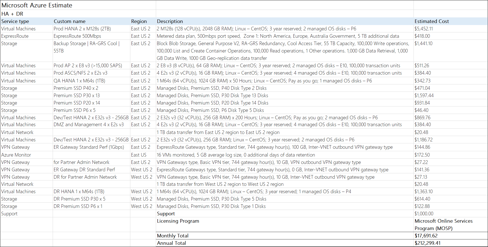



SAP HANA on Azure

 Whiteboard design session trainer guide

March 2019

Information in this document, including URL and other Internet Web site references, is subject to change without notice. Unless otherwise noted, the example companies, organizations, products, domain names, e-mail addresses, logos, people, places, and events depicted herein are fictitious, and no association with any real company, organization, product, domain name, e-mail address, logo, person, place or event is intended or should be inferred. Complying with all applicable copyright laws is the responsibility of the user. Without limiting the rights under copyright, no part of this document may be reproduced, stored in or introduced into a retrieval system, or transmitted in any form or by any means (electronic, mechanical, photocopying, recording, or otherwise), or for any purpose, without the express written permission of Microsoft Corporation.

Microsoft may have patents, patent applications, trademarks, copyrights, or other intellectual property rights covering subject matter in this document. Except as expressly provided in any written license agreement from Microsoft, the furnishing of this document does not give you any license to these patents, trademarks, copyrights, or other intellectual property.

The names of manufacturers, products, or URLs are provided for informational purposes only and Microsoft makes no representations and warranties, either expressed, implied, or statutory, regarding these manufacturers or the use of the products with any Microsoft technologies. The inclusion of a manufacturer or product does not imply endorsement of Microsoft of the manufacturer or product. Links may be provided to third party sites. Such sites are not under the control of Microsoft and Microsoft is not responsible for the contents of any linked site or any link contained in a linked site, or any changes or updates to such sites. Microsoft is not responsible for webcasting or any other form of transmission received from any linked site. Microsoft is providing these links to you only as a convenience, and the inclusion of any link does not imply endorsement of Microsoft of the site or the products contained therein.

© 2018 Microsoft Corporation. All rights reserved.

Microsoft and the trademarks listed at https://www.microsoft.com/en-us/legal/intellectualproperty/Trademarks/Usage/General.aspx are trademarks of the Microsoft group of companies. All other trademarks are property of their respective owners.

**Contents**

<!-- TOC -->

- [Trainer information](#trainer-information)
    - [Role of the trainer](#role-of-the-trainer)
    - [Whiteboard design session flow](#whiteboard-design-session-flow)
    - [Before the whiteboard design session: How to prepare](#before-the-whiteboard-design-session-how-to-prepare)
    - [During the whiteboard design session: Tips for an effective whiteboard design session](#during-the-whiteboard-design-session-tips-for-an-effective-whiteboard-design-session)
- [SAP HANA on Azure whiteboard design session student guide](#sap-hana-on-azure-whiteboard-design-session-student-guide)
    - [Abstract and learning objectives](#abstract-and-learning-objectives)
    - [Step 1: Review the customer case study](#step-1-review-the-customer-case-study)
        - [Customer situation](#customer-situation)
        - [Customer needs](#customer-needs)
        - [Customer objections](#customer-objections)
        - [Infographic for common scenarios](#infographic-for-common-scenarios)
    - [Step 2: Design a proof of concept solution](#step-2-design-a-proof-of-concept-solution)
    - [Step 3: Present the solution](#step-3-present-the-solution)
    - [Wrap-up](#wrap-up)
    - [Additional references](#additional-references)
- [SAP HANA on Azure whiteboard design session trainer guide](#sap-hana-on-azure-whiteboard-design-session-trainer-guide)
    - [Step 1: Review the customer case study](#step-1-review-the-customer-case-study-1)
    - [Step 2: Design a proof of concept solution](#step-2-design-a-proof-of-concept-solution-1)
    - [Step 3: Present the solution](#step-3-present-the-solution-1)
    - [Wrap-up](#wrap-up-1)
    - [Preferred target audience](#preferred-target-audience)
    - [Preferred solution](#preferred-solution)
    - [Checklist of preferred objection handling](#checklist-of-preferred-objection-handling)
    - [Customer quote (to be read back to the attendees at the end)](#customer-quote-to-be-read-back-to-the-attendees-at-the-end)

<!-- /TOC -->

# Trainer information

Thank you for taking time to support the whiteboard design sessions as a trainer!

## Role of the trainer

An amazing trainer:

-   Creates a safe environment in which learning can take place.

-   Stimulates the participant's thinking.

-   Involves the participant in the learning process.

-   Manages the learning process (on time, on topic, and adjusting to benefit participants).

-   Ensures individual participant accountability.

-   Ties it all together for the participant.

-   Provides insight and experience to the learning process.

-   Effectively leads the whiteboard design session discussion.

-   Monitors quality and appropriateness of participant deliverables.

-   Effectively leads the feedback process.

## Whiteboard design session flow 

Each whiteboard design session uses the following flow:

**Step 1: Review the customer case study (15 minutes)**

**Outcome**

Analyze your customer's needs.

-   Customer's background, situation, needs and technical requirements

-   Current customer infrastructure and architecture

-   Potential issues, objectives and blockers

**Step 2: Design a proof of concept solution (60 minutes)**

**Outcome**

Design a solution and prepare to present the solution to the target customer audience in a 15-minute chalk-talk format.

-   Determine your target customer audience.

-   Determine customer's business needs to address your solution.

-   Design and diagram your solution.

-   Prepare to present your solution.

**Step 3: Present the solution (30 minutes)**

**Outcome**

Present solution to your customer:

-   Present solution

-   Respond to customer objections

-   Receive feedback

**Wrap-up (15 minutes)**

-   Review preferred solution

## Before the whiteboard design session: How to prepare

Before conducting your first whiteboard design session:

-   Read the Student guide (including the case study) and Trainer guide.

-   Become familiar with all key points and activities.

-   Plan the point you want to stress, which questions you want to drive, transitions, and be ready to answer questions.

-   Prior to the whiteboard design session, discuss the case study to pick up more ideas.

-   Make notes for later.

## During the whiteboard design session: Tips for an effective whiteboard design session

**Refer to the Trainer guide** to stay on track and observe the timings.

**Do not expect to memorize every detail** of the whiteboard design session.

When participants are doing activities, you can **look ahead to refresh your memory**.

-   **Adjust activity and whiteboard design session pace** as needed to allow time for presenting, feedback, and sharing.

-   **Add examples, points, and stories** from your own experience. Think about stories you can share that help you make your points clearly and effectively.

-   **Consider creating a "parking lot"** to record issues or questions raised that are outside the scope of the whiteboard design session or can be answered later. Decide how you will address these issues, so you can acknowledge them without being derailed by them.

***Have fun**! Encourage participants to have fun and share!*

**Involve your participants.** Talk and share your knowledge but always involve your participants, even while you are the one speaking.

**Ask questions** and get them to share to fully involve your group in the learning process.

**Ask first**, whenever possible. Before launching into a topic, learn your audience's opinions about it and experiences with it. Asking first enables you to assess their level of knowledge and experience, and leaves them more open to what you are presenting.

**Wait for responses**. If you ask a question such as, "What's your experience with (fill in the blank)?" then wait. Do not be afraid of a little silence. If you leap into the silence, your participants will feel you are not serious about involving them and will become passive. Give participants a chance to think, and if no one answers, patiently ask again. You will usually get a response.

# SAP HANA on Azure whiteboard design session student guide

## Abstract and learning objectives 

In this Whiteboard Design Session, you will look at what is involved in deploying SAP HANA on Azure with the goals of designing for high availability, disaster recovery as well as supportability.

At the end of this whiteboard design session you will be able to better design and deploy SAP HANA on Azure.

## Step 1: Review the customer case study 

**Outcome**

Analyze your customer's needs.

Timeframe: 15 minutes

Directions: With all participants in the session, the facilitator/SME presents an overview of the customer case study along with technical tips.

1.  Meet your table participants and trainer.

1.  Read all of the directions for steps 1-3 in the student guide.

1.  As a table team, review the following customer case study.

### Customer situation

Contoso Group is a global pharmaceutical company with its headquarters based in Boston, US.

Contoso has been using SAP ERP and BW on HANA for its Finance/Logistics/Analytics systems on the HP-UX/Oracle platform. 

Contoso Leadership and Planning Groups wants to significantly reduce server and storage hardware in their own datacenters to minimize IT related costs. The leadership asked Contoso IT to look into the possibility of migrating its SAP HANA environment to cloud. Contoso is also considering transitioning to SAP HANA 2.0 with a longer term objective of deploying S/4 HANA and BW/4 HANA.

Contoso has already a number of their non-SAP systems migrated to Azure. Contoso IT decided to leverage its knowledge of the Microsoft cloud platform and existing ExpressRoute connectivity and host its SAP landscape in Azure. The intention is to migrate the BW system first (go live in March CY20), and migrate ECC in Q4 of CY20. The multi-stage approach is supposed to minimize potential migration risks.

Considering that Contoso management team often uses BW to support their management decisions, the systems should be highly available, and their performance must be predictable and consistent. In addition, the management team wants to leverage disaster recovery capabilities offered by Azure in order to ensure resiliency of the migrated environment in case the primary region hosting the new deployment becomes unavailable.

As Andrew Cross, CIO of Contoso Group emphasized this point by stating "Our operational dependencies on SAP applications force us to seek reasonably priced availability and disaster recovery capabilities for our production SAP HANA deployments."

Contoso also wants to dramatically simplify the process of provisioning Azure resources, as well as installation and configuration of SAP HANA software components. Contoso IT has been relying on Ansible to manage its on-premises environment and, with the cloud migration plans, it started evaluating the use of Terraform to automate on-premises and cloud-based deployments. 

Before migrating the production environment, Contoso wants to test its new deployment approach by provisioning training, development, test, and UAT environments in Azure.

### Customer needs 

-   Highly responsive systems with low network latency

-   In-memory database performance

-   High availability & disaster recovery

-   Enterprise data protection & security

-   Safe migration with downtime minimized

-   Access from HANA-based applications

-   Automated provisioning

-   Minimized cost

1.  Design scope:

    -   BW migration to HANA in Azure VMs

        -   Go-live date: March 2020

        -   Current BW (ABAP Unicode) on-premises with HP-UX/Oracle and application layer on Linux

        -   Customer requests flexible VM solution within Cloud to accommodate the BW workloads

            -   Use 1-year Reserved VM Instance option for Production VMs

    -   ERP is kept on-premises (with HP-UX/Oracle) until December 2020

        -   Data is transferred from ERP (on-premises) to BW (in Cloud) every hour

    -   (Option) Need to start to prepare for ERP migration to Cloud

1.  Target environment:

    -   Sizing

        -   Production (3-tier) with latest OS/DB fully certified and supported by SAP

            -   HANA sizing memory requirement 1.2 TB, estimate 1.9 TB in 3 years

            -   Throughput DB files at least 400MB/s \[/hana/data\]

            -   Throughput DB Log files at least 250MB/s \[/hana/log\]

            -   BW application servers: 15K SAPS

        -   Certification is NOT required for non-Prod

            -   QA (2-tier) HANA database server: 800 GB

            -   Dev, Test (both 2-tier) HANA database server(s): 256 GB

    -   Uptime -- Prod: 24x7, 744 hours/month, QA - 50 hours/month, DEV/Test - 200 hours/month

1.  High availability and disaster recovery:

    -   Availability

        -   Both HA only and HA with DR options need to be proposed.

        -   In regard to HA, in case of server/storage issues, auto failover to complete within a few minutes, in case of a disaster recovery within 1 day.

    -   Backup

        -   Long term backup -- use backup storage in Cloud

        -   Data loss not allowed

        -   HANA DB log backup taken every 30 minutes

        -   DB log backup to be kept for 1 day (DB restore to be fast)

        -   HANA DB full backup every night

        -   Daily HANA DB full backup to be retained for 1 month

        -   Monthly HANA DB full backup for 1 year, annual for 3 years

1.  End user access:

    -   User locations -- 300 from US, 50 LATAM, 50 Europe, 30 Asia - all intranet

    -   Currently ExpressRoute is set up to Azure East US 2

    -   Response time needs to be minimized

### Customer objections 

1.  ECC remains on-premises until Dec CY20. How can we maintain integrations between ECC and BW?

1.  How much does Azure cost? Give us two options (HA only and HA with DR).

1.  Do I have to pay for virtual machines when they are stopped?

1.  Can I automate the shutdown of virtual machines at specific times of day?

### Infographic for common scenarios

## Step 2: Design a proof of concept solution

**Outcome**

Design a solution and prepare to present the solution to the target customer audience in a 15-minute chalk-talk format.

Timeframe: 60 minutes

**Business needs**

Directions:  With all participants at your table, answer the following questions and list the answers on a flip chart:

1.  Who should you present this solution to? Who is your target customer audience? Who are the decision makers?

1.  What customer business needs do you need to address with your solution?

**Design**

Directions: With all participants at your table, respond to the following questions on a flip chart:

*High-level solution architecture:*

1.  What should be the Azure region(s) where the solution will be deployed?

1.  Should the customer use a 2-tier or 3-tier architecture for its SAP deployment?

1.  How would you ensure that the high-availability and disaster recovery requirements are satisfied?

*Network design:*

1.  What should be the hybrid connectivity option?

1.  What should be the Azure virtual network design in order to maximize security?

*SAP deployment architecture and methodology:*

1.  What will be the configuration of the configuration of the application and database components of your solution?

1.  What Azure VM sizes do you intend to use?

1.  What other Azure resources will be part of your solution?

1.  What should be the SAP deployment methodology?

*Solution cost:*

1.  What is the estimated cost of your solution with HA?

1.  What is the estimated cost of your solution with HA/DR?

**Prepare**

Directions: With all participants at your table:

1.  Identify any customer needs that are not addressed with the proposed solution.

1.  Identify the benefits of your solution.

1.  Determine how you will respond to the customer's objections.

Prepare a 15-minute chalk-talk style presentation to the customer.

## Step 3: Present the solution

**Outcome**

Present a solution to the target customer audience in a 15-minute chalk-talk format.

Timeframe: 30 minutes

**Presentation**

Directions:

1.  Pair with another table.

1.  One table is the Microsoft team and the other table is the customer.

1.  The Microsoft team presents their proposed solution to the customer.

1.  The customer makes one of the objections from the list of objections.

1.  The Microsoft team responds to the objection.

1.  The customer team gives feedback to the Microsoft team.

1.  Tables switch roles and repeat Steps 2-6.

##  Wrap-up 

Timeframe: 15 minutes

Directions: Tables reconvene with the larger group to hear the facilitator/SME share the preferred solution for the case study.
##  Additional references

|    |            |
|----------|:-------------:|
| **Description** | **Links** |
| High availability of SAP HANA on Azure VMs on SUSE Linux Enterprise Server | <https://docs.microsoft.com/en-us/azure/virtual-machines/workloads/sap/sap-hana-high-availability/> |
| High availability for SAP NetWeaver on Azure VMs on SUSE Linux Enterprise Server for SAP applications | <https://docs.microsoft.com/en-us/azure/virtual-machines/workloads/sap/high-availability-guide-suse> |
| Automated SAP Deployments in Azure Cloud | <https://github.com/Azure/sap-hana> |
| 1928533 - SAP Applications on Azure: Supported Products and Azure VM types | <https://launchpad.support.sap.com/#/notes/1928533> |

# SAP HANA on Azure whiteboard design session trainer guide

## Step 1: Review the customer case study

-   Check in with your table participants to introduce yourself as the trainer.

-   Ask, "What questions do you have about the customer case study?"

-   Briefly review the steps and timeframes of the whiteboard design session.

-   Ready, set, go! Let the table participants begin.

## Step 2: Design a proof of concept solution

-   Check in with your tables to ensure that they are transitioning from step to step on time.

-   Provide some feedback on their responses to the business needs and design.

    -   Try asking questions first that will lead the participants to discover the answers on their own.

-   Provide feedback for their responses to the customer's objections.

    -   Try asking questions first that will lead the participants to discover the answers on their own.
    
## Step 3: Present the solution

-   Determine which table will be paired with your table before Step 3 begins.

-   For the first round, assign one table as the presenting team and the other table as the customer.

-   Have the presenting team present their solution to the customer team.

    -   Have the customer team provide one objection for the presenting team to respond to.

    -   The presentation, objections, and feedback should take no longer than 15 minutes.

    -   If needed, the trainer may also provide feedback.

## Wrap-up

-   Have the table participants reconvene with the larger session group to hear the facilitator/SME share the following preferred solution.

##  Preferred target audience

Business Development Manager (BDM) or Application Sponsor (CFO)

-   Funds projects & apps

-   Most interested in public cloud

Business Unit IT / Developers (Director of SAP Business Analysts, Director of SAP Operations)

-   Reports to BDM and is responsible for coding and testing apps

-   Big influencer of public cloud strategy

Central IT (VP of IT Operations)

-   Reports into CIO and responsible for operating datacenter

-   Concerned about shadow IT created issues: security/compliance, server sprawl, and lack of control

## Preferred solution

*High level solution architecture*

1.  **Design**: What should be the Azure region(s) where the solution should be deployed?

    **Solution**: Our solution consists of two options. Both options offer SAP HANA high availability but the second one includes additionally disaster recovery capabilities. Both provide cross premises connectivity, with the customer’s on-premises corporate network and an Azure datacenter in the East US 2 region. The second option involves implementation of a virtual network in the West US 2 Azure region and leverages MPLS-based ExpressRoute to facilitate cross-region and cross-premises connectivity. 

    Note that the West US 2 region chosen for the secondary site is not paired up with East US 2. Its selection is based on the availability of **M-series** Azure VM sizes that are included in the planned implementation and on the need to minimize the possibility of a regional disaster affecting negatively the operational status of the secondary site. 

1.  **Design**: Should the customer use a 2-tier or 3-tier architecture for its SAP deployment?

    **Solution**: The 3-tier architecture is necessary in order to satisfy high-availability requirement stipulated by the customer.

1.  **Design**: How would you ensure that the high-availability and disaster recovery requirements are satisfied?

    **Solution**: Our design offers two options, which allow the customer to choose a solution that provides the required level of high availability and disaster recovery. The first option (Azure Virtual Machines -- BW on HANA with HA) provides high availability for the SAP HANA deployment. The second option (Azure virtual machines - BW on HANA with HA/DR) further enhances our design by providing disaster recovery capabilities.
    
    
    *Option 1: Azure Virtual Machines -- BW on HANA with HA*

    ![Diagram of the BW on HANA with HA preferred solution. This option provides high availability for the SAP HANA components. This is accomplished by provisioning two identically configured M128s Azure VM and a single D2sv3 Azure VM into the same availabilty set. The two Azure VMs form the database tier and host two identically configured HANA instances replicating synchronously with each other by using HANA System Replication. The single E2s v3 Azure VM hosts an iSCSI target component and serves the function of an SDB (STONITH Block Device daemon) device in the Pacemaker-based cluster containing the three Azure VMs. Implementing high availability in the application tier involves provisioning two pairs of Azure VMs, with each pair in its own availability set. The first pair consists of two E2s v3 Azure VMs hosting SAP ASCS and NFS components. The second pair consists of a two E8 v3 Azure VMs, hosting the application servers and delivering total of 17,512 SAPS. We also provision a non-production SAP HANA environment consisting of a single M64s Azure VM for QA purposes and two E32s v3 Azure VMs that will serve as development and test servers. A couple of E2 v3 Azure VMs deployed into the designated DMZ subnet can be used for remote administration tasks, such as patching.](images/Whiteboarddesignsessiontrainerguide-SAPHANAonAzureimages/media/image16.png "BW on HANA with HA preferred solution")

    This option provides high availability for the SAP HANA components. This is accomplished by provisioning two identically configured M128s Azure VM and a single E2s v3 Azure VM into the same availability set. The two Azure VMs form the database tier and host two identically configured HANA instances replicating synchronously with each other by using HANA System Replication. The single Es2 v3 Azure VM hosts an iSCSI target component and serves the role of an SDB (STONITH Block Device daemon) device in a Pacemaker-based cluster containing the three Azure VMs. 

     > **Note**: The iSCSI target server can be shared with other Pacemaker clusters. The advantage of using an SBD device is a faster failover time (comparing with the Azure Fence agent that relies on an Azure Active Directory service principal) and, is identical to the way SBD devices are used in on-premises scenarios. It is possible to use up to three SBD devices for a Pacemaker cluster to allow an SBD device to become unavailable, for example during OS patching of the iSCSI target server. 

    Implementing high availability in the application tier involves provisioning two pairs of Azure VMs, with each pair in its own availability set. The first pair consists of two E2_v3 Azure VMs hosting SAP ASCS and NFS components. The second pair consists of a two E8_v3 Azure VMs, forming a Linux-based cluster, hosting the application servers and delivering total of 17,512 SAPS.

    We also provision a non-production SAP HANA environment consisting of a single M64s Azure VM for QA purposes and two E32s v3 Azure VMs that will serve as development and test servers. A couple of E2 v3 Azure VMs deployed into the designated DMZ subnet can be used for remote administration tasks, such as patching.

    *Option 2: Azure virtual machines - BW on HANA with HA/DR*
    ![Diagram of the BW on HANA with HA/DR preferred solution. To further enhance our design by providing disaster recovery capabilities, we create a virtual network in the West US 2 Azure region and leverage MPLS-based ExpressRoute to provide cross-region and cross-premises connectivity. Next, we deploy another M128s Azure VM in the newly provisioned virtual network and configure it with asynchronous HANA system replication from the cluster hosting the primary database instance. We also leverage Azure Site Recovery to implement a standby disaster recovery environment for the application tier. In order to ensure that the content of the sapmnt share is up-to-date, we provision a single E2 v3 Azure VM serving the role of the SAP ASCS DR instance and configure it as target of a scheduled task that performs file robocopy from the production SAP ASCS instance.](images/Whiteboarddesignsessiontrainerguide-SAPHANAonAzureimages/media/image20.png)

    To further enhance our design by providing disaster recovery capabilities, we create a virtual network in the West US 2 Azure region and leverage MPLS-based ExpressRoute to provide cross-region and cross-premises connectivity. Next, we deploy another M128s Azure VM in the newly provisioned virtual network and configure it with asynchronous HANA system replication from the cluster hosting the primary database instance. We also leverage Azure Site Recovery to implement a standby disaster recovery environment for the application tier. In order to ensure that the content of the **sapmnt** share is up-to-date, we provision a single E2 v3 Azure VM serving the role of the SAP ASCS DR instance and configure it as target of a scheduled task that performs file robocopy from the production SAP ASCS instance.

*Network design:*

1.  **Design**: What should be the hybrid connectivity option?

    **Solution**: Both option in our solution accounts for the need for hybrid connectivity, with the customer’s on-premises corporate network and an Azure datacenter in the East US 2 region. For cross-premises connectivity, our design leverages an MPLS-based ExpressRoute circuit. The second option, providing disaster recovery capabilities, includes a virtual network in the West US 2 Azure region and leverages MPLS-based ExpressRoute to provide cross-region and cross-premises connectivity. 

     > **Note**: A single ExpressRoute circuit can be used to connect to multiple regions in the same geopolitical area (in this case, to both East US 2 and West US 2 regions).

1.  **Design**: What should be the Azure virtual network design in order to maximize security?

    **Solution**: All connectivity between on-premises networks and Azure virtual networks is provided by using private connections via MPLS-based ExpressRoute. The on-premises connection to the virtual network hosting our SAP deployment will be routed via a dedicated hub virtual network. The hub virtual network will contain a DMZ subnet hosting a pair of jumpbox Azure VMs that can be used to perform standard remote management tasks, such as patching. Traffic destined to and originating from each subnet of the hub and spokes virtual networks will be additinally restricted by using Network Security Groups.

*SAP deployment architecture:*

1.  **Design**: What will be the configuration of the application and database components of your solution?

    **Solution**: Both options provide high availability for the SAP HANA deployment. This is accomplished by provisioning two identically configured M128s Azure VM and a single D2sv3 Azure VM into the same availabilty set. The two Azure VMs form the database tier and host two identically configured HANA instances replicating synchronously with each other by using HANA System Replication. A single E2s v3 Azure VM hosts an iSCSI target component and serves the function of an SDB (STONITH Block Device daemon) device in the Pacemaker-based cluster containing the three Azure VMs. Implementing high availability in the application tier involves provisioning two pairs of Azure VMs, with each pair in its own availability set. The first pair consists of two E2s v3 Azure VMs hosting SAP ASCS and NFS components. The second pair consists of a two E8 v3 Azure VMs, hosting the application servers and delivering total of 17,512 SAPS. We also provision a non-production SAP HANA environment consisting of a single M64s Azure VM for QA purposes and two E32s v3 Azure VMs that will serve as development and test servers. A couple of E2 v3 Azure VMs deployed into the designated DMZ subnet can be used for remote administration tasks, such as patching. The second option includes another Azure VM hosting HANA database configured for asynchronous HANA system replication from the cluster hosting the primary database instances. We also leverage Azure Site Recovery to implement a standby disaster recovery environment for the application tier. To ensure that the content of the **sapmnt** share is up-to-date, we provision a single E2 v3 Azure VM serving the role of the SAP ASCS DR instance and configure it as target of a scheduled task that performs file robocopy from the production SAP ASCS instance. 

1.  **Design**: What Azure VM sizes do you intend to use?

    **Solution**: The first option includes two identically configured M128s memory-optimized Azure VM, which, along with a single E2s v3 Azure VM that serves the function of an SDB device, form a Pacemaker-based cluster. Each of the two Azure VMs hosts an identically configured HANA instance, which are synchronized by using HANA System Replication. These Azure VMs are configured with three P30 disks, striped into a single volume hosting data files, which deliver total of 3 TB of disk space and 600 MB/s throughput. Logs are stored on a volume residing on two P20 disks that deliver combined 1 TB of disk space and 300 MB/s throughput. The shared HANA volume uses one P30 disk, with 1 TB of disk space and 200 MB/s throughput. 

    Implementing high availability in the application tier involves provisioning three pairs of Azure VMs. The first pair consists of two E2 v3 Azure VMs hosting SAP ASCS components. The second pair also consists of two E2 v3 Azure VMs hosting NFS servers. High availability in both cases is implemented by relying on Pacemaker-based clustering. The third pair consists of a two E8 v3 Azure VMs, hosting the application servers. This satisfies the customer requirement, according to which the Business Warehouse application servers must be able to handle 15,000 SAPS (two E8 v3 Azure VMs can facilitate 17,512 SAPS). 

    The second option includes another M128s Azure VM, deployed in the West US 2 Azure region and hosting a HANA instance configured with asynchronous HANA system replication from the cluster hosting the primary database instances. We also implement standby disaster recovery environment for the application tier by using Azure Site Recovery. In order to ensure that the content of the **sapmnt** share is up-to-date, we provision a single E2 v3 Azure VM serving the role of the SAP ASCS DR instance and configure it as target of a scheduled task that performs file robocopy from the production SAP ASCS instance.

    As per customer's requirements, the Azure deployment includes Dev, Test, QA, and production environments. There are two Dev and Test Standard E32s v3 Azure VMs, each with two P20 data disk, one P20 transaction log disk, two P6 disks for root and usr/sap volumes, respectively, and a single P20 disk for backups. There is also a single QA Azure VM of Standard M64s size with two P30 disks containing data, one P30 disk containing logs, two P6 disks for root and usr/sap volumes, respectively, and two P30 disks for backups. 

1.  **Design**: What other Azure resources will be part of your solution?

    **Solution**: In order to facilitate short term production backup, the solution relies on two P40 Premium Storage disks. For long term backups, the solution utilizes Azure Site Recovery vault, with retention set to 31 daily, 12 monthly, and 3 yearly backups, yielding the estimated total of about 55TB of storage space. We also rely on Azure Site Recovery for maintaining replicas of the application tier Azure VMs in the secondary region.
    
1.  What should be the SAP deployment methodology?

    **Solution**: Considering technologies used or intended to be used for on-premises deployments, the solution will leverage Ansible for configuration management and Terraform for Azure resource provisioning. The solution offers full automation capabilities, including both provisioning Azure resources, as well as installation and configuration of SAP HANA software components.

*Solution cost:*

1.  **Design**: What is the estimated cost of your solution with HA?

    **Solution**: The cost of the first option reflects charges associated with the components necessary to provide high availability. These components approximately double the cost of a single production instance of the HANA database (for both compute and storage resources). In addition, there are charges associated with implementing high availability of the application tier. In this case, the increase represents compute and storage resources of four E2 v3 Azure VMs that host highly available ASCS and NFS components.
    
    Note that the charges do not take into account licensing, but do include ExpressRoute-related charges, Azure Backup and Azure Monitor costs, and pricing of the Microsoft Professional Direct-level Support. 

1.  **Design**:  What is the estimated cost of your solution with HA/DR?

    **Solution**: The extra cost of the second option reflects charges associated with additional components necessary to provide disaster recovery. These components effectively represent the cost of the production instance of a single HANA database instance (for both compute and storage resources). In addition, there are extra charges associated with implementing high availability of the application tier. In this case, the increase represents storage resources of two E2_v3 Azure VMs that host the ASCS and NFS components as well as Azure VMs hosting the SAP production application tier. There is also an added cost of Azure Site Recovery.
 
    Note that the charges do not take into account licensing, but do include ExpressRoute-related charges, Azure Backup and Azure Monitor costs, and pricing of the Microsoft Professional Direct-level Support. 

## Checklist of preferred objection handling

1.  ECC remains on-premises until Dec CY20. How can we maintain integrations between ECC and BW?

    -   Microsoft supports a hybrid solution, with symmetry between on-premises applications and those on the public cloud.

    -   Windows Azure Virtual Network allows to create a logically isolated section in Azure and securely connect it to on-premises datacenters.

    -   ExpressRoute provides secure, high-bandwidth, low-latency connectivity between Azure and on-premises datacenters.

1.  How much does Azure cost? Give us two options (HA only and HA with DR).

    -   The proposed design offers two options:

        -   HA with no DR

        -   HA and DR

    -   For mission-critical SAP applications using SAP HANA, high availability can be achieved through a highly resilient architecture with active and standby systems that have databases configured with synchronous data replication. If a deployment is non-mission critical, it is possible to ensure high availability for just the data and spin up necessary compute on-demand in the event of a failure.

    -   Disaster recovery can leverage:

        -   Azure Site Recovery Services (A2A scenario)

            -   Replicates SAP application instance VMs and ASCS/SCS VMs to second SAP Azure region

            -   VMs in DR region regions are not up and running (no compute costs)

        -   SAP HANA System Replication in asynchronous replication mode

        -   File robocopy from the production SAP ASCS instance to a single, low-end Azure VM serving the role of the SAP ASCS DR instance

1.  Do I have to pay for virtual machines when they are stopped?

    -   Azure VM must be in the stopped (deallocated) state in order to avoid compute charges. If the VM is stopped (but not deallocated), it will continue to incur compute charges.

    -   Deallocating does not mean deleting the VM as it still exists in storage.

    -   You will still incur storage charge even if the VM is deallocated.

1.  Can I automate the shutdown of virtual machines at periodic times of day?

    -   Yes, this functionality is available directly from the Azure portal. Alternatively, you can use the **Start/Stop VMs during off-hours** Azure Automation solution, custom Azure Automation runbooks, or custom Azure PowerShell and Azure CLI scripts to stop and deallocate any instance.

    -   The same approach can be used to start the instance on a scheduled time.

    -   Note that the built-in platform auto-shutdown functionality does not provide the draining functionality of application servers, so it is important to verify that these servers do not have any active tasks before initiating shutdown. This can be implemented by using Azure Automation or Azure functions.

## Customer quote (to be read back to the attendees at the end)

"Azure has provided high availability and disaster recovery capabilities for our production environment at a very reasonable price."

Andrew Cross, CIO, Contoso Group
